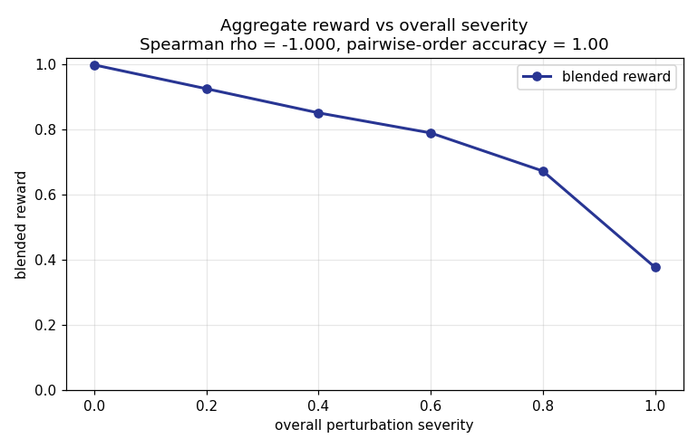

# Web-Design Replication RL Environment

A scalable pipeline that **generates** multi-page web-design tasks from scratch and
**grades** a coding agent's attempt to replicate them from screenshots alone — built
on the **Harbor** RL-environment framework, evaluated with Claude Code + Opus 4.7.
Functionality is out of scope by design; the reward measures the *visual + content
fidelity* of the replication.

This repo is built around one conviction the brief makes explicit — *the model learns
the grading logic, so a noisy reward poisons training.* So the grader came first, and
its validity is **proven, not asserted**. Start there:

## The reward is a faithful signal — here's the proof

We manufacture variants of a reference site whose quality ordering is *known a priori*
(controlled perturbations at rising severity), score them with the real grader, and
check the reward respects that ordering. It does — **monotonically, on every axis**:



- **Spearman ρ = −1.000**, pairwise-ordering accuracy **1.00** — reward falls
  monotonically as damage rises (`0.998 → 0.925 → 0.851 → 0.790 → 0.672 → 0.377`).
- **Oracle (reference vs itself) = 0.996** vs **Opus 4.7 ≈ 0.76** — a large, healthy
  gap, so the grader genuinely discriminates quality rather than saturating.
- Each of the four terms responds to *its own* perturbation axis; degenerate outputs
  (blank / gray / lorem) are floored by the blend.

→ **Full study with all four curves: [`reports/grader-validation/`](reports/grader-validation/)**
(renders inline on GitHub; every number is auditable in its `scores.json`).

## What the brief asked, and where it lives

| Brief deliverable / requirement | Where in this repo |
|---|---|
| Recipe code — the generation + grading pipeline | [`src/webdesign_rl/`](src/webdesign_rl/) (`generate/`, `grade/`, `render/`, `emit/`, `eval/`) + [`scripts/`](scripts/) |
| Documentation of **how the problem was thought through** | [`documentation/`](documentation/) — start at [`index.md`](documentation/index.md) |
| **≥10 final tasks** showcasing distribution + complexity | [`tasks/`](tasks/) — **11 tasks**, see [`tasks/README.md`](tasks/README.md) |
| **Visual report of results** (Opus 4.7 ×10, how the grader scores) | each [`tasks/<id>/report.md`](tasks/) — renders on GitHub |
| **Why higher reward = better replication** | [`reports/grader-validation/`](reports/grader-validation/) (the proof above) + the per-task galleries |
| **Patterns the model struggles with** | [`documentation/design/eval_pipeline.md`](documentation/design/eval_pipeline.md) (the `content` finding) |
| Continuous (not pass/fail) grading | 4-term reward ∈ [0,1] — [`documentation/design/grader_design.md`](documentation/design/grader_design.md) |
| Generated from scratch (no crawling); ≥5 pages; design-only | [`documentation/design/generator_design.md`](documentation/design/generator_design.md) (taxonomy, 5–10 pages, static-only gate) |

The assignment we built against is preserved verbatim at
[`documentation/project-brief.md`](documentation/project-brief.md).

## The final tasks

[`tasks/`](tasks/) holds **11 self-contained bundles** chosen to span the output
distribution — **all 10 archetypes × all 10 aesthetics**, complexity at **5 / 7 / 10
pages**, and the **full observed score range 0.66 → 0.827** (both extremes included).
Each bundle has a runnable Harbor `task/`, the 10× Opus-4.7 eval as a GitHub-rendered
`report.md` (+ plots and reference-vs-candidate galleries), `scores.json/csv`, and a
per-task README. See [`tasks/README.md`](tasks/README.md) for the coverage table.

## Quickstart

**Just want to look?** Browse [`tasks/`](tasks/) on GitHub — every task's screenshots
and `report.md` render in place, no clone needed.

**To run it:**

```bash
# 1. Environment (uv, Python >=3.12)
uv venv && source .venv/bin/activate
uv pip install -e ".[grade,modal]"
playwright install chromium          # the grader renders HTML headless, offline
# OCR (the `content` term) needs the tesseract binary locally:
#   macOS: brew install tesseract   |   Debian/Ubuntu: apt-get install tesseract-ocr

# 2. Credentials — env vars, no committed secrets (see note below)
export ANTHROPIC_API_KEY=sk-ant-...
```

The editable install above puts `webdesign_rl` on your path, so the scripts run
directly — no `PYTHONPATH` needed:

```bash
# Reproduce the grader-validation proof above (perturbation study -> curves)
python scripts/validate_grader.py

# Evaluate a task: Claude Code + Opus 4.7 x10 on Modal, graded + reported
python scripts/evaluate.py --task tasks/000_saas-landing_swiss-editorial_low/task --name my-eval --yes
python scripts/report.py jobs/my-eval --format markdown

# Generate a fresh batch on Modal, then pull it down
python scripts/generate.py --count 4 --concurrency 4 --volume my-batch
python scripts/pull_artifacts.py --volume my-batch
```

The grader itself is `python -m webdesign_rl.grade` (what each task's `tests/test.sh`
runs inside the Harbor verifier). Operational detail in the runbooks:
[grading](documentation/runbooks/harbor_grading.md) ·
[batch generation on Modal](documentation/runbooks/modal_batch.md).

> **Credentials (clone-and-go):** `export ANTHROPIC_API_KEY` covers grading + eval.
> Cloud *generation* additionally needs Modal auth (`modal token new` or
> `MODAL_TOKEN_ID`/`MODAL_TOKEN_SECRET`) plus a one-time `modal secret create
> anthropic-api-key ANTHROPIC_API_KEY=…` — the cloud worker reads the key from a Modal
> Secret, not your shell. `pull` needs only the Modal token.

## How it works

- **Grader** — four equal-weighted terms, `reward = mean`, averaged over pages:
  `structure` (MS-SSIM), `color` (CIEDE2000), `content` (OCR word-F1), `design_judge`
  (VLM rubric, Sonnet 4.6 — *Sonnet judges Opus to avoid self-preference bias*).
  Rendered via a **deterministic offline render with bundled fonts** so the same HTML
  always yields the same pixels (a real font-substitution bug forced this — see the
  trail). → [`grader_design.md`](documentation/design/grader_design.md)
- **Generator** — a **3-stage concept→code pipeline** (design system → layout → code),
  **stratified across a taxonomy** (10 archetypes × 10 aesthetics × 3 complexity
  levels), with a deterministic **quality gate** (substance floor, static-only,
  font-palette compliance). Direct Anthropic API calls (not Claude Code) for per-stage
  temperature + parallelism control. → [`generator_design.md`](documentation/design/generator_design.md)
- **Eval** — Claude Code + Opus 4.7 run **10×** via Harbor on Modal, graded, harvested
  into a per-task visual report. → [`eval_pipeline.md`](documentation/design/eval_pipeline.md)

**The headline learning:** `content` is the bottleneck, and its fidelity is **inversely
proportional to prose density** — the model paraphrases body copy (generation is its
native mode, not transcription) while nailing layout and color. Cross-confirmed by the
OCR term *and* the VLM judge. This is exactly the "what the model struggles with"
finding the brief asks for; the design-taste tension (is verbatim text the right thing
to reward in a *design* task?) is surfaced, not hidden.

## The research and the reasoning trail

Research taste is visible decisions plus the evidence that settled them — including the
dead-ends. So beyond the polished design docs:

- **Grader research** — [`grader_design.md` → "How the field grades design fidelity"](documentation/design/grader_design.md#research-how-the-field-grades-design-fidelity-deep-research-2026-05-30):
  a deep review of how the Design2Code-family benchmarks score replication (the
  single-most-important finding, a per-benchmark breakdown, adversarially verified) and
  how it shaped the four-term blend.
- **Generator research** — [`generator_research.md`](documentation/design/research/generator_research.md):
  the field study behind the 3-stage pipeline (22 sources, with refuted claims listed
  honestly).
- **[`documentation/thinking_trail.md`](documentation/thinking_trail.md)** — the raw,
  timestamped development log: real-time thinking, the bugs hit (the font/SSIM gotcha),
  and the commands run at each step.
- **[`documentation/prds/`](documentation/prds/)** — the development arc as PRDs +
  issues, in build order (grader-mvp, site-generator, eval-pipeline).

## Repository layout

```
src/webdesign_rl/   the pipeline: generate/ · grade/ · render/ · emit/ · eval/
scripts/            thin CLIs: generate · pull_artifacts · curate · evaluate(_all) · report(_all) · validate_grader
tasks/              the 11 final tasks (runnable task/ + GitHub-rendered report.md)
reports/grader-validation/   the "higher reward = better" proof (curves + scores)
documentation/      index.md (start here) · design/ · runbooks/ · research/ · thinking_trail.md · prds/
templates/          Harbor task scaffolding (task.toml, instruction, test.sh, Dockerfile)
tests/              behavioral test suite (337 passing)
```
