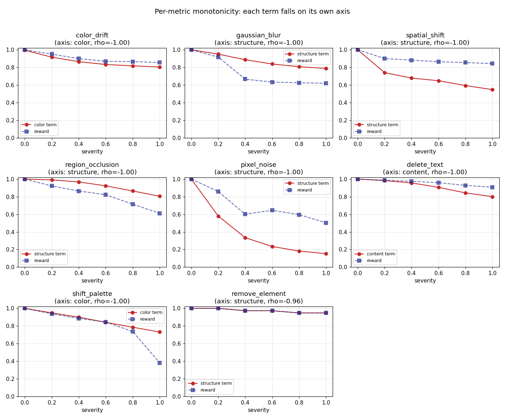
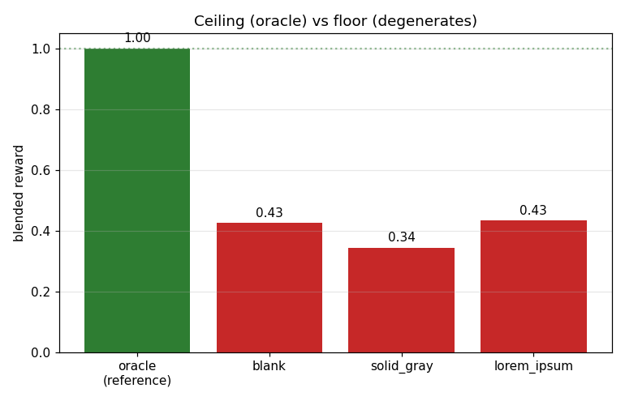
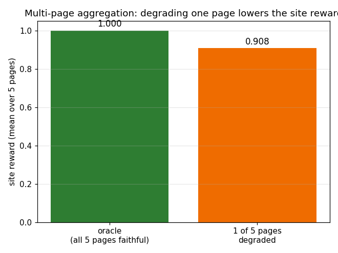

# Grader validation report

*Generated by `scripts/validate_grader.py`. Regenerate from scratch with
`python scripts/validate_grader.py`.*

This report is the evidence for the central claim of the grader: **higher reward
= better replication.** We manufacture variants of a hand-authored reference site
whose quality ordering is *known a priori* (programmatic perturbations along
controlled axes, plus degenerate outputs), score them with the real grader, and
show the reward respects that ordering — monotonic on every axis, ≈1.0 at the
oracle, and floored on the degenerates.

The grader blends four equal-weighted terms (`structure`, `color`, `content`,
`design_judge`); `reward = mean` of the four, averaged across pages.

Judge used for this run: **real Anthropic vision judge.**

## 1. Aggregate monotonicity — reward vs overall severity

A combined source-space ladder (palette shift + text deletion + element removal
applied together, re-rendered) degrades the whole site across axes. The blended
reward falls monotonically as severity rises.

- **Spearman rho = -1.000** (severity vs reward; -1 is perfectly
  monotonic-decreasing).
- **Pairwise-ordering accuracy = 1.00** (fraction of severity-ordered
  variant pairs the reward ranks correctly).
- Reward ladder: 0.998, 0.925, 0.851, 0.790, 0.672, 0.377 at severities
  0.0, 0.2, 0.4, 0.6, 0.8, 1.0.

## 2. Per-metric monotonicity — each term responds to its own axis

Each perturbation stresses one term; the term falls monotonically along that
perturbation's severity. Image-space ladders score the degraded image directly;
source-space ladders re-render an edited HTML/CSS site.

**Image-space perturbations** (scored on the degraded image directly):

| perturbation | axis | Spearman rho | pairwise-order acc |
| --- | --- | --- | --- |
| `color_drift` | color | -1.000 | 1.00 |
| `gaussian_blur` | structure | -1.000 | 1.00 |
| `spatial_shift` | structure | -1.000 | 1.00 |
| `region_occlusion` | structure | -1.000 | 1.00 |
| `pixel_noise` | structure | -1.000 | 1.00 |

**Source-space perturbations** (edited HTML/CSS, re-rendered then scored):

| perturbation | axis | Spearman rho | pairwise-order acc |
| --- | --- | --- | --- |
| `delete_text` | content | -1.000 | 1.00 |
| `shift_palette` | color | -1.000 | 1.00 |
| `remove_element` | structure | -0.956 | 1.00 |

## 3. Ceiling and floor — oracle ≈ 1.0, degenerates floored

- **Oracle (unperturbed reference) reward = 1.000** — the ground-truth site
  scores ≈ 1.0 (the `design_judge` term caps it below 1.0 when stubbed at a
  mid-rubric or scored by a real judge).
- **Degenerate floor** — blank / solid-gray / lorem-ipsum outputs, which
  replicate nothing, are floored by the blend:

| degenerate | reward | structure | color | content | design_judge |
| --- | --- | --- | --- | --- | --- |
| `blank` | 0.426 | 0.70 | 1.00 | 0.00 | 0.00 |
| `solid_gray` | 0.343 | 0.67 | 0.70 | 0.00 | 0.00 |
| `lorem_ipsum` | 0.433 | 0.64 | 1.00 | 0.00 | 0.10 |

**The `color ≈ 0.67` mean-gray caveat (issue 02).** A single mid-gray fill sits
~ΔE 33 from both black and white, so the **`color` term alone is generous** to a
solid-gray page (see the `solid_gray` row's `color` value above — well above 0).
That is the honest "reads palette, not mean" behavior, *not* a bug. The
anti-gaming guarantee is on the **aggregate**: `content` (OCR finds no matching
text) and `design_judge` collapse to ~0, so the blended reward floors the
degenerate far below the oracle — no single lenient term can rescue a page that
replicates nothing.

## 4. Multi-page aggregation — degrading one page lowers the site reward

The reference is a **5-page** site (home / about / services / pricing / contact).
The site reward is the mean over pages, so corrupting a single page must drag the
aggregate down.

- **Oracle (all 5 pages faithful) = 1.000.**
- **One of five pages degraded (its text deleted) = 0.908.**
- A single bad page in five lowers the site reward, confirming the aggregation
  propagates per-page quality.

## Reproducibility

- Raw per-variant scores: [`scores.json`](scores.json) and
  [`scores.csv`](scores.csv) — every number in this report is auditable there.
- Reference site: `tests/fixtures/site5_reference/` (HTML/CSS), rendered once to
  `tests/fixtures/site5_render_reference/` (committed PNGs).
- Rank correlations use `scipy.stats.spearmanr`; plots use matplotlib (Agg).
