# Animation model-eval report — anim-000_saas-landing_swiss-editorial_smooth-fade

## 1. Provenance

| field | value |
|---|---|
| Task | anim-000_saas-landing_swiss-editorial_smooth-fade |
| Seed tuple | saas-landing / swiss-editorial / low / north-american-consumers / confident-and-bold / smooth-fade |
| Archetype / Aesthetic / Complexity | saas-landing / swiss-editorial / low |
| Animation style | smooth-fade |
| Model | claude-opus-4-7 |
| Agent | claude-code |
| Executor | modal |
| Trials | 10 |
| Cost | $21.12 |
| Input tokens | 18081700 |
| Output tokens | 349057 |
| Wall-clock | 16.0 min |
| Filmstrip timestamps (ms) | 0, 200, 500, 900, 1400, 2000 |
| Date | 2026-06-01 |
| Repo commit | 88c4d89565f60dfbcdeef1eeb94d8ed65001b8a0 |

## 2. Per-trial scores

| trial | reward | static_design | motion | animation_judge |
|---|---|---|---|---|
| 2ov4rmV | 0.557 | 0.768 | 0.373 | 0.530 |
| UX5ft9y | 0.436 | 0.768 | 0.011 | 0.530 |
| bMccsWe | 0.545 | 0.780 | 0.346 | 0.510 |
| dE7xHAk | 0.431 | 0.760 | 0.022 | 0.510 |
| e4s87C4 | 0.519 | 0.748 | 0.343 | 0.465 |
| f2ysHDg | 0.560 | 0.793 | 0.356 | 0.530 |
| o9iFeLb | 0.554 | 0.766 | 0.347 | 0.550 |
| pcnEqku | 0.648 | 0.764 | 0.671 | 0.510 |
| xQ4LrCo | 0.586 | 0.758 | 0.449 | 0.550 |
| zxJbLVt | 0.570 | 0.737 | 0.463 | 0.510 |
| **summary** | med 0.556 · 0.541±0.062 | med 0.765 · 0.764±0.015 | med 0.352 · 0.338±0.187 | med 0.520 · 0.519±0.024 |

## 3. Reward + per-term distributions

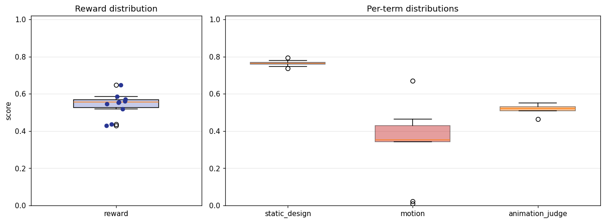

## 4. Per-term means

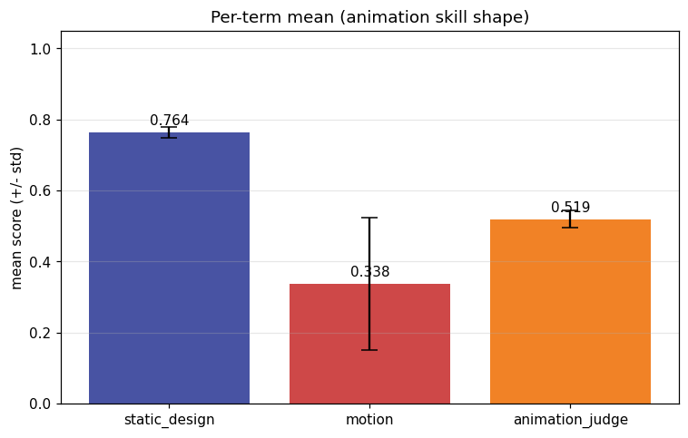

## 5. Per-page × per-term heatmap

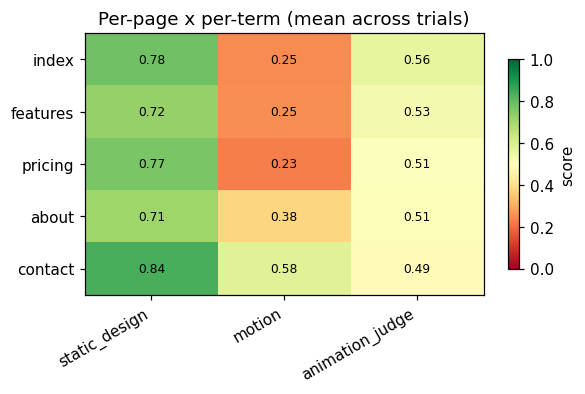

## 6. Worst per metric (reference vs candidate)

**static_design** — worst page `features` (trial `zxJbLVt`, score 0.677)

| reference | candidate |
|---|---|
| 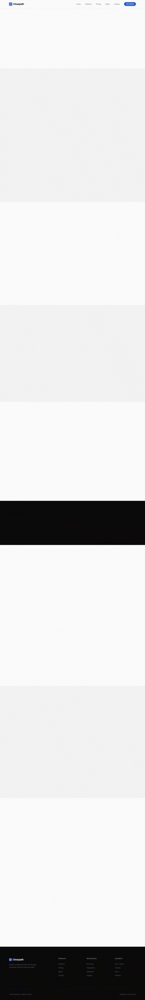 | 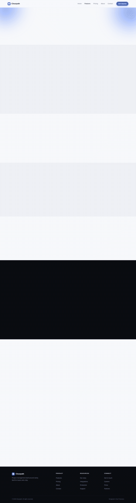 |

**motion** — worst page `features` (trial `UX5ft9y`, score 0.005)

| reference | candidate |
|---|---|
|  | 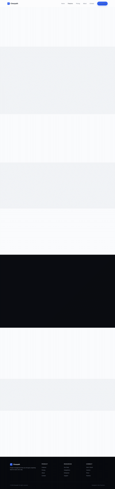 |

**animation_judge** — worst page `pricing` (trial `e4s87C4`, score 0.325)

| reference | candidate |
|---|---|
| 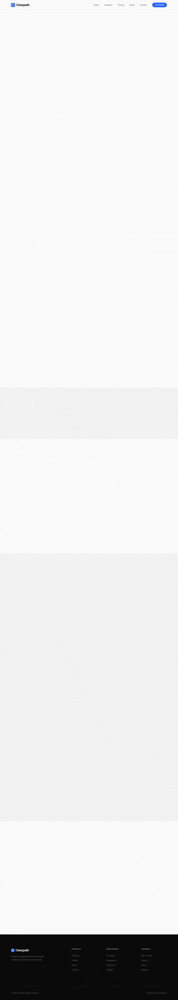 | 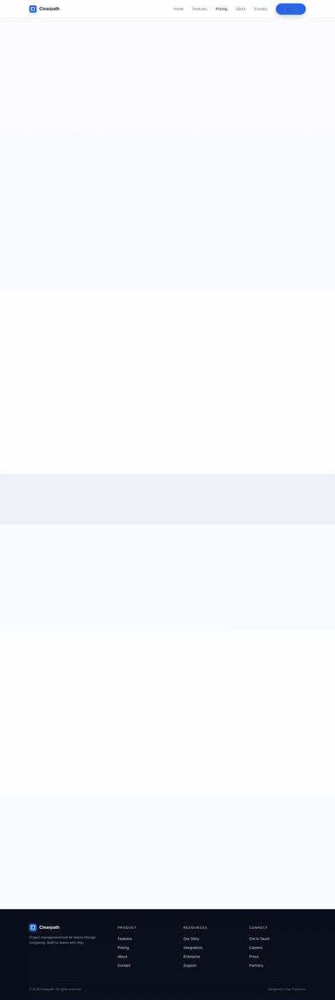 |

## 7. Best-overall attempt vs reference (all pages)

Best-overall trial `pcnEqku` (reward 0.648).

| page | reference | candidate |
|---|---|---|
| index | 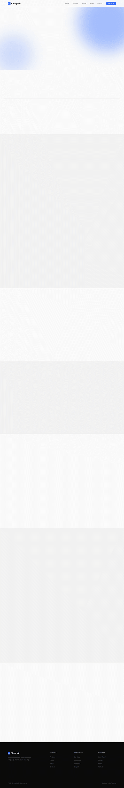 | 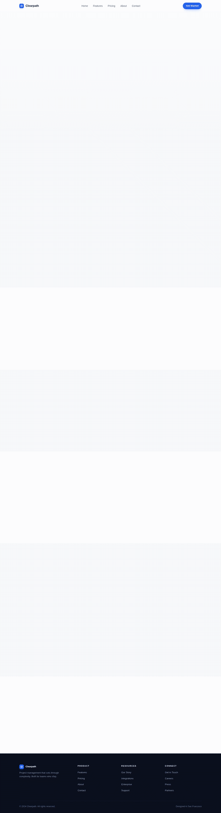 |
| features |  | 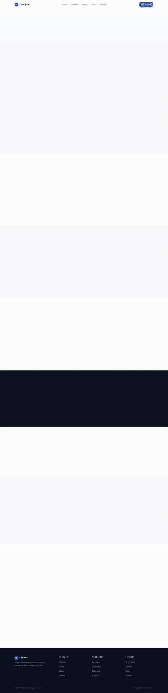 |
| pricing |  |  |
| about | 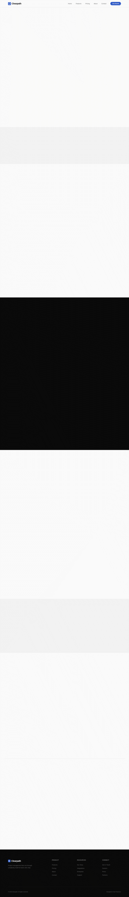 | 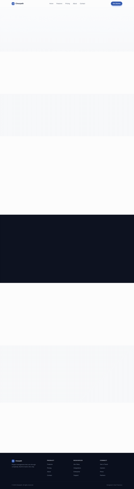 |
| contact | 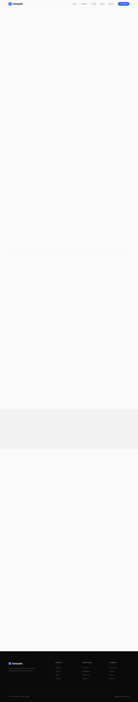 | 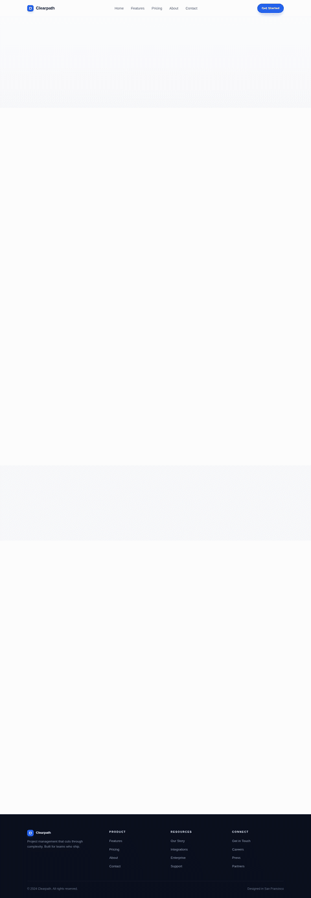 |
