# Animation model-eval report — anim-001_agency-portfolio_brutalist_snappy-slide

## 1. Provenance

| field | value |
|---|---|
| Task | anim-001_agency-portfolio_brutalist_snappy-slide |
| Seed tuple | agency-portfolio / brutalist / med / european-enterprises / calm-and-trustworthy / snappy-slide |
| Archetype / Aesthetic / Complexity | agency-portfolio / brutalist / med |
| Animation style | snappy-slide |
| Model | claude-opus-4-7 |
| Agent | claude-code |
| Executor | modal |
| Trials | 10 |
| Cost | $21.07 |
| Input tokens | 18501356 |
| Output tokens | 343139 |
| Wall-clock | 14.8 min |
| Filmstrip timestamps (ms) | 0, 200, 500, 900, 1400, 2000 |
| Date | 2026-06-01 |
| Repo commit | 88c4d89565f60dfbcdeef1eeb94d8ed65001b8a0 |

## 2. Per-trial scores

| trial | reward | static_design | motion | animation_judge |
|---|---|---|---|---|
| Avor2gK | 0.408 | 0.656 | 0.021 | 0.545 |
| CNXy22Q | 0.454 | 0.660 | 0.163 | 0.540 |
| DNEnF42 | 0.467 | 0.679 | 0.193 | 0.530 |
| EscKEzD | 0.548 | 0.667 | 0.408 | 0.570 |
| G3gG4ts | 0.589 | 0.673 | 0.525 | 0.570 |
| QVXHtDw | 0.529 | 0.655 | 0.383 | 0.550 |
| egSgTuh | 0.518 | 0.669 | 0.316 | 0.570 |
| hosXHzw | 0.576 | 0.677 | 0.465 | 0.585 |
| iymwGch | 0.470 | 0.660 | 0.180 | 0.570 |
| toLn7UM | 0.541 | 0.693 | 0.344 | 0.585 |
| **summary** | med 0.524 · 0.510±0.055 | med 0.668 · 0.669±0.011 | med 0.330 · 0.300±0.149 | med 0.570 · 0.561±0.018 |

## 3. Reward + per-term distributions

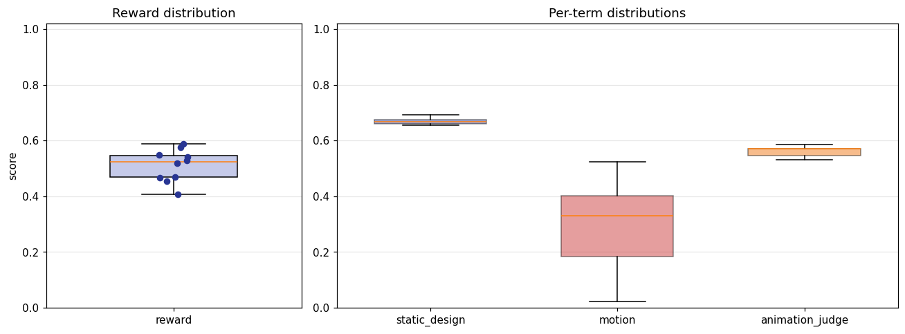

## 4. Per-term means

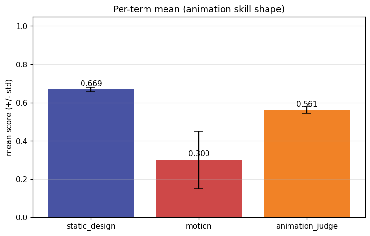

## 5. Per-page × per-term heatmap

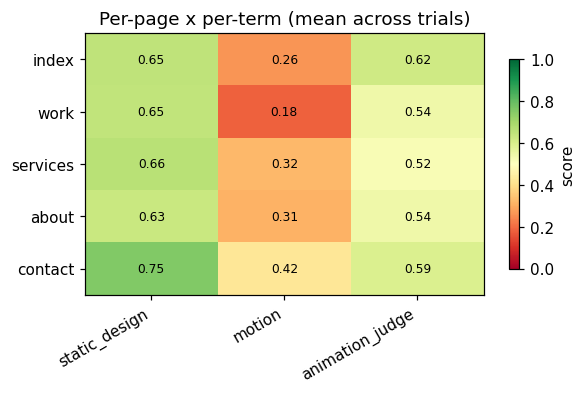

## 6. Worst per metric (reference vs candidate)

**static_design** — worst page `about` (trial `Avor2gK`, score 0.608)

| reference | candidate |
|---|---|
|  | 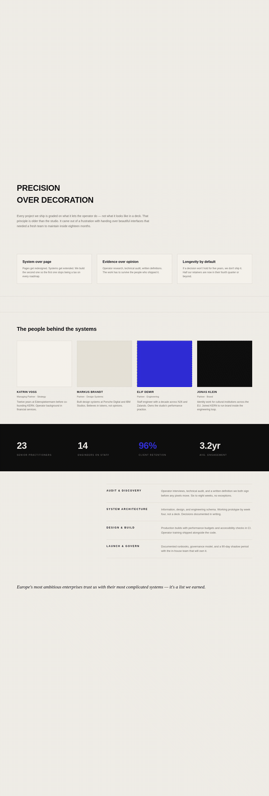 |

**motion** — worst page `contact` (trial `Avor2gK`, score 0.004)

| reference | candidate |
|---|---|
|  | 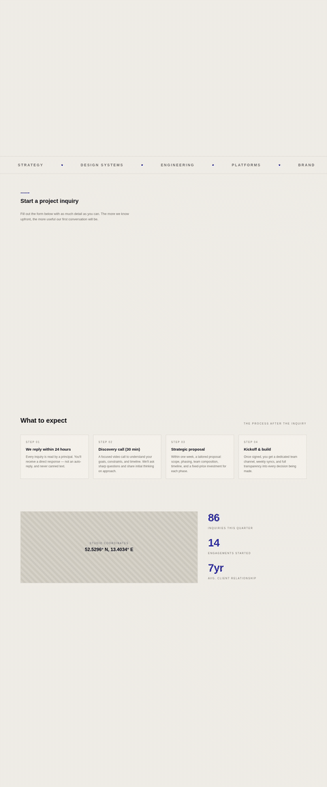 |

**animation_judge** — worst page `services` (trial `Avor2gK`, score 0.450)

| reference | candidate |
|---|---|
|  | 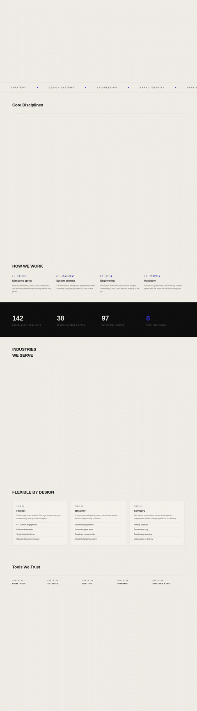 |

## 7. Best-overall attempt vs reference (all pages)

Best-overall trial `G3gG4ts` (reward 0.589).

| page | reference | candidate |
|---|---|---|
| index | 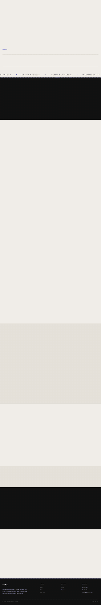 | 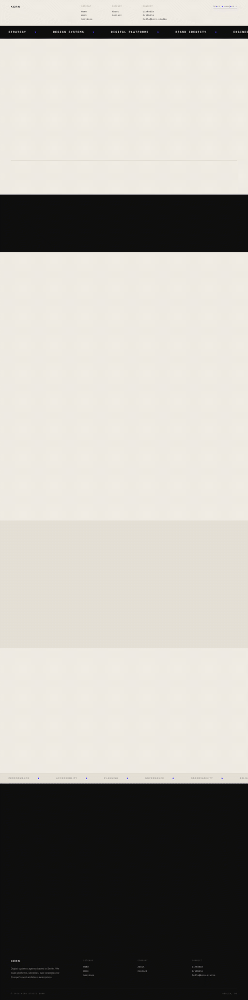 |
| work | 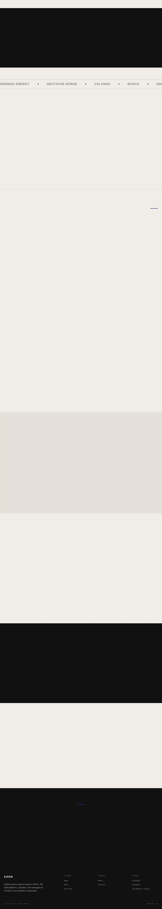 | 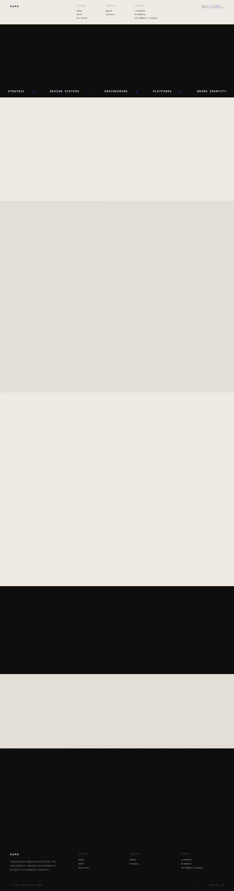 |
| services | 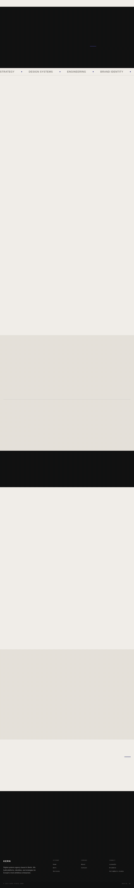 | 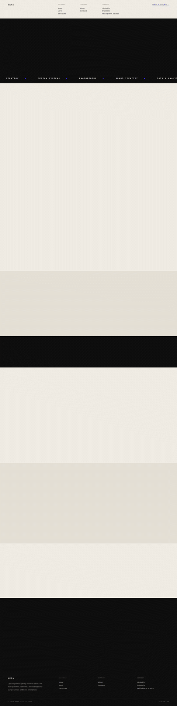 |
| about | 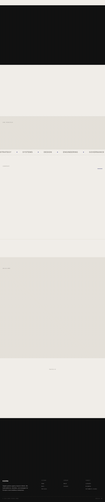 | 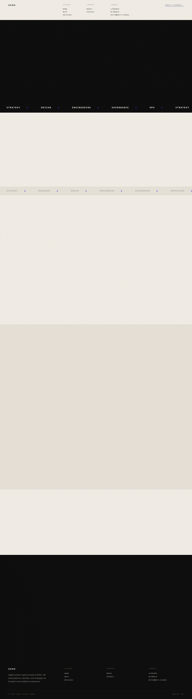 |
| contact | 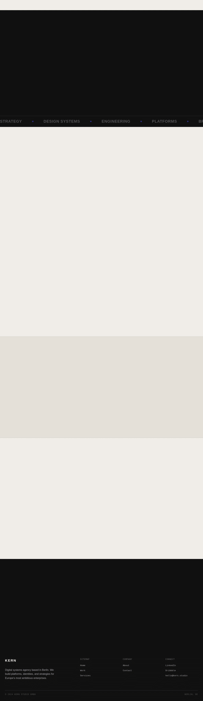 | 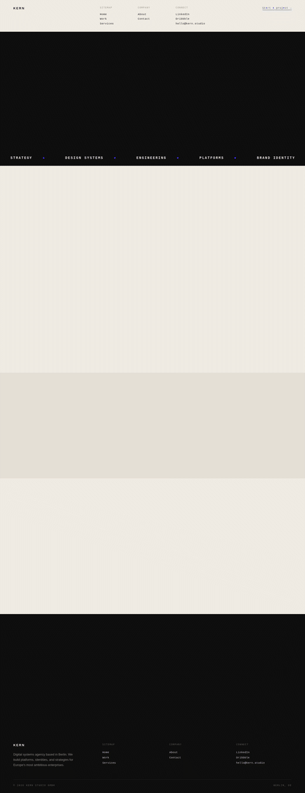 |
