# Animation model-eval report — anim-002_ecommerce-store_neo-brutalist_playful-bounce

## 1. Provenance

| field | value |
|---|---|
| Task | anim-002_ecommerce-store_neo-brutalist_playful-bounce |
| Seed tuple | ecommerce-store / neo-brutalist / high / global-developers / playful-and-energetic / playful-bounce |
| Archetype / Aesthetic / Complexity | ecommerce-store / neo-brutalist / high |
| Animation style | playful-bounce |
| Model | claude-opus-4-7 |
| Agent | claude-code |
| Executor | modal |
| Trials | 10 |
| Cost | $25.70 |
| Input tokens | 19879274 |
| Output tokens | 469685 |
| Wall-clock | 18.2 min |
| Filmstrip timestamps (ms) | 0, 200, 500, 900, 1400, 2000 |
| Date | 2026-06-01 |
| Repo commit | 88c4d89565f60dfbcdeef1eeb94d8ed65001b8a0 |

## 2. Per-trial scores

| trial | reward | static_design | motion | animation_judge |
|---|---|---|---|---|
| 7mKPq8E | 0.489 | 0.644 | 0.374 | 0.450 |
| AZKyQK5 | 0.505 | 0.678 | 0.306 | 0.530 |
| HmzPGrm | 0.418 | 0.705 | 0.059 | 0.490 |
| RSH4dZ9 | 0.521 | 0.667 | 0.386 | 0.510 |
| impaNpv | 0.476 | 0.662 | 0.295 | 0.470 |
| m6QQJuW | 0.476 | 0.683 | 0.234 | 0.510 |
| q6K8GbD | 0.590 | 0.692 | 0.528 | 0.550 |
| sDQCCtF | 0.534 | 0.688 | 0.425 | 0.490 |
| u8hEjMF | 0.544 | 0.703 | 0.380 | 0.550 |
| y6sppaX | 0.418 | 0.680 | 0.083 | 0.490 |
| **summary** | med 0.497 · 0.497±0.051 | med 0.681 · 0.680±0.018 | med 0.340 · 0.307±0.140 | med 0.500 · 0.504±0.031 |

## 3. Reward + per-term distributions

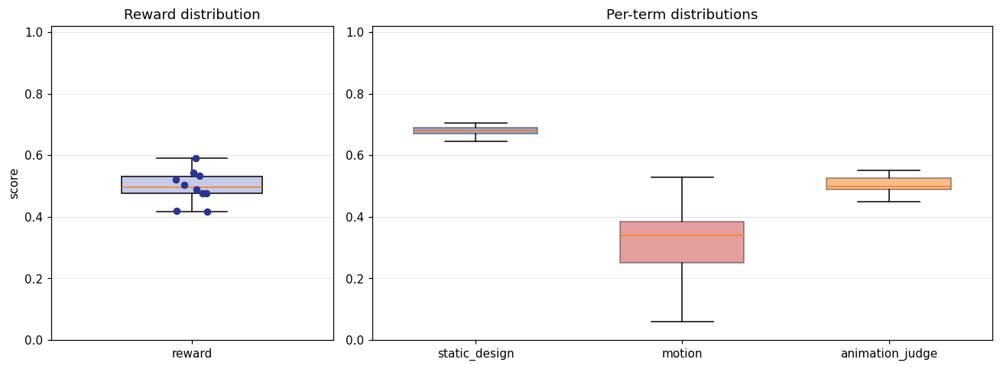

## 4. Per-term means

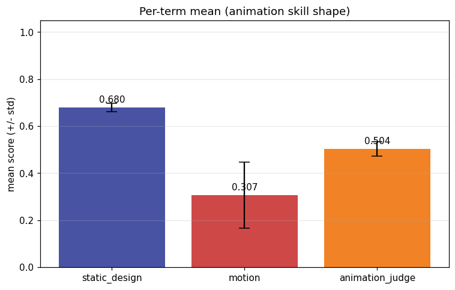

## 5. Per-page × per-term heatmap

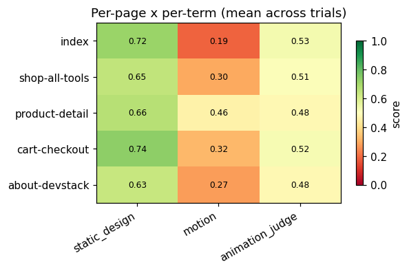

## 6. Worst per metric (reference vs candidate)

**static_design** — worst page `shop-all-tools` (trial `7mKPq8E`, score 0.606)

| reference | candidate |
|---|---|
|  | 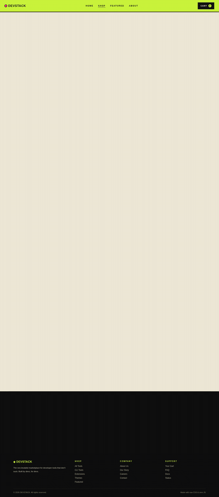 |

**motion** — worst page `index` (trial `y6sppaX`, score 0.012)

| reference | candidate |
|---|---|
| 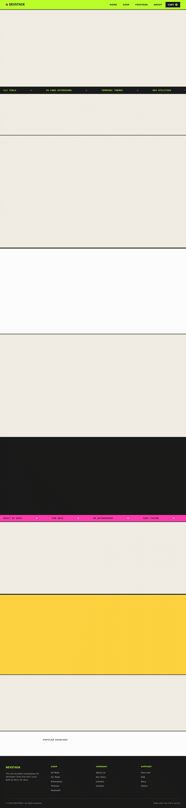 |  |

**animation_judge** — worst page `about-devstack` (trial `7mKPq8E`, score 0.350)

| reference | candidate |
|---|---|
| 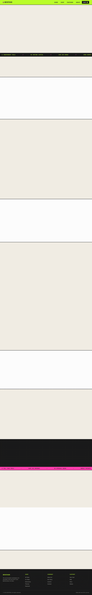 | 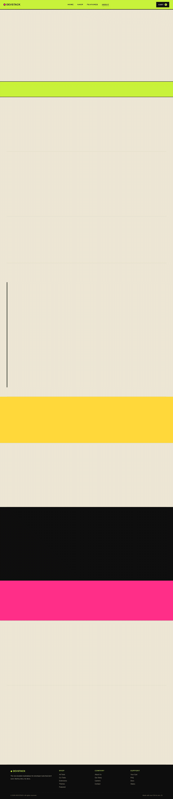 |

## 7. Best-overall attempt vs reference (all pages)

Best-overall trial `q6K8GbD` (reward 0.590).

| page | reference | candidate |
|---|---|---|
| index |  | 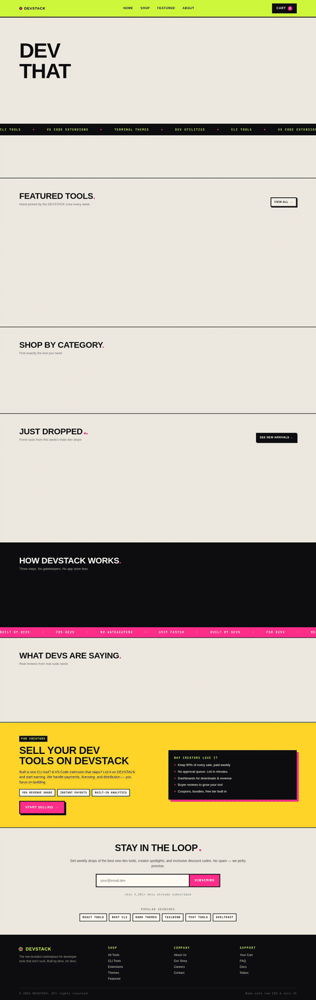 |
| shop-all-tools | 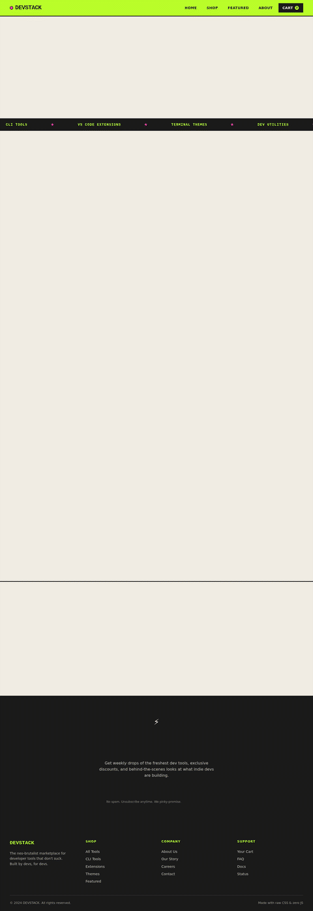 | 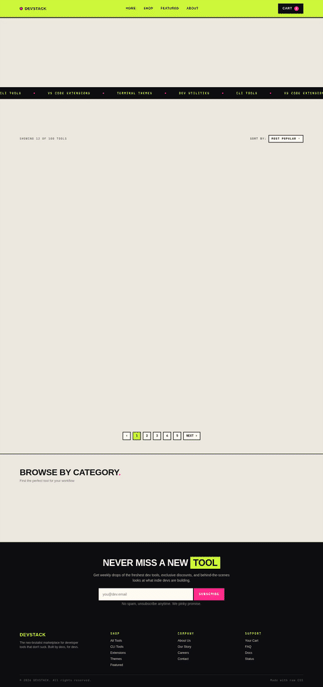 |
| product-detail | 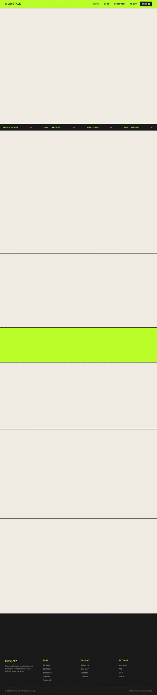 | 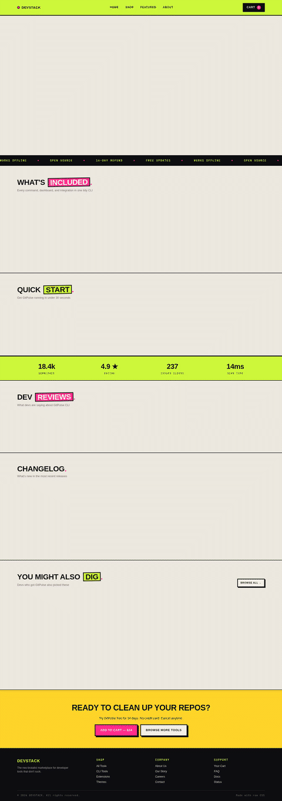 |
| cart-checkout | 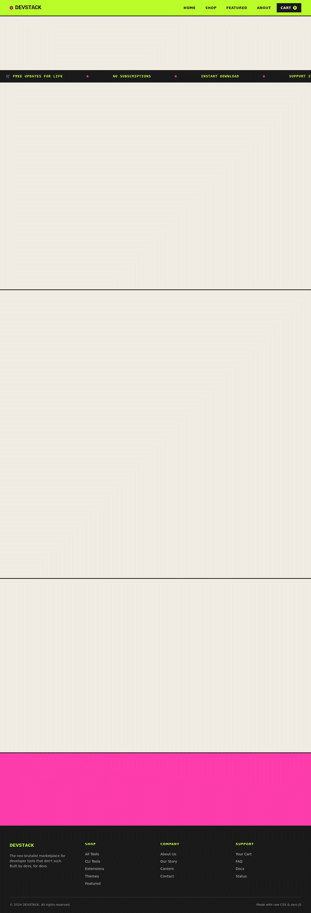 | 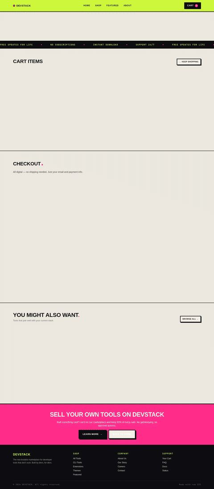 |
| about-devstack |  | 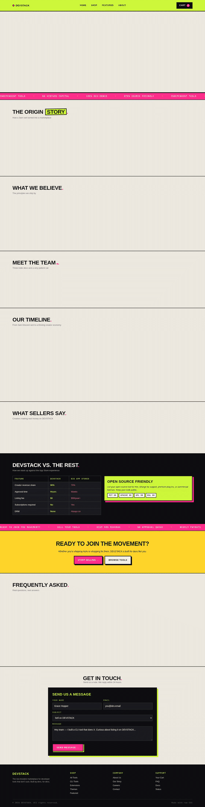 |
