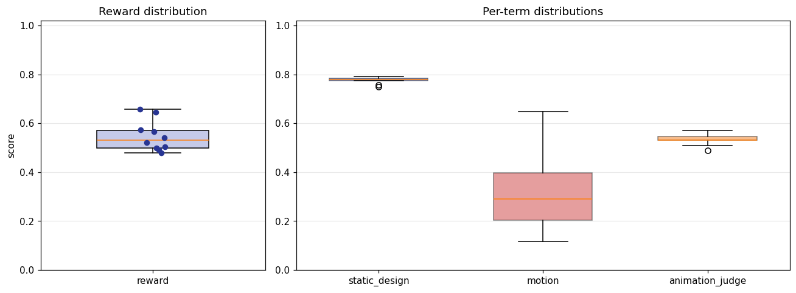
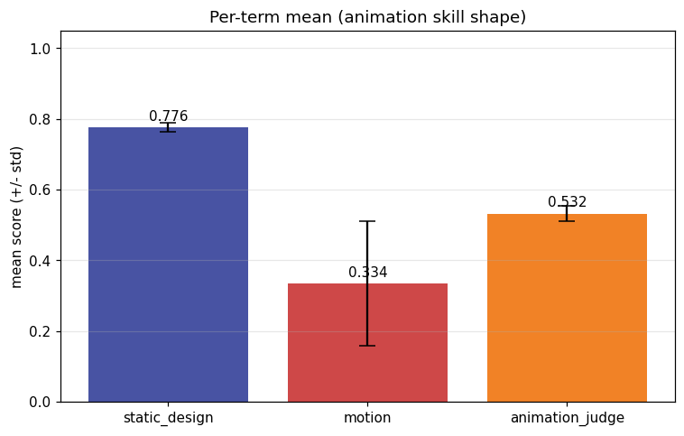
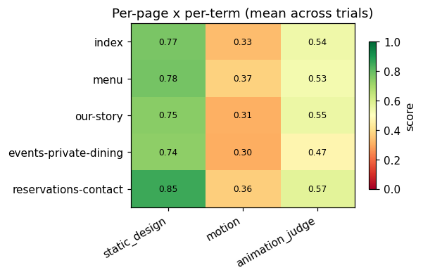
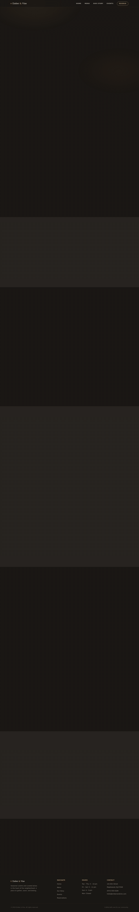
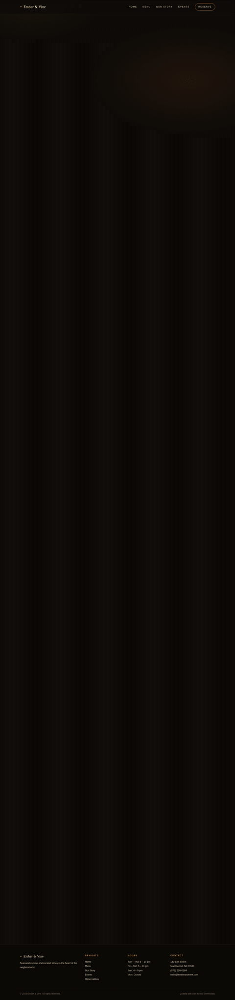
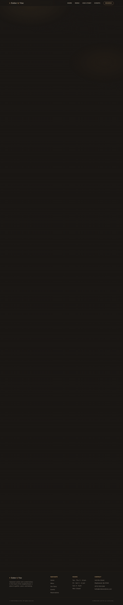
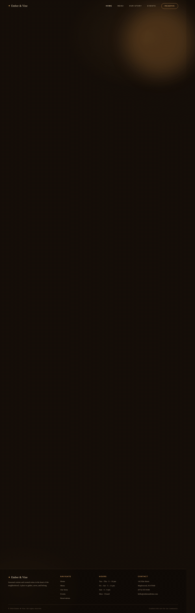
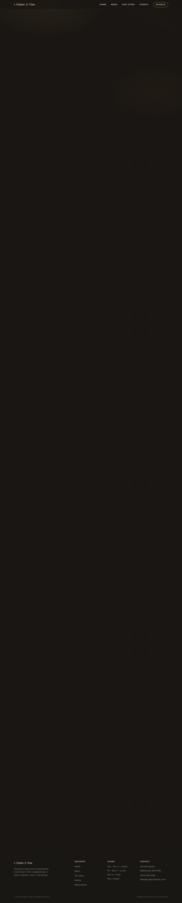
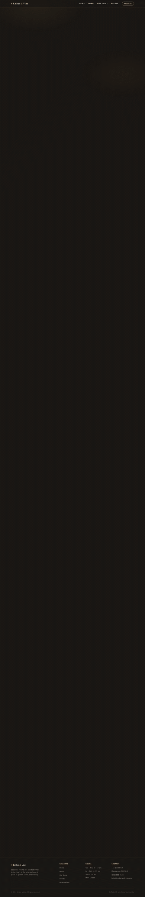
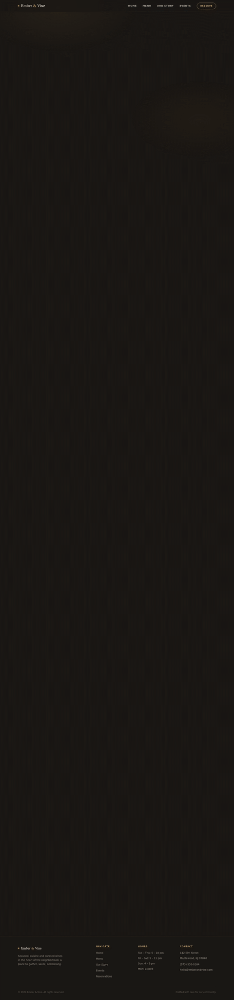

# Animation model-eval report — anim-003_restaurant-hospitality_glassmorphism_elegant-reveal

## 1. Provenance

| field | value |
|---|---|
| Task | anim-003_restaurant-hospitality_glassmorphism_elegant-reveal |
| Seed tuple | restaurant-hospitality / glassmorphism / low / local-community / premium-and-understated / elegant-reveal |
| Archetype / Aesthetic / Complexity | restaurant-hospitality / glassmorphism / low |
| Animation style | elegant-reveal |
| Model | claude-opus-4-7 |
| Agent | claude-code |
| Executor | modal |
| Trials | 10 |
| Cost | $21.73 |
| Input tokens | 18040463 |
| Output tokens | 369503 |
| Wall-clock | 20.4 min |
| Filmstrip timestamps (ms) | 0, 200, 500, 900, 1400, 2000 |
| Date | 2026-06-01 |
| Repo commit | 88c4d89565f60dfbcdeef1eeb94d8ed65001b8a0 |

## 2. Per-trial scores

| trial | reward | static_design | motion | animation_judge |
|---|---|---|---|---|
| 29a3duf | 0.498 | 0.756 | 0.248 | 0.490 |
| FMq6pSQ | 0.521 | 0.775 | 0.258 | 0.530 |
| We79bs3 | 0.573 | 0.789 | 0.401 | 0.530 |
| ajgbZ2N | 0.658 | 0.774 | 0.649 | 0.550 |
| ayxcgGQ | 0.479 | 0.750 | 0.118 | 0.570 |
| ccpgMSR | 0.542 | 0.791 | 0.325 | 0.510 |
| d2eCLXM | 0.646 | 0.778 | 0.631 | 0.530 |
| kWg3KFu | 0.492 | 0.781 | 0.144 | 0.550 |
| rHAL8Sa | 0.565 | 0.783 | 0.383 | 0.530 |
| rLxRfMY | 0.503 | 0.786 | 0.188 | 0.535 |
| **summary** | med 0.531 · 0.548±0.060 | med 0.779 · 0.776±0.013 | med 0.291 · 0.334±0.177 | med 0.530 · 0.532±0.021 |

## 3. Reward + per-term distributions

## 4. Per-term means

## 5. Per-page × per-term heatmap

## 6. Worst per metric (reference vs candidate)

**static_design** — worst page `events-private-dining` (trial `ayxcgGQ`, score 0.713)

| reference | candidate |
|---|---|
|  |  |

**motion** — worst page `events-private-dining` (trial `ayxcgGQ`, score 0.036)

| reference | candidate |
|---|---|
|  |  |

**animation_judge** — worst page `index` (trial `29a3duf`, score 0.450)

| reference | candidate |
|---|---|
|  |  |

## 7. Best-overall attempt vs reference (all pages)

Best-overall trial `ajgbZ2N` (reward 0.658).

| page | reference | candidate |
|---|---|---|
| index |  |  |
| menu |  |  |
| our-story |  |  |
| events-private-dining |  |  |
| reservations-contact |  |  |
