# Animation model-eval report — anim-004_editorial-blog_corporate-flat_kinetic-loop

## 1. Provenance

| field | value |
|---|---|
| Task | anim-004_editorial-blog_corporate-flat_kinetic-loop |
| Seed tuple | editorial-blog / corporate-flat / med / students-and-educators / warm-and-welcoming / kinetic-loop |
| Archetype / Aesthetic / Complexity | editorial-blog / corporate-flat / med |
| Animation style | kinetic-loop |
| Model | claude-opus-4-7 |
| Agent | claude-code |
| Executor | modal |
| Trials | 10 |
| Cost | $22.59 |
| Input tokens | 18361342 |
| Output tokens | 394083 |
| Wall-clock | 18.2 min |
| Filmstrip timestamps (ms) | 0, 200, 500, 900, 1400, 2000 |
| Date | 2026-06-01 |
| Repo commit | 88c4d89565f60dfbcdeef1eeb94d8ed65001b8a0 |

## 2. Per-trial scores

| trial | reward | static_design | motion | animation_judge |
|---|---|---|---|---|
| KpeRPeh | 0.607 | 0.724 | 0.567 | 0.530 |
| LXPFoEr | 0.604 | 0.705 | 0.576 | 0.530 |
| QBXoSec | 0.554 | 0.724 | 0.429 | 0.510 |
| QpYtEGG | 0.437 | 0.728 | 0.121 | 0.460 |
| TVZB85m | 0.665 | 0.729 | 0.716 | 0.550 |
| XAZthW3 | 0.643 | 0.747 | 0.680 | 0.500 |
| aWmYpj6 | 0.454 | 0.726 | 0.126 | 0.510 |
| sXm6aFS | 0.647 | 0.723 | 0.687 | 0.530 |
| vU2HHps | 0.595 | 0.725 | 0.531 | 0.530 |
| xBEvQ9A | 0.645 | 0.741 | 0.683 | 0.510 |
| **summary** | med 0.605 · 0.585±0.076 | med 0.725 · 0.727±0.011 | med 0.571 · 0.512±0.211 | med 0.520 · 0.516±0.023 |

## 3. Reward + per-term distributions

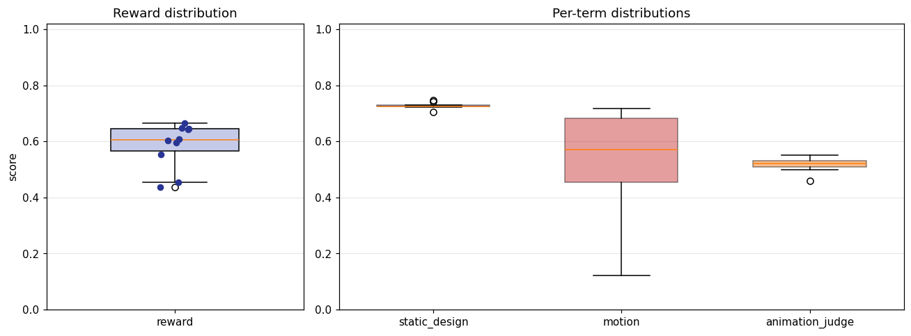

## 4. Per-term means

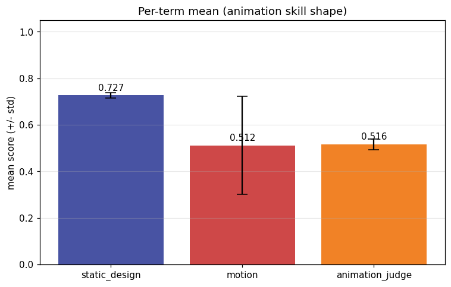

## 5. Per-page × per-term heatmap

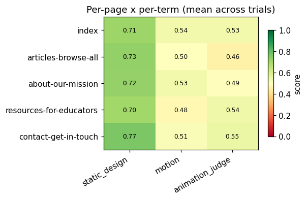

## 6. Worst per metric (reference vs candidate)

**static_design** — worst page `resources-for-educators` (trial `LXPFoEr`, score 0.689)

| reference | candidate |
|---|---|
| 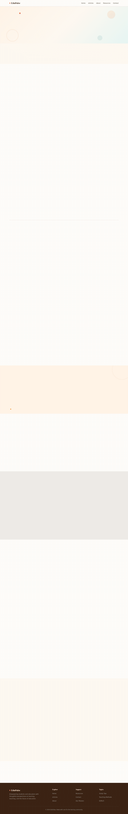 | 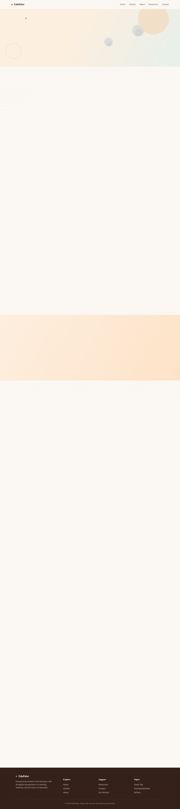 |

**motion** — worst page `about-our-mission` (trial `aWmYpj6`, score 0.081)

| reference | candidate |
|---|---|
|  |  |

**animation_judge** — worst page `about-our-mission` (trial `QpYtEGG`, score 0.300)

| reference | candidate |
|---|---|
| 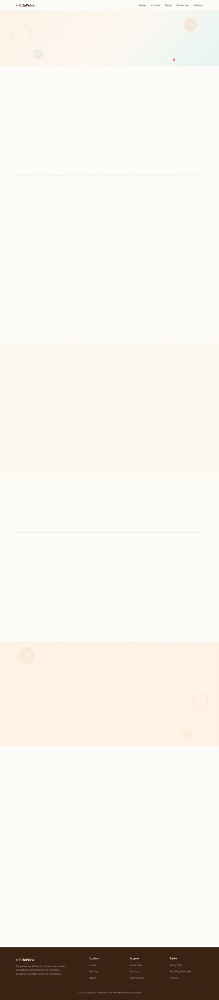 | 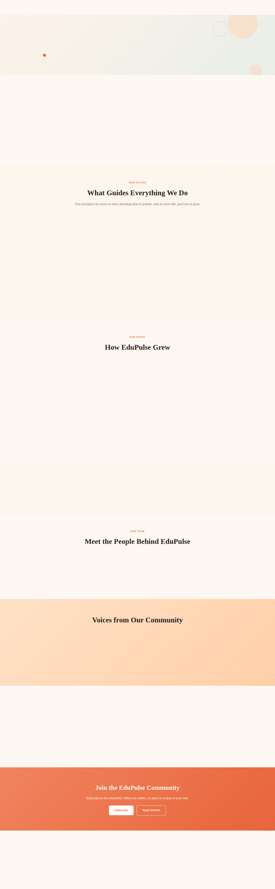 |

## 7. Best-overall attempt vs reference (all pages)

Best-overall trial `TVZB85m` (reward 0.665).

| page | reference | candidate |
|---|---|---|
| index | 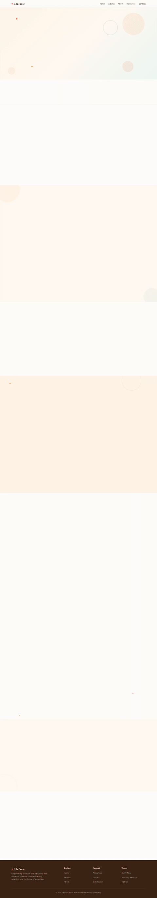 | 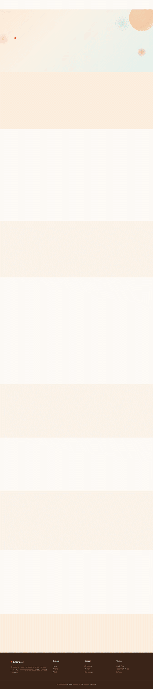 |
| articles-browse-all | 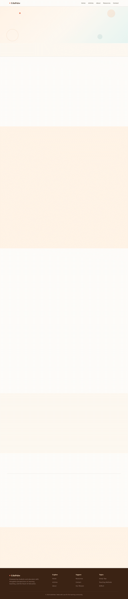 | 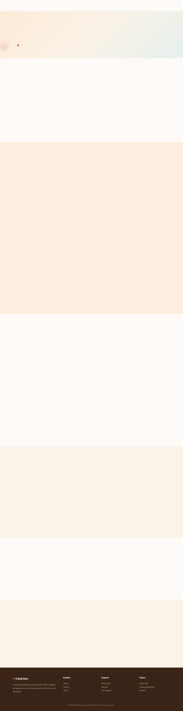 |
| about-our-mission |  | 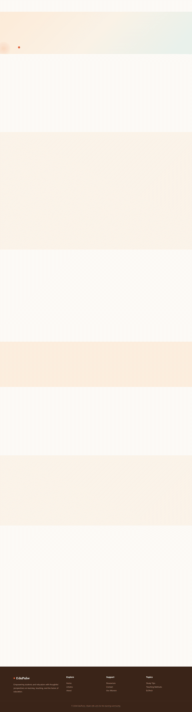 |
| resources-for-educators |  | 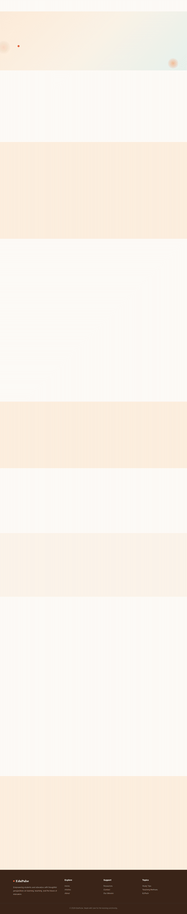 |
| contact-get-in-touch | 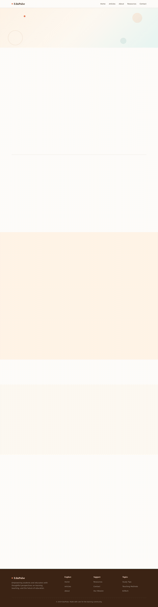 | 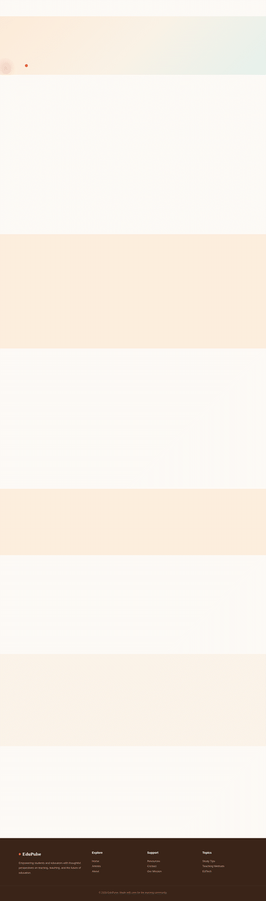 |
