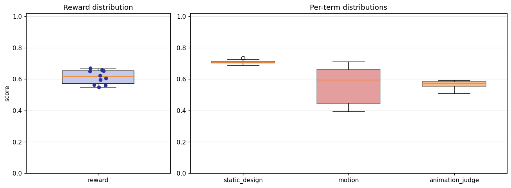
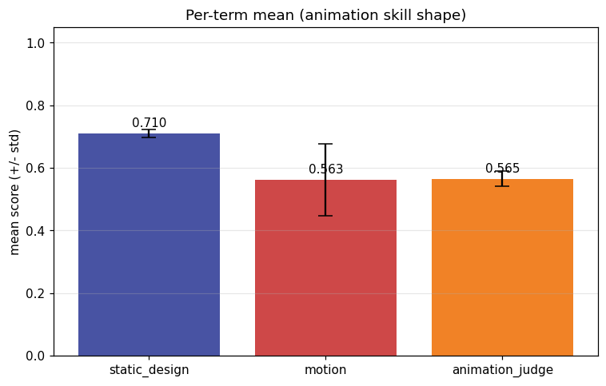
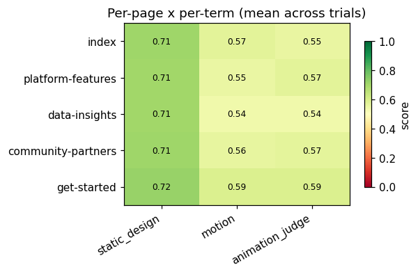
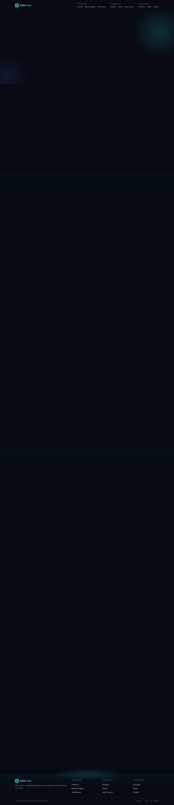
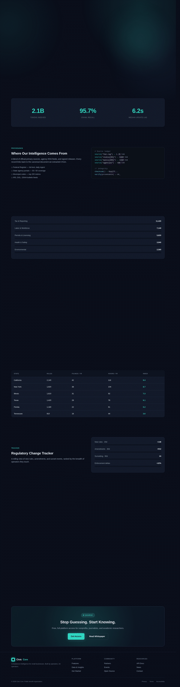

# Animation model-eval report — anim-005_nonprofit-civic_dark-techy_smooth-fade

## 1. Provenance

| field | value |
|---|---|
| Task | anim-005_nonprofit-civic_dark-techy_smooth-fade |
| Seed tuple | nonprofit-civic / dark-techy / high / small-business-owners / technical-and-precise / smooth-fade |
| Archetype / Aesthetic / Complexity | nonprofit-civic / dark-techy / high |
| Animation style | smooth-fade |
| Model | claude-opus-4-7 |
| Agent | claude-code |
| Executor | modal |
| Trials | 10 |
| Cost | $25.61 |
| Input tokens | 21539076 |
| Output tokens | 442235 |
| Wall-clock | 34.9 min |
| Filmstrip timestamps (ms) | 0, 200, 500, 900, 1400, 2000 |
| Date | 2026-06-01 |
| Repo commit | 88c4d89565f60dfbcdeef1eeb94d8ed65001b8a0 |

## 2. Per-trial scores

| trial | reward | static_design | motion | animation_judge |
|---|---|---|---|---|
| 2yefYRA | 0.596 | 0.688 | 0.549 | 0.550 |
| 8jKLhtM | 0.563 | 0.715 | 0.410 | 0.565 |
| CCsBgzc | 0.669 | 0.706 | 0.711 | 0.590 |
| Dpg87u7 | 0.651 | 0.724 | 0.653 | 0.575 |
| J63VtCx | 0.654 | 0.702 | 0.668 | 0.590 |
| MrNfw38 | 0.561 | 0.709 | 0.405 | 0.570 |
| NNJmjkA | 0.624 | 0.713 | 0.570 | 0.590 |
| RWtDTtq | 0.657 | 0.736 | 0.666 | 0.570 |
| Vv9bWNe | 0.547 | 0.706 | 0.391 | 0.545 |
| WZWFpGQ | 0.606 | 0.701 | 0.605 | 0.510 |
| **summary** | med 0.615 · 0.613±0.043 | med 0.708 · 0.710±0.012 | med 0.588 · 0.563±0.115 | med 0.570 · 0.565±0.024 |

## 3. Reward + per-term distributions

## 4. Per-term means

## 5. Per-page × per-term heatmap

## 6. Worst per metric (reference vs candidate)

**static_design** — worst page `platform-features` (trial `2yefYRA`, score 0.675)

| reference | candidate |
|---|---|
|  |  |

**motion** — worst page `platform-features` (trial `MrNfw38`, score 0.310)

| reference | candidate |
|---|---|
|  |  |

**animation_judge** — worst page `data-insights` (trial `WZWFpGQ`, score 0.450)

| reference | candidate |
|---|---|
|  |  |

## 7. Best-overall attempt vs reference (all pages)

Best-overall trial `CCsBgzc` (reward 0.669).

| page | reference | candidate |
|---|---|---|
| index |  |  |
| platform-features |  |  |
| data-insights |  |  |
| community-partners |  |  |
| get-started |  |  |
