# Animation model-eval report — anim-006_personal-resume_warm-organic_snappy-slide

## 1. Provenance

| field | value |
|---|---|
| Task | anim-006_personal-resume_warm-organic_snappy-slide |
| Seed tuple | personal-resume / warm-organic / low / creative-professionals / rebellious-and-edgy / snappy-slide |
| Archetype / Aesthetic / Complexity | personal-resume / warm-organic / low |
| Animation style | snappy-slide |
| Model | claude-opus-4-7 |
| Agent | claude-code |
| Executor | modal |
| Trials | 10 |
| Cost | $21.29 |
| Input tokens | 17938929 |
| Output tokens | 356323 |
| Wall-clock | 15.7 min |
| Filmstrip timestamps (ms) | 0, 200, 500, 900, 1400, 2000 |
| Date | 2026-06-01 |
| Repo commit | 88c4d89565f60dfbcdeef1eeb94d8ed65001b8a0 |

## 2. Per-trial scores

| trial | reward | static_design | motion | animation_judge |
|---|---|---|---|---|
| 5Dd4eUj | 0.601 | 0.738 | 0.491 | 0.575 |
| CRkLupf | 0.529 | 0.724 | 0.319 | 0.545 |
| YyuSGjQ | 0.583 | 0.732 | 0.471 | 0.545 |
| bmPM7t9 | 0.531 | 0.689 | 0.379 | 0.525 |
| c2Pky5S | 0.524 | 0.714 | 0.333 | 0.525 |
| dDUAFGb | 0.518 | 0.712 | 0.266 | 0.575 |
| fXvHAF3 | 0.538 | 0.746 | 0.313 | 0.555 |
| qpLyBcb | 0.459 | 0.728 | 0.150 | 0.500 |
| tBFSpwR | 0.400 | 0.721 | 0.008 | 0.470 |
| tp7kD3p | 0.459 | 0.715 | 0.118 | 0.545 |
| **summary** | med 0.527 · 0.514±0.057 | med 0.722 · 0.722±0.015 | med 0.316 · 0.285±0.146 | med 0.545 · 0.536±0.031 |

## 3. Reward + per-term distributions

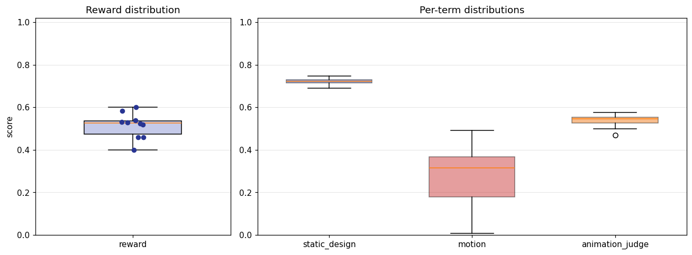

## 4. Per-term means

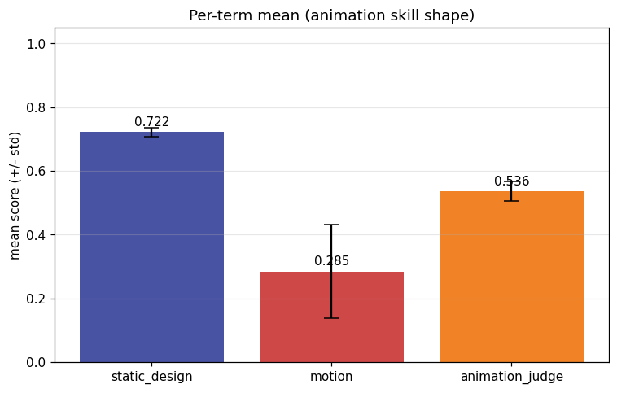

## 5. Per-page × per-term heatmap

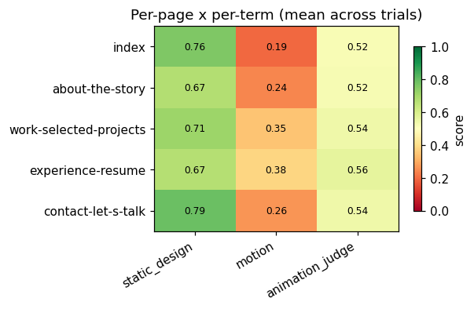

## 6. Worst per metric (reference vs candidate)

**static_design** — worst page `about-the-story` (trial `tp7kD3p`, score 0.608)

| reference | candidate |
|---|---|
|  | 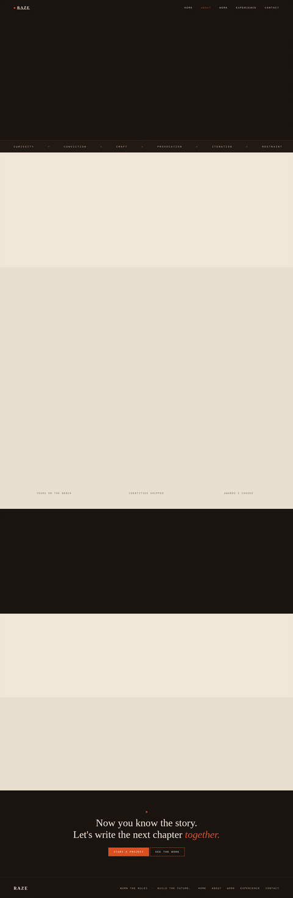 |

**motion** — worst page `index` (trial `tBFSpwR`, score 0.001)

| reference | candidate |
|---|---|
| 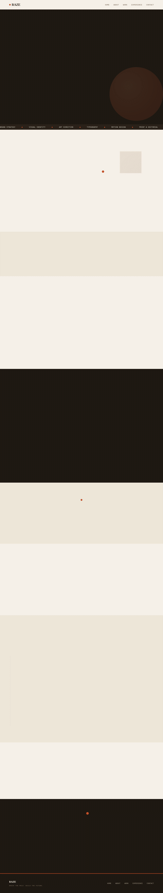 | 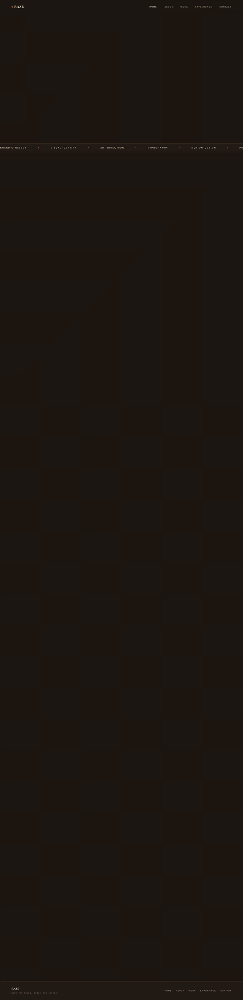 |

**animation_judge** — worst page `index` (trial `bmPM7t9`, score 0.450)

| reference | candidate |
|---|---|
|  | 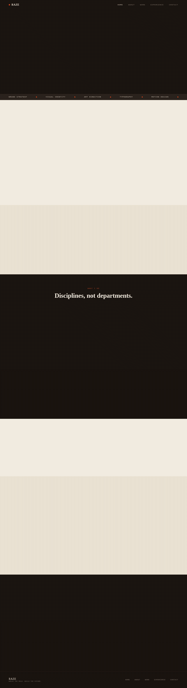 |

## 7. Best-overall attempt vs reference (all pages)

Best-overall trial `5Dd4eUj` (reward 0.601).

| page | reference | candidate |
|---|---|---|
| index |  | 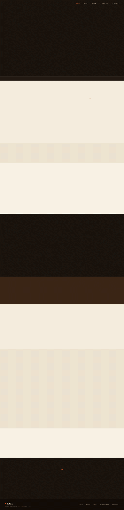 |
| about-the-story | 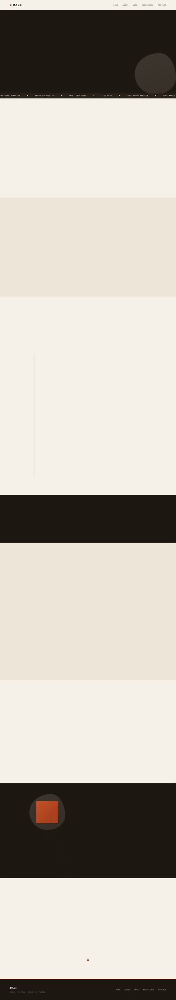 | 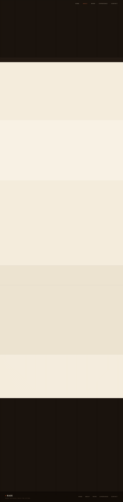 |
| work-selected-projects | 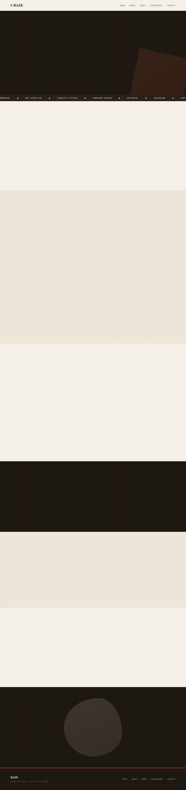 | 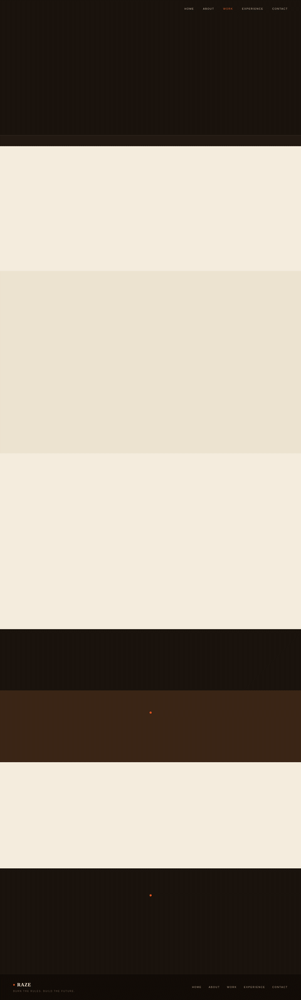 |
| experience-resume | 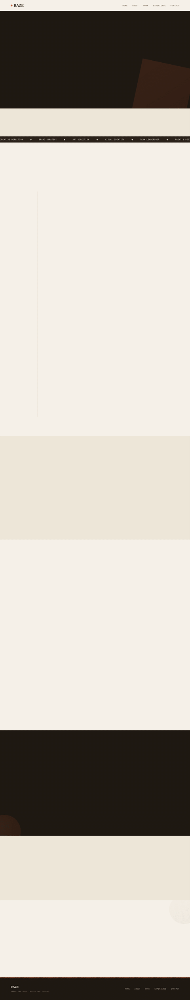 | 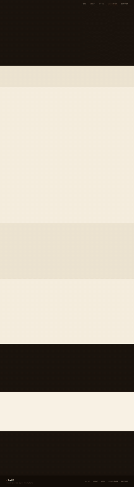 |
| contact-let-s-talk | 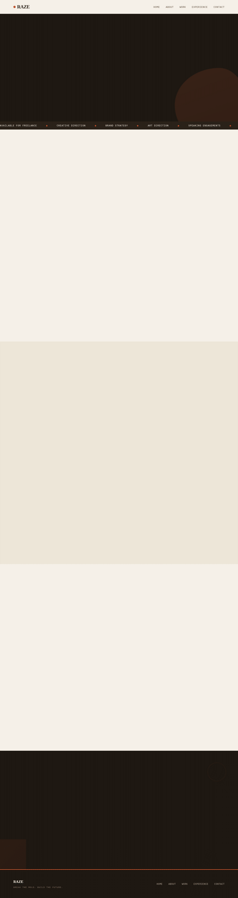 | 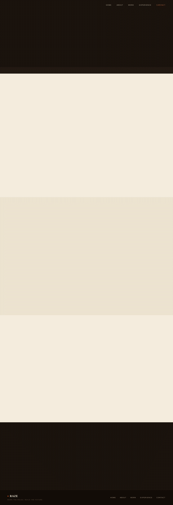 |
