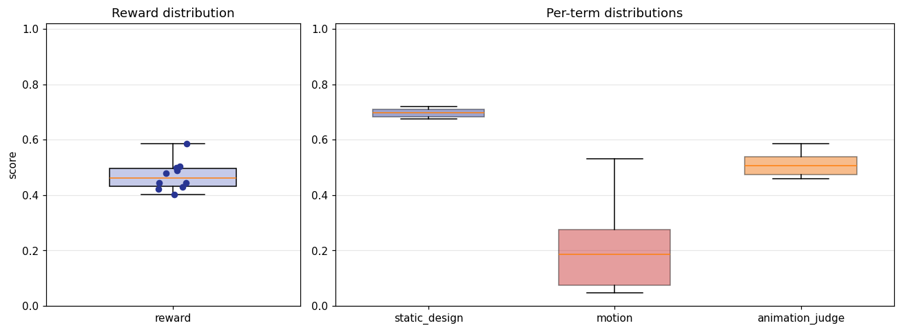
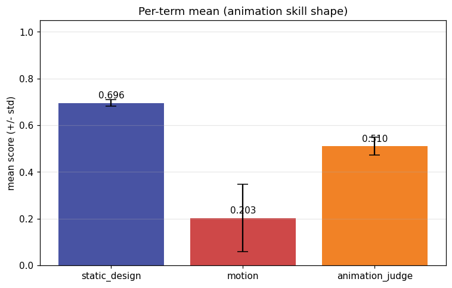
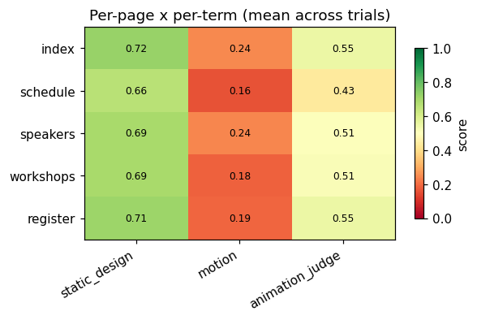
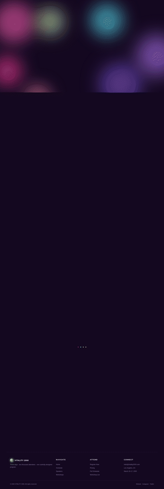
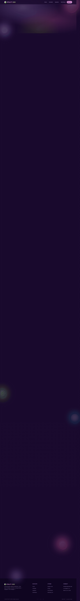
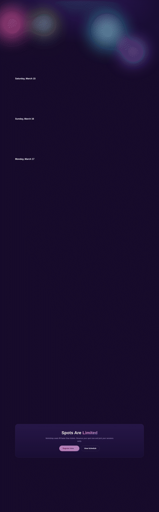
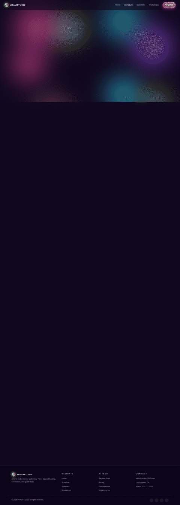
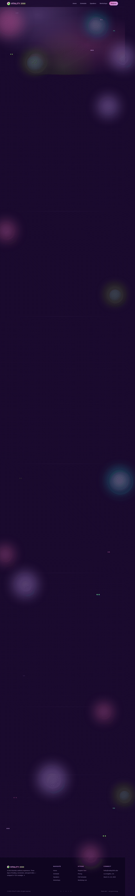
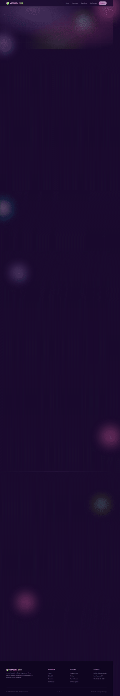

# Animation model-eval report — anim-007_event-conference_retro-y2k_playful-bounce

## 1. Provenance

| field | value |
|---|---|
| Task | anim-007_event-conference_retro-y2k_playful-bounce |
| Seed tuple | event-conference / retro-y2k / med / health-and-wellness-seekers / nostalgic-and-charming / playful-bounce |
| Archetype / Aesthetic / Complexity | event-conference / retro-y2k / med |
| Animation style | playful-bounce |
| Model | claude-opus-4-7 |
| Agent | claude-code |
| Executor | modal |
| Trials | 10 |
| Cost | $21.66 |
| Input tokens | 16968460 |
| Output tokens | 393611 |
| Wall-clock | 19.7 min |
| Filmstrip timestamps (ms) | 0, 200, 500, 900, 1400, 2000 |
| Date | 2026-06-01 |
| Repo commit | 88c4d89565f60dfbcdeef1eeb94d8ed65001b8a0 |

## 2. Per-trial scores

| trial | reward | static_design | motion | animation_judge |
|---|---|---|---|---|
| 5yiTdsB | 0.490 | 0.697 | 0.188 | 0.585 |
| JrriszZ | 0.479 | 0.703 | 0.243 | 0.490 |
| KVUNneN | 0.444 | 0.680 | 0.183 | 0.470 |
| Uu4Sbe2 | 0.421 | 0.710 | 0.048 | 0.505 |
| VzzZQKX | 0.428 | 0.714 | 0.061 | 0.510 |
| YpMuSpP | 0.443 | 0.696 | 0.094 | 0.540 |
| cJZpipu | 0.499 | 0.682 | 0.286 | 0.530 |
| e23yPA6 | 0.503 | 0.719 | 0.327 | 0.465 |
| ewTUjRN | 0.403 | 0.682 | 0.067 | 0.460 |
| nzaMy7e | 0.586 | 0.676 | 0.532 | 0.550 |
| **summary** | med 0.461 · 0.470±0.051 | med 0.697 · 0.696±0.015 | med 0.185 · 0.203±0.144 | med 0.508 · 0.510±0.039 |

## 3. Reward + per-term distributions

## 4. Per-term means

## 5. Per-page × per-term heatmap

## 6. Worst per metric (reference vs candidate)

**static_design** — worst page `schedule` (trial `nzaMy7e`, score 0.618)

| reference | candidate |
|---|---|
|  |  |

**motion** — worst page `workshops` (trial `VzzZQKX`, score 0.015)

| reference | candidate |
|---|---|
|  |  |

**animation_judge** — worst page `schedule` (trial `ewTUjRN`, score 0.300)

| reference | candidate |
|---|---|
|  |  |

## 7. Best-overall attempt vs reference (all pages)

Best-overall trial `nzaMy7e` (reward 0.586).

| page | reference | candidate |
|---|---|---|
| index |  |  |
| schedule |  |  |
| speakers |  |  |
| workshops |  |  |
| register |  |  |
