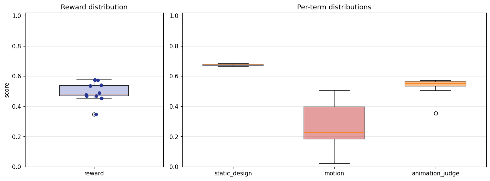
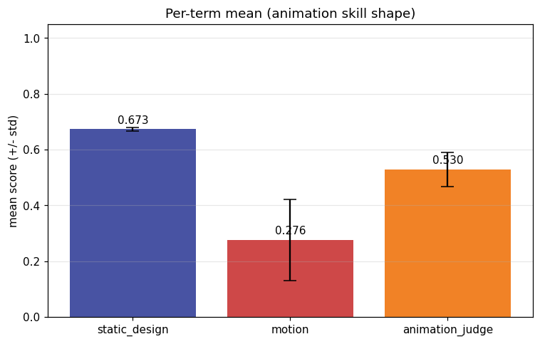
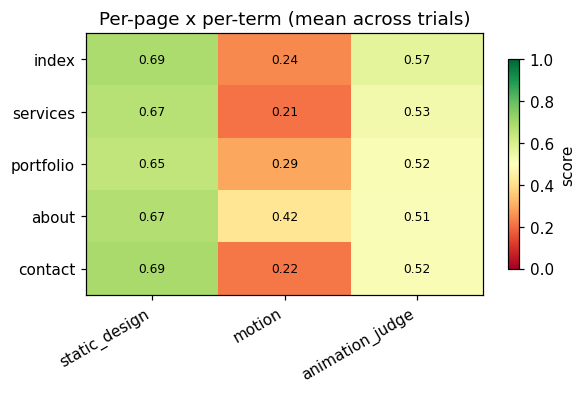
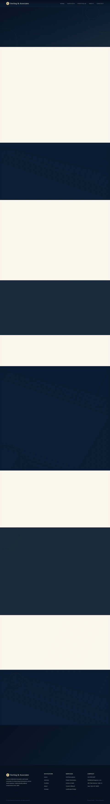
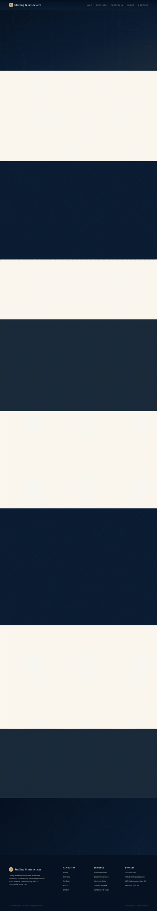
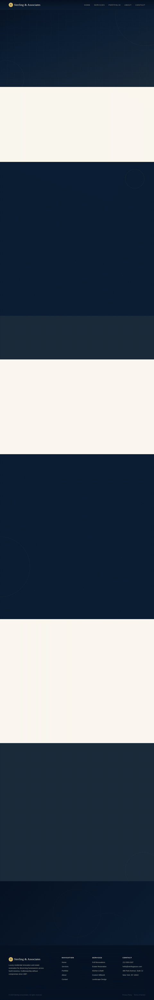
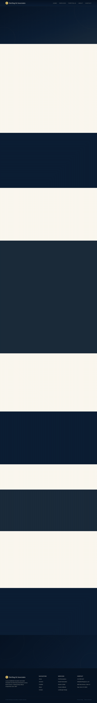
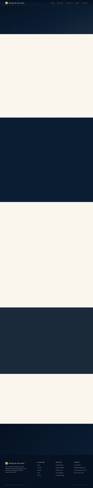

# Animation model-eval report — anim-008_local-service_luxury-serif_elegant-reveal

## 1. Provenance

| field | value |
|---|---|
| Task | anim-008_local-service_luxury-serif_elegant-reveal |
| Seed tuple | local-service / luxury-serif / high / north-american-consumers / confident-and-bold / elegant-reveal |
| Archetype / Aesthetic / Complexity | local-service / luxury-serif / high |
| Animation style | elegant-reveal |
| Model | claude-opus-4-7 |
| Agent | claude-code |
| Executor | modal |
| Trials | 10 |
| Cost | $22.76 |
| Input tokens | 19874766 |
| Output tokens | 377752 |
| Wall-clock | 20.4 min |
| Filmstrip timestamps (ms) | 0, 200, 500, 900, 1400, 2000 |
| Date | 2026-06-01 |
| Repo commit | 88c4d89565f60dfbcdeef1eeb94d8ed65001b8a0 |

## 2. Per-trial scores

| trial | reward | static_design | motion | animation_judge |
|---|---|---|---|---|
| 8AgNqJQ | 0.470 | 0.674 | 0.187 | 0.550 |
| D5M8Auq | 0.536 | 0.679 | 0.399 | 0.530 |
| Dqbfsaj | 0.470 | 0.679 | 0.161 | 0.570 |
| HhKF2Dc | 0.477 | 0.674 | 0.211 | 0.545 |
| MdvNhrY | 0.488 | 0.672 | 0.242 | 0.550 |
| TQLJSmM | 0.540 | 0.663 | 0.388 | 0.570 |
| UJEQjzT | 0.346 | 0.662 | 0.022 | 0.355 |
| X4wUjCA | 0.573 | 0.685 | 0.465 | 0.570 |
| bzYKvpn | 0.576 | 0.668 | 0.504 | 0.555 |
| ggrgoTy | 0.454 | 0.674 | 0.183 | 0.505 |
| **summary** | med 0.482 · 0.493±0.065 | med 0.674 · 0.673±0.007 | med 0.227 · 0.276±0.147 | med 0.550 · 0.530±0.061 |

## 3. Reward + per-term distributions

## 4. Per-term means

## 5. Per-page × per-term heatmap

## 6. Worst per metric (reference vs candidate)

**static_design** — worst page `portfolio` (trial `ggrgoTy`, score 0.625)

| reference | candidate |
|---|---|
|  |  |

**motion** — worst page `services` (trial `UJEQjzT`, score 0.001)

| reference | candidate |
|---|---|
|  |  |

**animation_judge** — worst page `about` (trial `UJEQjzT`, score 0.275)

| reference | candidate |
|---|---|
|  |  |

## 7. Best-overall attempt vs reference (all pages)

Best-overall trial `bzYKvpn` (reward 0.576).

| page | reference | candidate |
|---|---|---|
| index |  |  |
| services |  |  |
| portfolio |  |  |
| about |  |  |
| contact |  |  |
