# Animation model-eval report — anim-009_docs-product_playful-rounded_kinetic-loop

## 1. Provenance

| field | value |
|---|---|
| Task | anim-009_docs-product_playful-rounded_kinetic-loop |
| Seed tuple | docs-product / playful-rounded / low / european-enterprises / calm-and-trustworthy / kinetic-loop |
| Archetype / Aesthetic / Complexity | docs-product / playful-rounded / low |
| Animation style | kinetic-loop |
| Model | claude-opus-4-7 |
| Agent | claude-code |
| Executor | modal |
| Trials | 10 |
| Cost | $24.67 |
| Input tokens | 20381971 |
| Output tokens | 428852 |
| Wall-clock | 20.5 min |
| Filmstrip timestamps (ms) | 0, 200, 500, 900, 1400, 2000 |
| Date | 2026-06-01 |
| Repo commit | 88c4d89565f60dfbcdeef1eeb94d8ed65001b8a0 |

## 2. Per-trial scores

| trial | reward | static_design | motion | animation_judge |
|---|---|---|---|---|
| 3AKTV9Z | 0.622 | 0.725 | 0.592 | 0.550 |
| CMLSD5p | 0.427 | 0.730 | 0.046 | 0.505 |
| HQc45mm | 0.482 | 0.705 | 0.251 | 0.490 |
| HXaJC3S | 0.599 | 0.714 | 0.514 | 0.570 |
| JJWfAMD | 0.378 | 0.719 | 0.024 | 0.390 |
| Jkqvqsq | 0.591 | 0.708 | 0.536 | 0.530 |
| LvgdA5g | 0.513 | 0.713 | 0.278 | 0.550 |
| Pq7pDtP | 0.569 | 0.719 | 0.438 | 0.550 |
| QYhN3WV | 0.406 | 0.733 | 0.016 | 0.470 |
| WWSCu47 | 0.606 | 0.708 | 0.560 | 0.550 |
| **summary** | med 0.541 · 0.519±0.087 | med 0.716 · 0.717±0.009 | med 0.358 · 0.325±0.222 | med 0.540 · 0.515±0.051 |

## 3. Reward + per-term distributions

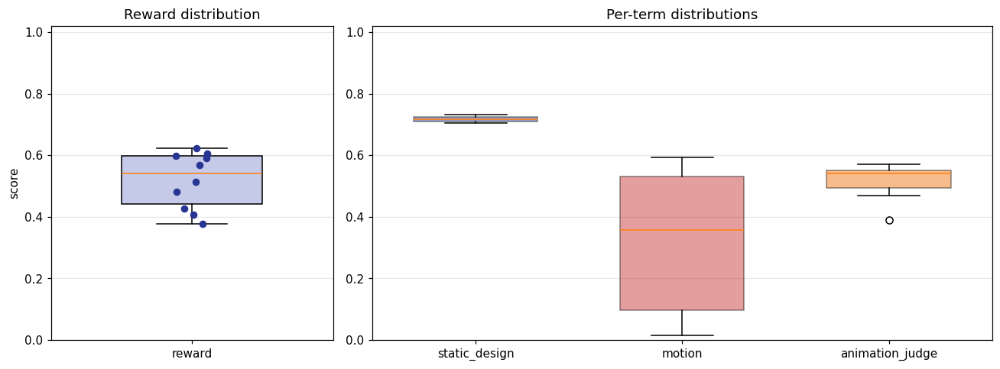

## 4. Per-term means

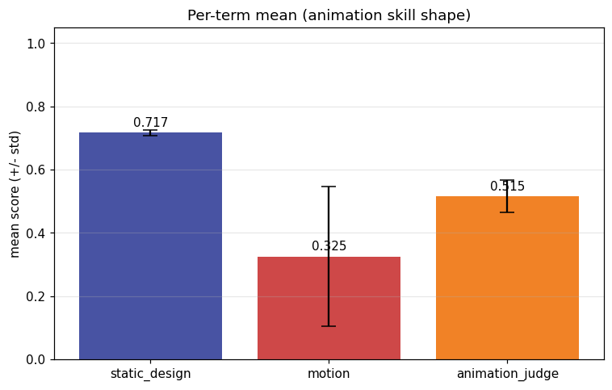

## 5. Per-page × per-term heatmap

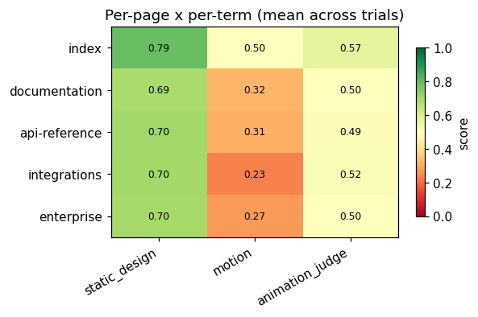

## 6. Worst per metric (reference vs candidate)

**static_design** — worst page `enterprise` (trial `HQc45mm`, score 0.662)

| reference | candidate |
|---|---|
|  | 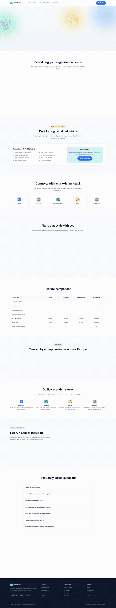 |

**motion** — worst page `api-reference` (trial `QYhN3WV`, score 0.001)

| reference | candidate |
|---|---|
| 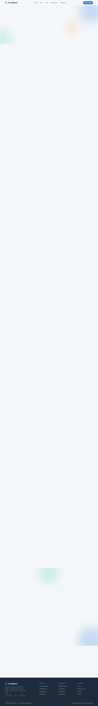 | 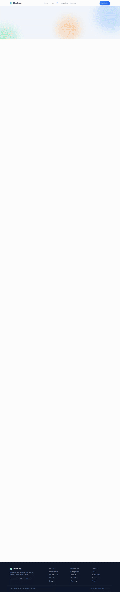 |

**animation_judge** — worst page `integrations` (trial `JJWfAMD`, score 0.325)

| reference | candidate |
|---|---|
|  | 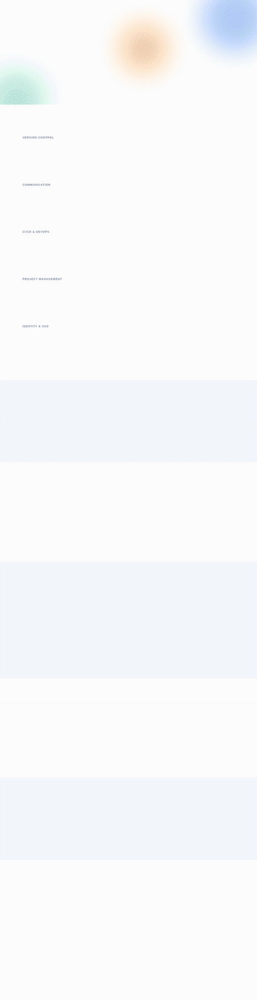 |

## 7. Best-overall attempt vs reference (all pages)

Best-overall trial `3AKTV9Z` (reward 0.622).

| page | reference | candidate |
|---|---|---|
| index | 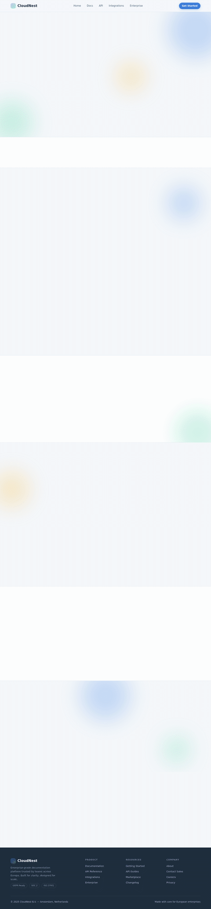 | 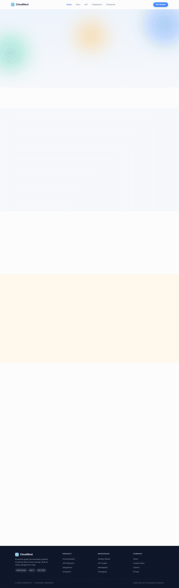 |
| documentation | 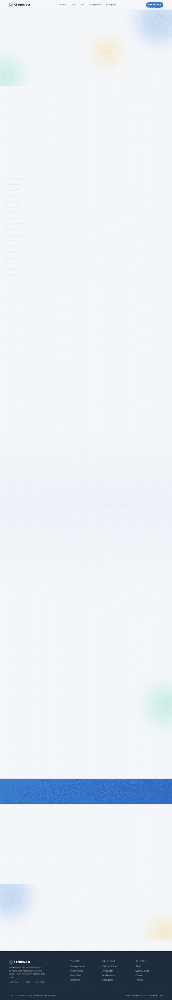 | 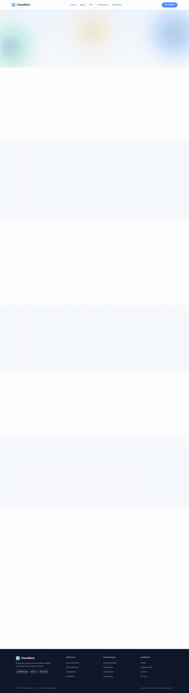 |
| api-reference |  | 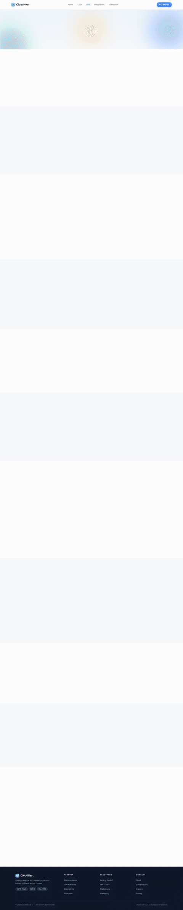 |
| integrations | 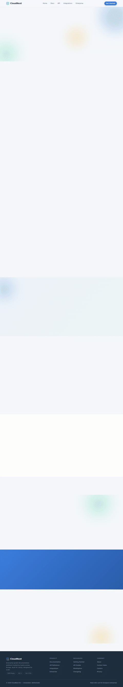 | 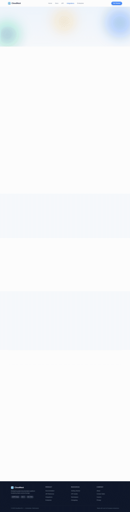 |
| enterprise | 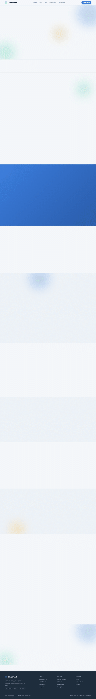 | 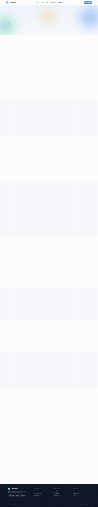 |
