# Model-eval report — 000_saas-landing_swiss-editorial_low

## 1. Provenance

| field | value |
|---|---|
| Task | 000_saas-landing_swiss-editorial_low |
| Seed tuple | saas-landing / swiss-editorial / low / north-american-consumers / confident-and-bold |
| Archetype / Aesthetic / Complexity | saas-landing / swiss-editorial / low |
| Model | claude-opus-4-7 |
| Agent | claude-code |
| Executor | modal |
| Trials | 10 |
| Cost | $15.76 |
| Wall-clock | 10.9 min |
| Date | 2026-05-31 |
| Repo commit | fd7c5311b6ae7fbe07c534662a9b313d1a6931f7 |

## 2. Per-trial scores

| trial | reward | structure | color | content | design_judge |
|---|---|---|---|---|---|
| 7WApF2c | 0.828 | 0.782 | 0.995 | 0.763 | 0.770 |
| 8vKLBzM | 0.837 | 0.768 | 0.983 | 0.816 | 0.780 |
| FP6zarg | 0.815 | 0.775 | 0.994 | 0.759 | 0.730 |
| H3Ak6j3 | 0.829 | 0.781 | 0.986 | 0.800 | 0.750 |
| Uh77tei | 0.827 | 0.789 | 0.986 | 0.732 | 0.800 |
| WRknU4K | 0.831 | 0.768 | 0.986 | 0.816 | 0.755 |
| gfEyC5b | 0.839 | 0.795 | 0.996 | 0.797 | 0.770 |
| jsi8XjM | 0.822 | 0.788 | 0.982 | 0.758 | 0.760 |
| ompWS7g | 0.824 | 0.786 | 0.995 | 0.735 | 0.780 |
| rEwYoKQ | 0.825 | 0.776 | 0.996 | 0.774 | 0.755 |
| **summary** | med 0.827 · 0.828±0.007 | med 0.782 · 0.781±0.008 | med 0.990 · 0.990±0.005 | med 0.769 · 0.775±0.029 | med 0.765 · 0.765±0.018 |

## 3. Reward + per-term distributions

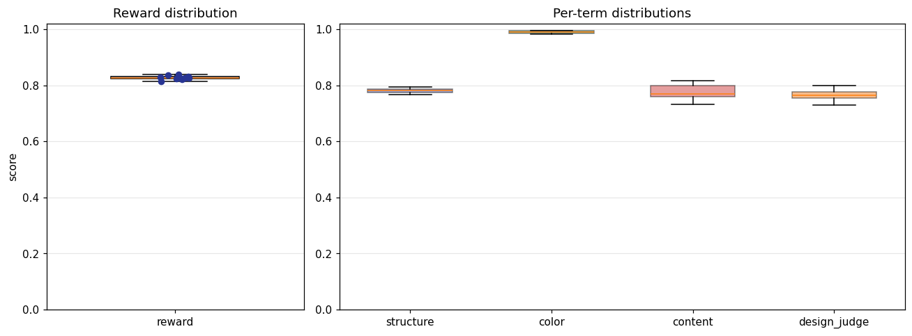

## 4. Per-term means

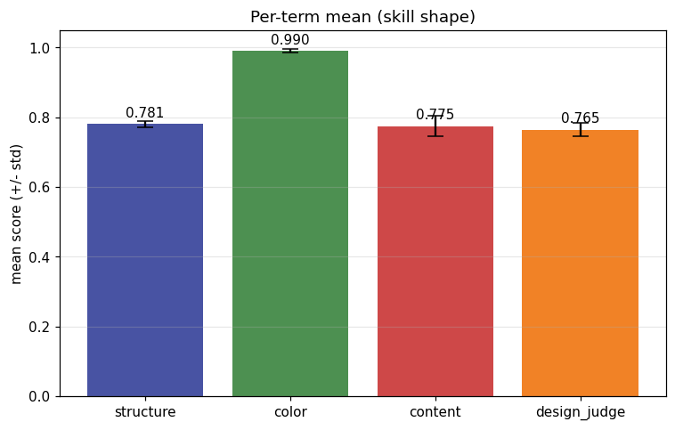

## 5. Per-page × per-term heatmap

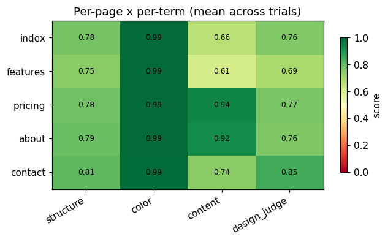

## 6. Worst per metric (reference vs candidate)

**structure** — worst page `features` (trial `8vKLBzM`, score 0.734)

| reference | candidate |
|---|---|
|  | 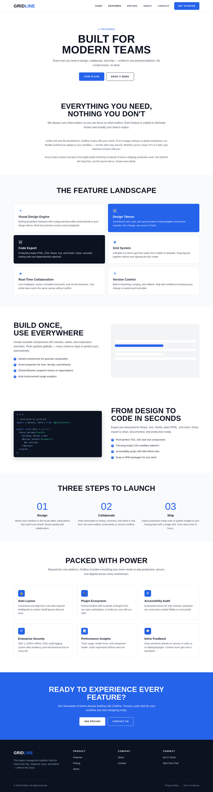 |

**color** — worst page `contact` (trial `8vKLBzM`, score 0.978)

| reference | candidate |
|---|---|
|  | 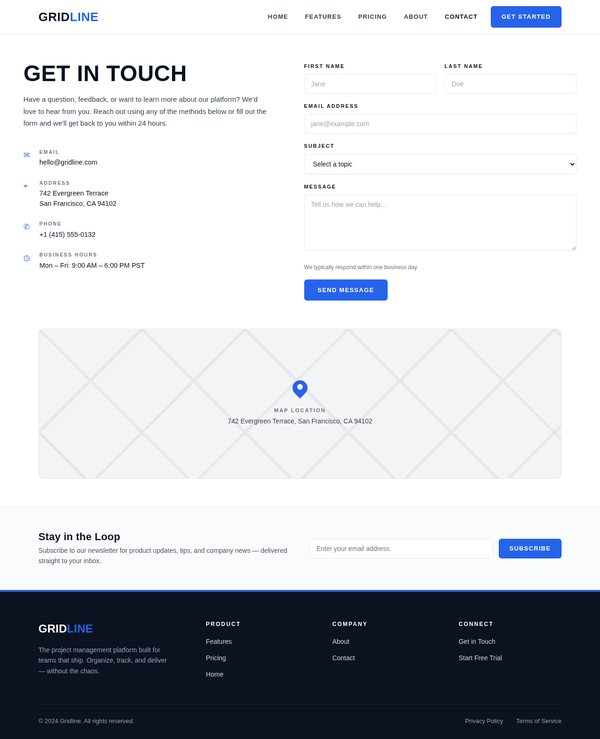 |

**content** — worst page `index` (trial `Uh77tei`, score 0.417)

| reference | candidate |
|---|---|
| 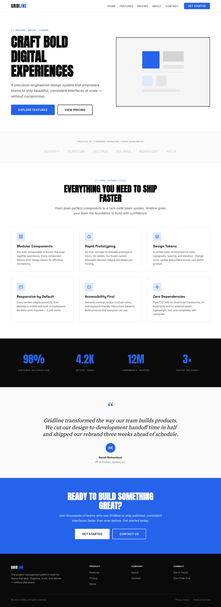 | 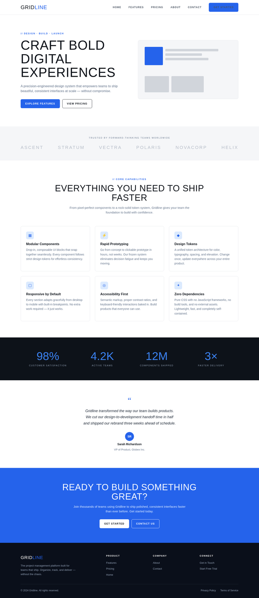 |

**design_judge** — worst page `features` (trial `rEwYoKQ`, score 0.650)

| reference | candidate |
|---|---|
| 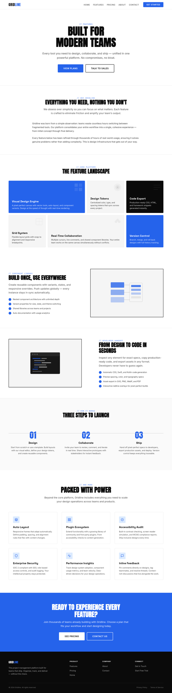 | 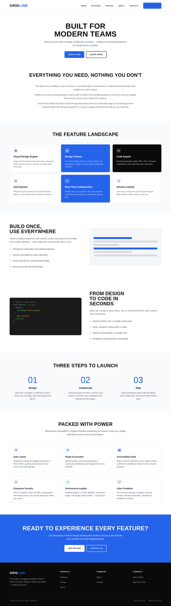 |

## 7. Best-overall attempt vs reference (all pages)

Best-overall trial `gfEyC5b` (reward 0.839).

| page | reference | candidate |
|---|---|---|
| index |  | 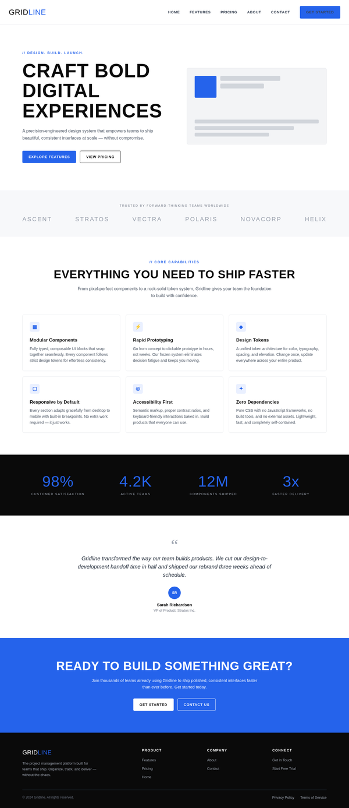 |
| features |  | 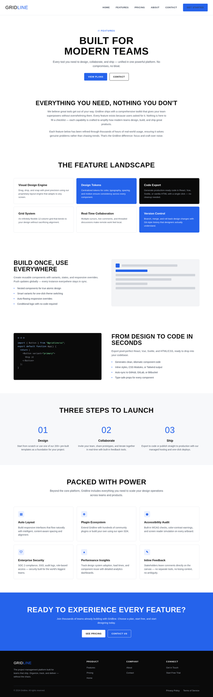 |
| pricing | 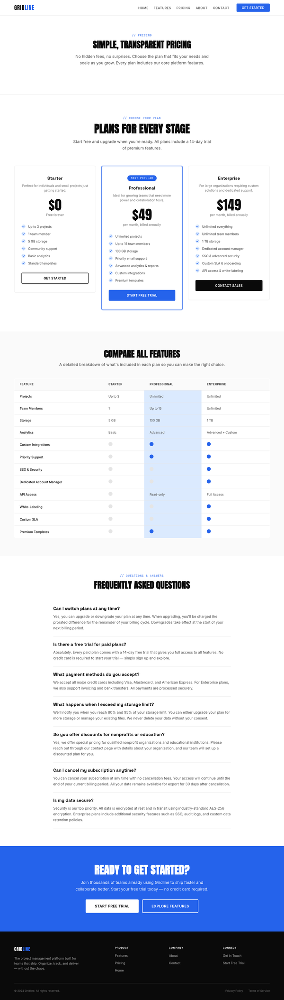 | 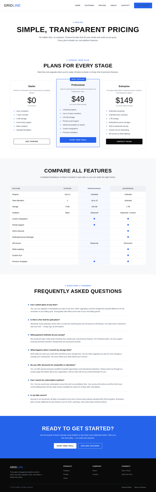 |
| about | 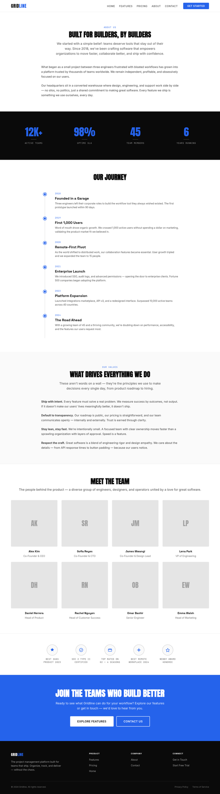 | 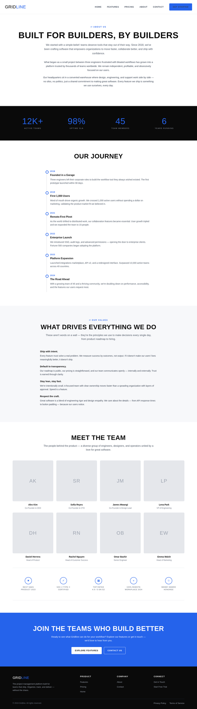 |
| contact | 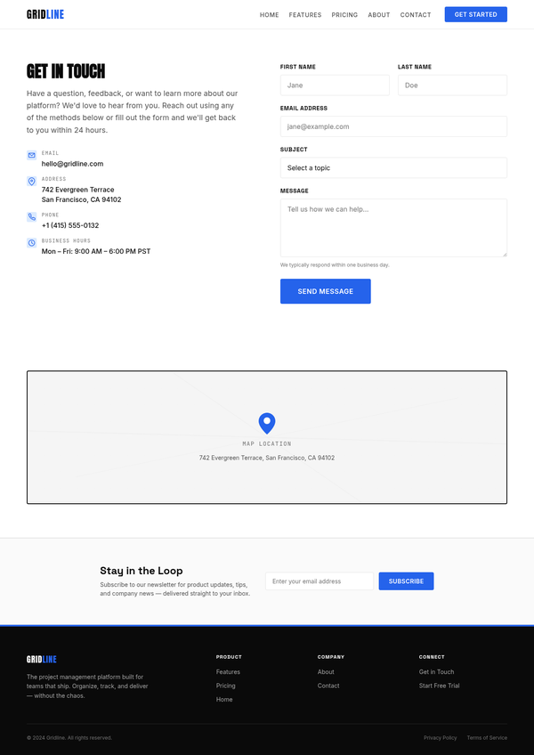 | 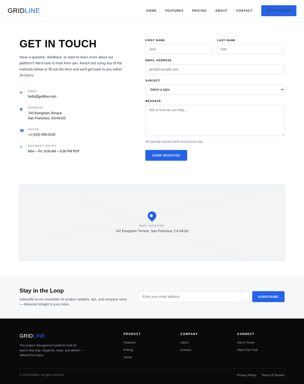 |
