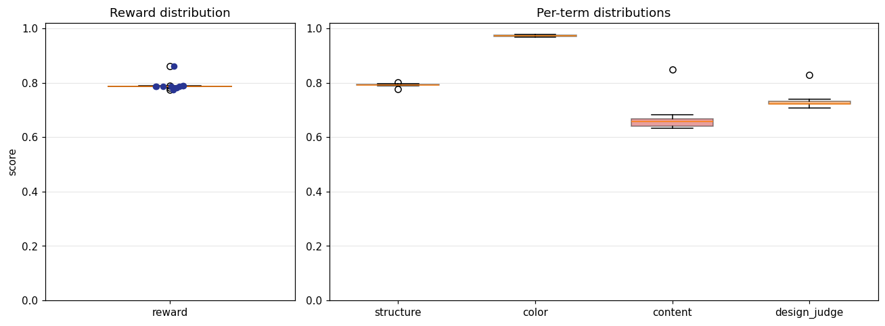
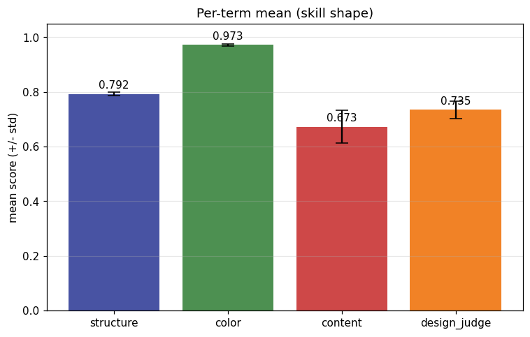
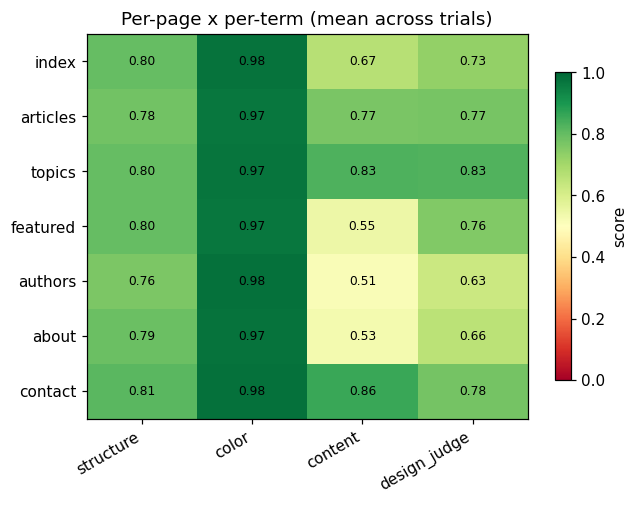
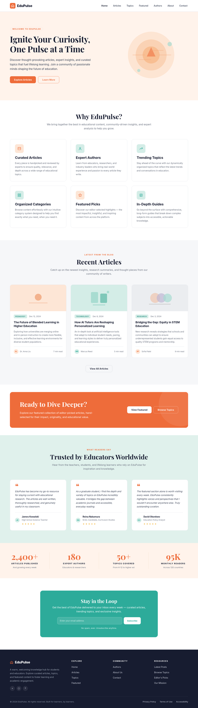
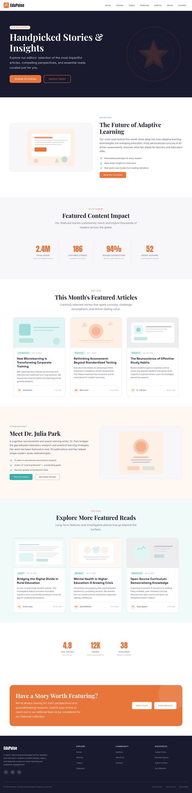

# Model-eval report — 004_editorial-blog_corporate-flat_med

## 1. Provenance

| field | value |
|---|---|
| Task | 004_editorial-blog_corporate-flat_med |
| Seed tuple | editorial-blog / corporate-flat / med / students-and-educators / warm-and-welcoming |
| Archetype / Aesthetic / Complexity | editorial-blog / corporate-flat / med |
| Model | claude-opus-4-7 |
| Agent | claude-code |
| Executor | modal |
| Trials | 10 |
| Cost | $29.29 |
| Wall-clock | 23.4 min |
| Date | 2026-05-31 |
| Repo commit | fd7c5311b6ae7fbe07c534662a9b313d1a6931f7 |

## 2. Per-trial scores

| trial | reward | structure | color | content | design_judge |
|---|---|---|---|---|---|
| 5gDVnG7 | 0.862 | 0.794 | 0.978 | 0.849 | 0.829 |
| DroJgBS | 0.787 | 0.776 | 0.968 | 0.682 | 0.721 |
| EcRwc7R | 0.787 | 0.802 | 0.978 | 0.648 | 0.721 |
| HMwojm2 | 0.787 | 0.796 | 0.969 | 0.652 | 0.732 |
| LyHJTwm | 0.786 | 0.792 | 0.971 | 0.663 | 0.718 |
| ZTWNYYr | 0.790 | 0.793 | 0.968 | 0.668 | 0.732 |
| fp5PyXL | 0.775 | 0.788 | 0.973 | 0.634 | 0.707 |
| hscGHTb | 0.780 | 0.792 | 0.972 | 0.637 | 0.721 |
| idW2QXR | 0.787 | 0.795 | 0.977 | 0.637 | 0.739 |
| y2bm8AT | 0.788 | 0.791 | 0.974 | 0.661 | 0.725 |
| **summary** | med 0.787 · 0.793±0.023 | med 0.793 · 0.792±0.006 | med 0.972 · 0.973±0.004 | med 0.656 · 0.673±0.060 | med 0.723 · 0.735±0.032 |

## 3. Reward + per-term distributions

## 4. Per-term means

## 5. Per-page × per-term heatmap

## 6. Worst per metric (reference vs candidate)

**structure** — worst page `authors` (trial `DroJgBS`, score 0.739)

| reference | candidate |
|---|---|
|  |  |

**color** — worst page `featured` (trial `HMwojm2`, score 0.945)

| reference | candidate |
|---|---|
|  |  |

**content** — worst page `authors` (trial `idW2QXR`, score 0.431)

| reference | candidate |
|---|---|
|  |  |

**design_judge** — worst page `authors` (trial `hscGHTb`, score 0.575)

| reference | candidate |
|---|---|
|  |  |

## 7. Best-overall attempt vs reference (all pages)

Best-overall trial `5gDVnG7` (reward 0.862).

| page | reference | candidate |
|---|---|---|
| index |  |  |
| articles |  |  |
| topics |  |  |
| featured |  |  |
| authors |  |  |
| about |  |  |
| contact |  |  |
