# Model-eval report — 007_event-conference_retro-y2k_med

## 1. Provenance

| field | value |
|---|---|
| Task | 007_event-conference_retro-y2k_med |
| Seed tuple | event-conference / retro-y2k / med / health-and-wellness-seekers / nostalgic-and-charming |
| Archetype / Aesthetic / Complexity | event-conference / retro-y2k / med |
| Model | claude-opus-4-7 |
| Agent | claude-code |
| Executor | modal |
| Trials | 10 |
| Cost | $27.64 |
| Wall-clock | 28.0 min |
| Date | 2026-05-31 |
| Repo commit | fd7c5311b6ae7fbe07c534662a9b313d1a6931f7 |

## 2. Per-trial scores

| trial | reward | structure | color | content | design_judge |
|---|---|---|---|---|---|
| 3V9n78X | 0.722 | 0.753 | 0.940 | 0.570 | 0.625 |
| 7QEnUbM | 0.703 | 0.750 | 0.924 | 0.571 | 0.568 |
| LJsMZ6k | 0.727 | 0.768 | 0.937 | 0.583 | 0.621 |
| LSJzH7J | 0.726 | 0.783 | 0.940 | 0.588 | 0.593 |
| YqHqutX | 0.727 | 0.750 | 0.948 | 0.561 | 0.650 |
| ktrPUUd | 0.836 | 0.759 | 0.960 | 0.841 | 0.786 |
| oJKb9J3 | 0.722 | 0.759 | 0.948 | 0.558 | 0.621 |
| ose6NGg | 0.729 | 0.778 | 0.948 | 0.557 | 0.632 |
| tqJLuFh | 0.725 | 0.744 | 0.933 | 0.585 | 0.639 |
| v7trsiR | 0.731 | 0.747 | 0.935 | 0.583 | 0.657 |
| **summary** | med 0.727 · 0.735±0.035 | med 0.756 · 0.759±0.012 | med 0.940 · 0.941±0.010 | med 0.577 · 0.600±0.081 | med 0.629 · 0.639±0.055 |

## 3. Reward + per-term distributions

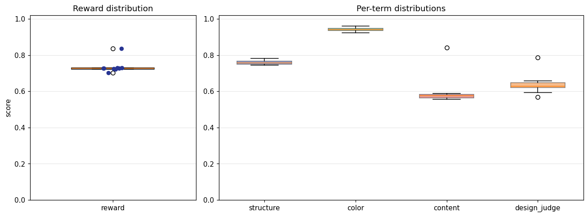

## 4. Per-term means

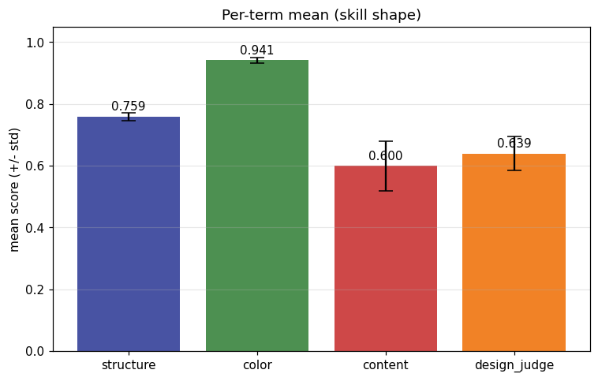

## 5. Per-page × per-term heatmap

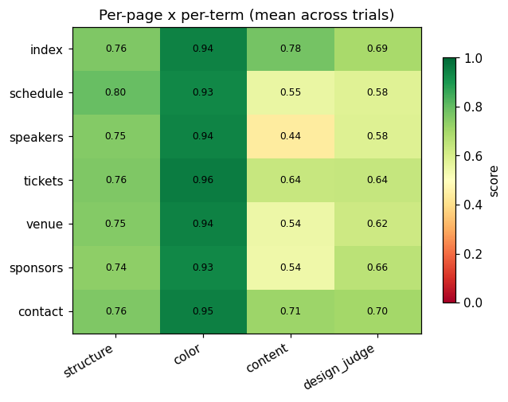

## 6. Worst per metric (reference vs candidate)

**structure** — worst page `sponsors` (trial `v7trsiR`, score 0.720)

| reference | candidate |
|---|---|
|  | 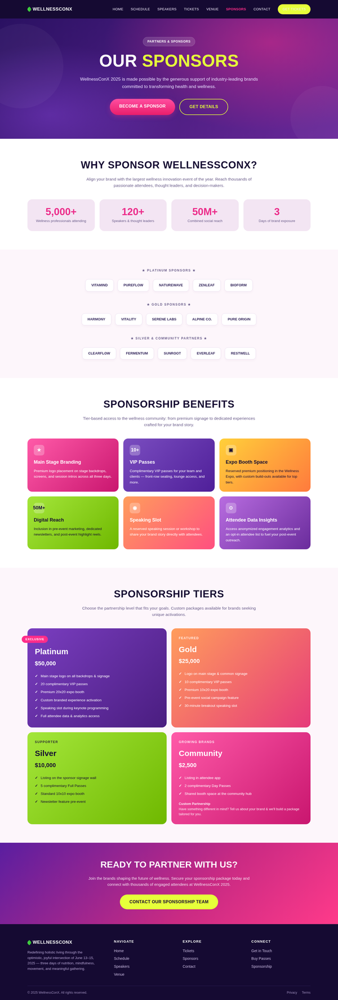 |

**color** — worst page `sponsors` (trial `7QEnUbM`, score 0.905)

| reference | candidate |
|---|---|
|  | 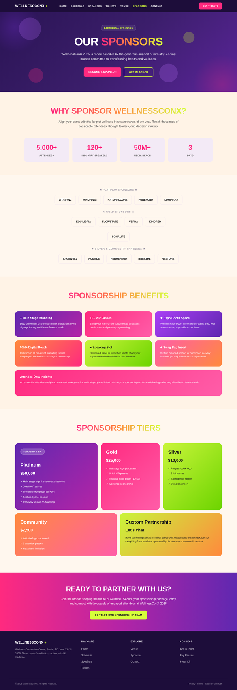 |

**content** — worst page `speakers` (trial `YqHqutX`, score 0.363)

| reference | candidate |
|---|---|
|  | 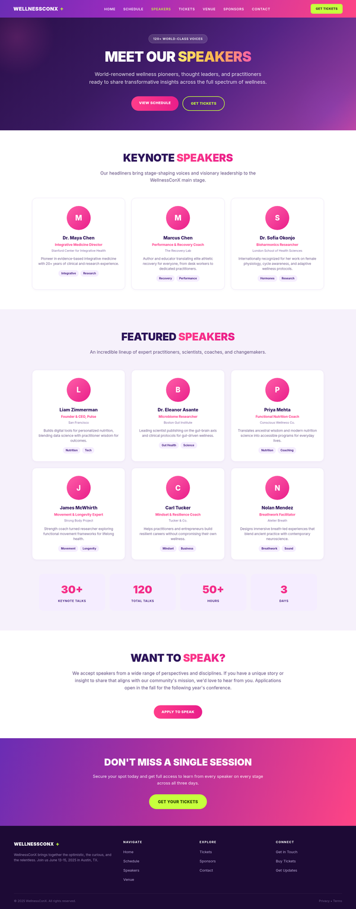 |

**design_judge** — worst page `speakers` (trial `7QEnUbM`, score 0.500)

| reference | candidate |
|---|---|
|  | 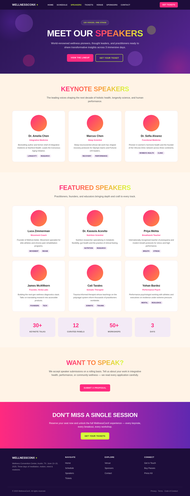 |

## 7. Best-overall attempt vs reference (all pages)

Best-overall trial `ktrPUUd` (reward 0.836).

| page | reference | candidate |
|---|---|---|
| index | 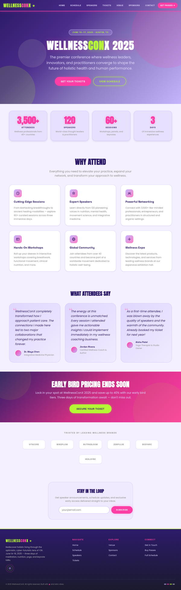 | 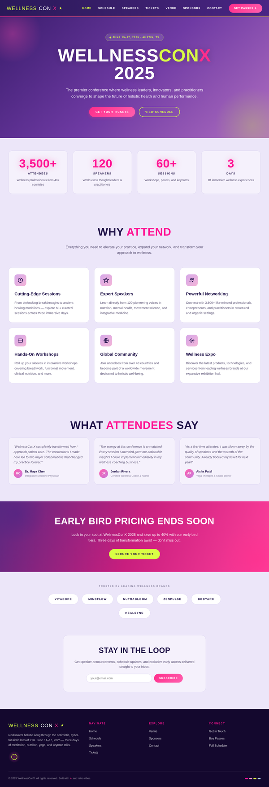 |
| schedule | 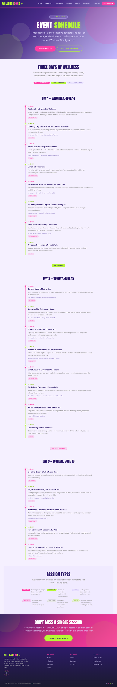 | 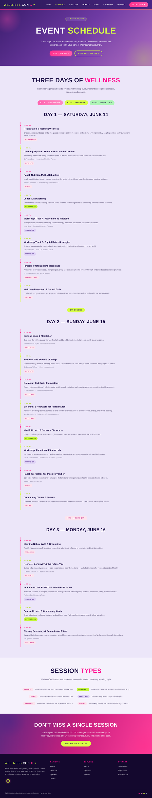 |
| speakers | 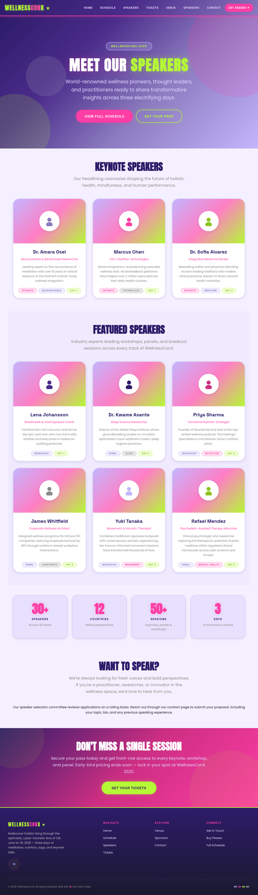 | 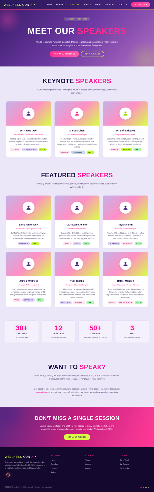 |
| tickets | 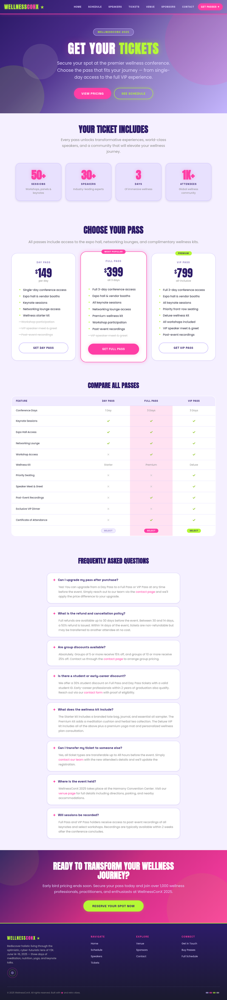 | 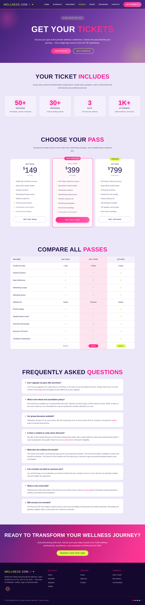 |
| venue | 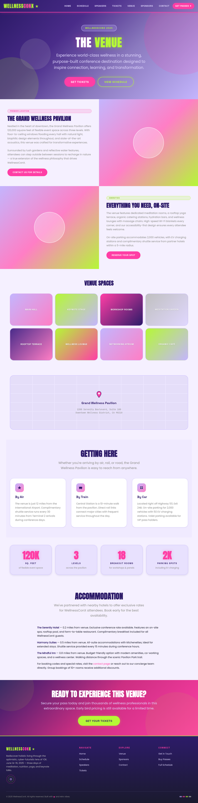 | 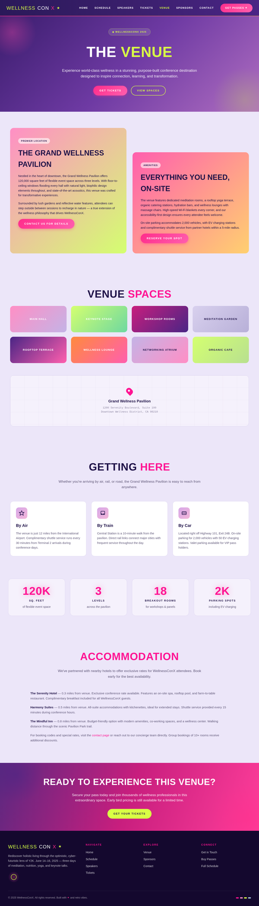 |
| sponsors | 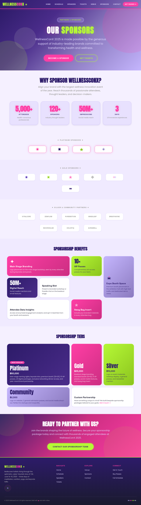 | 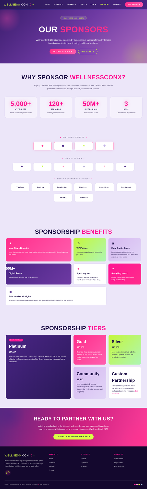 |
| contact |  | 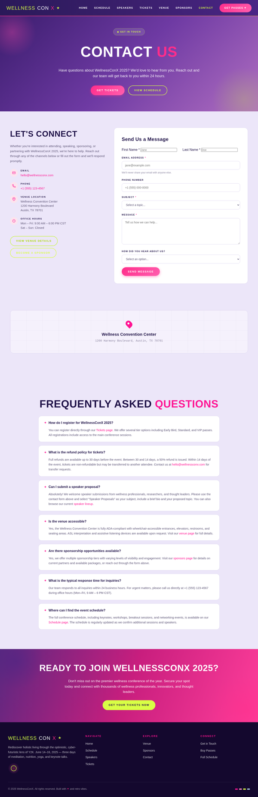 |
