# Model-eval report — 011_ecommerce-store_brutalist_high

## 1. Provenance

| field | value |
|---|---|
| Task | 011_ecommerce-store_brutalist_high |
| Seed tuple | ecommerce-store / brutalist / high / local-community / premium-and-understated |
| Archetype / Aesthetic / Complexity | ecommerce-store / brutalist / high |
| Model | claude-opus-4-7 |
| Agent | claude-code |
| Executor | modal |
| Trials | 10 |
| Cost | $36.10 |
| Wall-clock | 21.1 min |
| Date | 2026-06-01 |
| Repo commit | fd7c5311b6ae7fbe07c534662a9b313d1a6931f7 |

## 2. Per-trial scores

| trial | reward | structure | color | content | design_judge |
|---|---|---|---|---|---|
| 47zEvfx | 0.660 | 0.458 | 0.959 | 0.544 | 0.677 |
| 6RgEQpD | 0.673 | 0.498 | 0.967 | 0.543 | 0.682 |
| M86CyR8 | 0.649 | 0.455 | 0.957 | 0.491 | 0.693 |
| UDXH7VK | 0.645 | 0.475 | 0.955 | 0.484 | 0.665 |
| WtujNSA | 0.662 | 0.472 | 0.973 | 0.535 | 0.667 |
| ao9DK5V | 0.663 | 0.474 | 0.967 | 0.562 | 0.647 |
| iFEU45r | 0.679 | 0.487 | 0.963 | 0.573 | 0.693 |
| jHKbtVS | 0.656 | 0.478 | 0.957 | 0.501 | 0.690 |
| xLNpcQp | 0.657 | 0.464 | 0.963 | 0.519 | 0.680 |
| yxemSMH | 0.661 | 0.488 | 0.965 | 0.526 | 0.665 |
| **summary** | med 0.660 · 0.660±0.009 | med 0.475 · 0.475±0.013 | med 0.963 · 0.963±0.005 | med 0.531 · 0.528±0.028 | med 0.679 · 0.676±0.014 |

## 3. Reward + per-term distributions

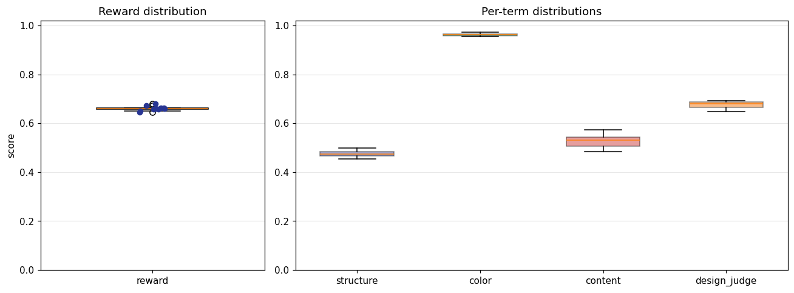

## 4. Per-term means

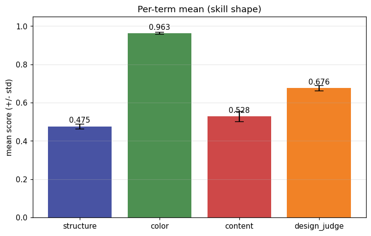

## 5. Per-page × per-term heatmap

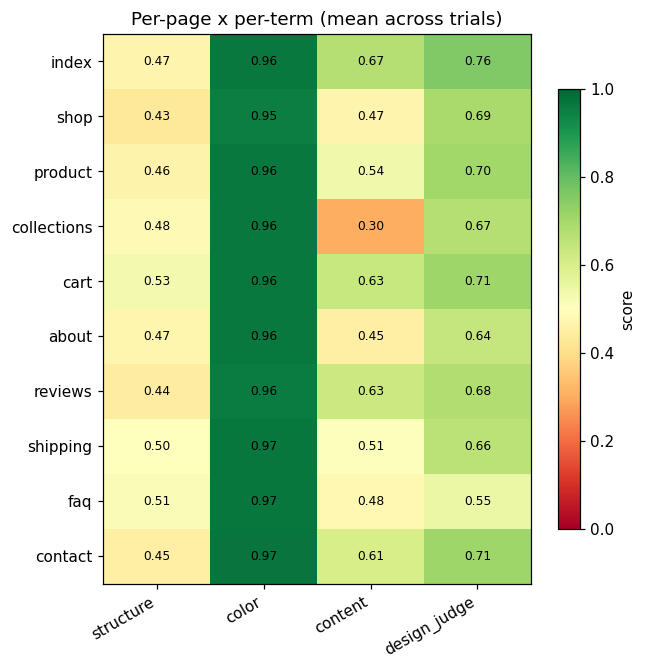

## 6. Worst per metric (reference vs candidate)

**structure** — worst page `product` (trial `47zEvfx`, score 0.378)

| reference | candidate |
|---|---|
| 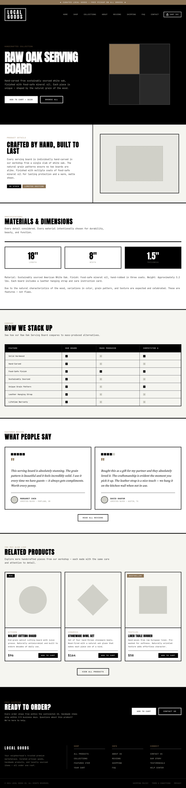 | 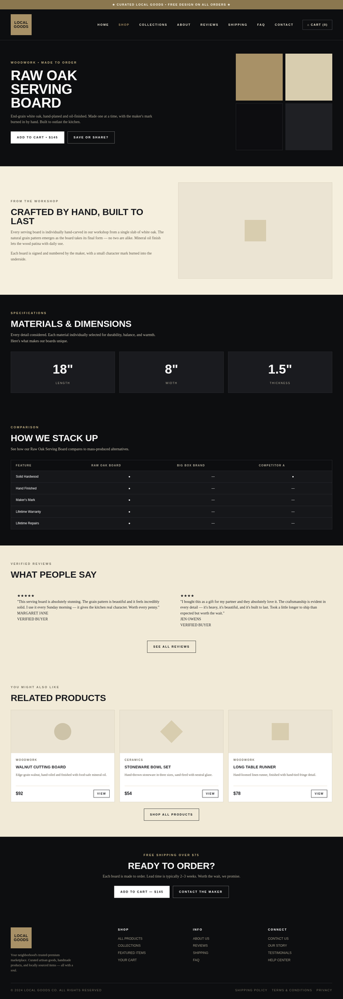 |

**color** — worst page `reviews` (trial `47zEvfx`, score 0.939)

| reference | candidate |
|---|---|
| 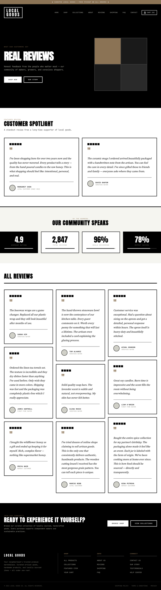 | 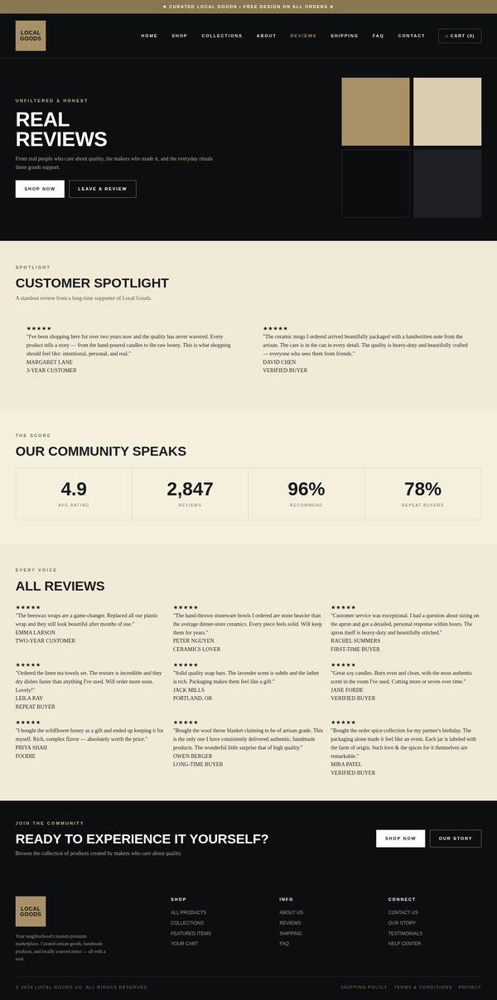 |

**content** — worst page `collections` (trial `47zEvfx`, score 0.272)

| reference | candidate |
|---|---|
|  | 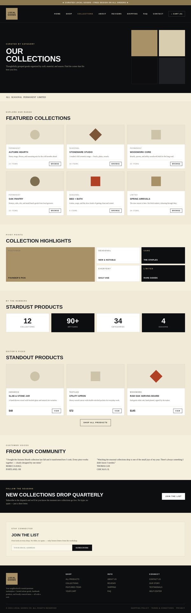 |

**design_judge** — worst page `faq` (trial `WtujNSA`, score 0.425)

| reference | candidate |
|---|---|
| 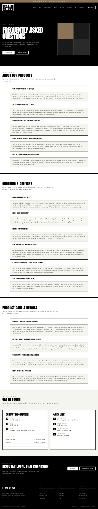 | 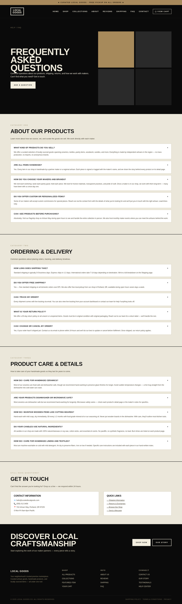 |

## 7. Best-overall attempt vs reference (all pages)

Best-overall trial `iFEU45r` (reward 0.679).

| page | reference | candidate |
|---|---|---|
| index | 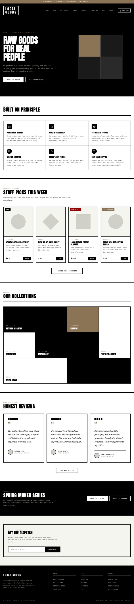 | 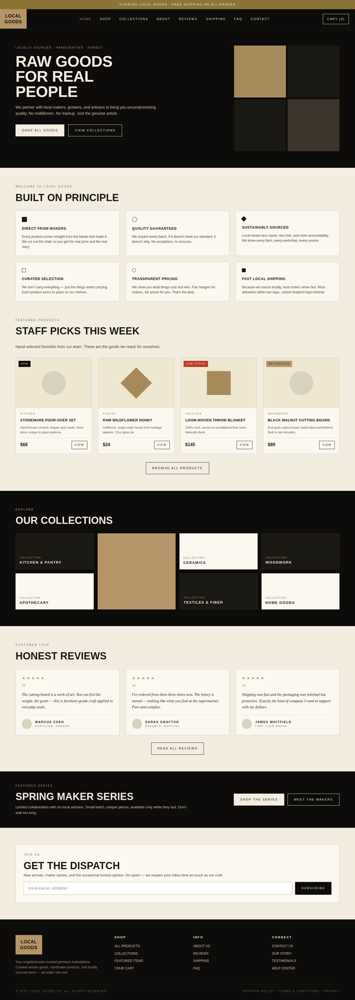 |
| shop | 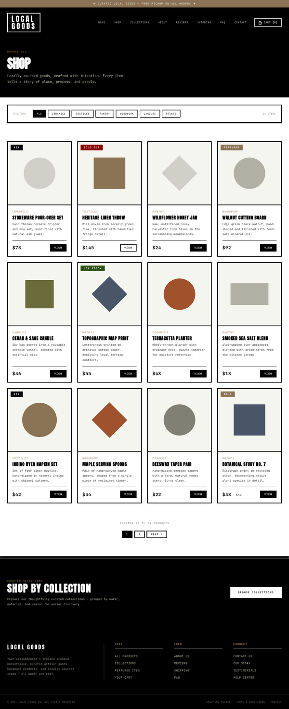 | 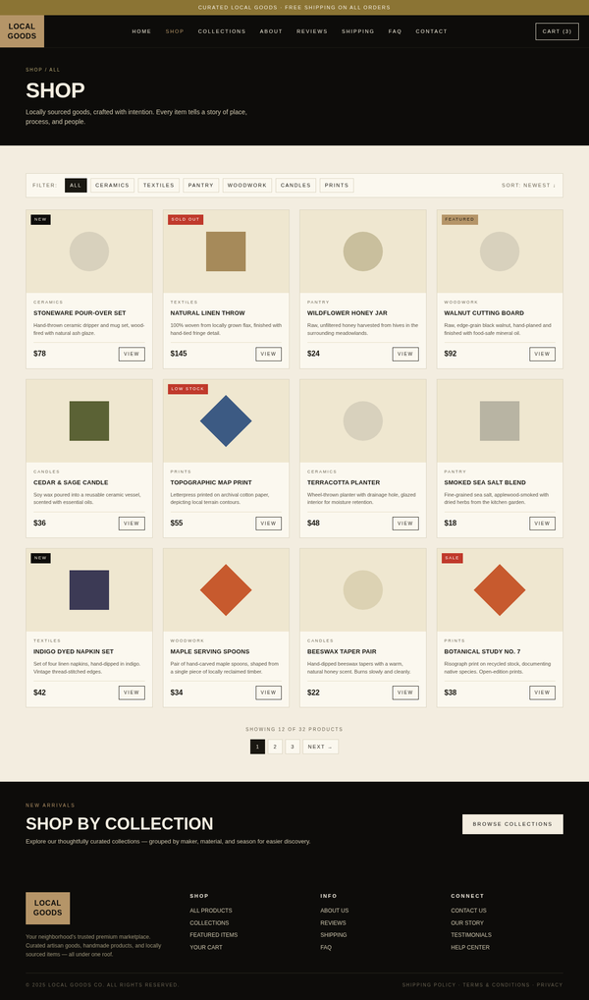 |
| product |  | 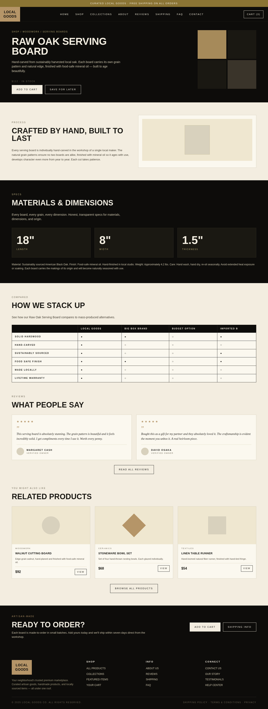 |
| collections | 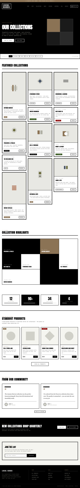 | 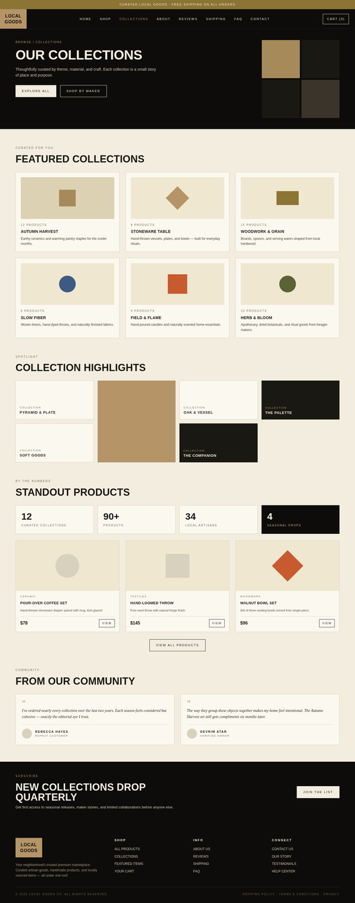 |
| cart | 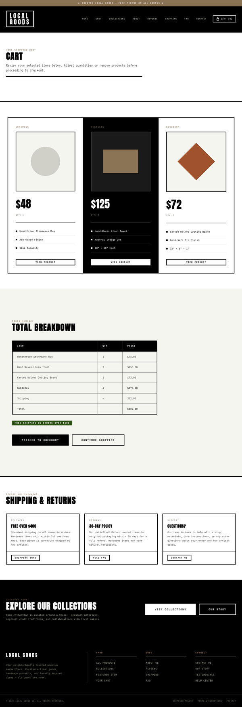 | 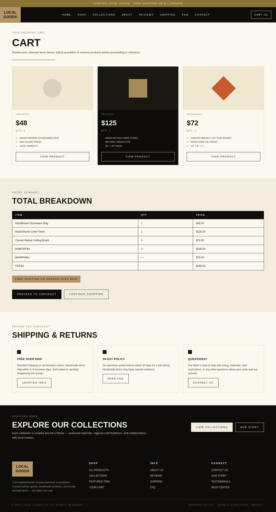 |
| about | 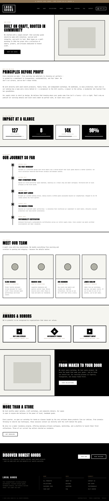 | 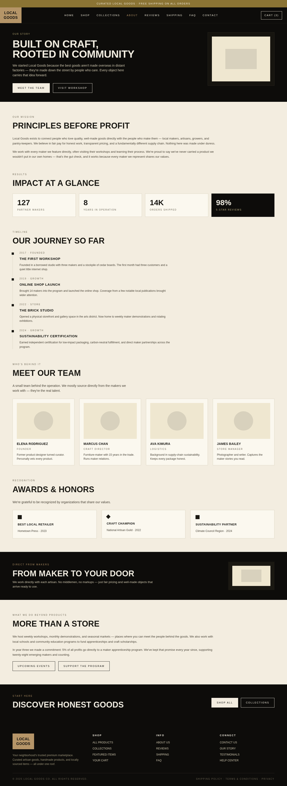 |
| reviews |  | 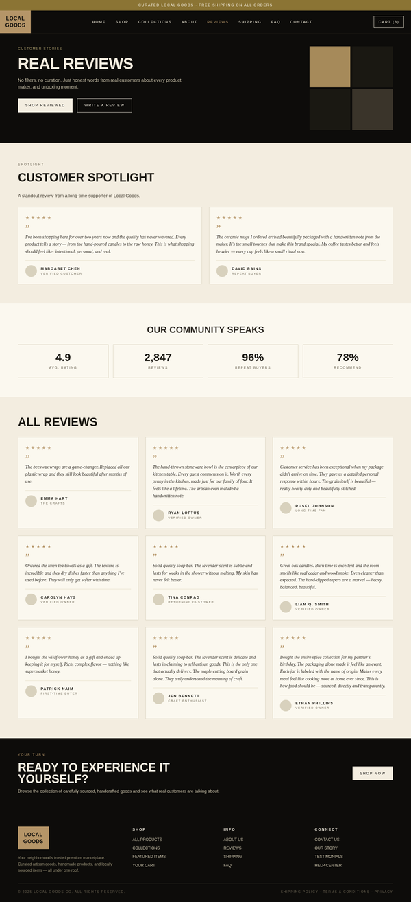 |
| shipping | 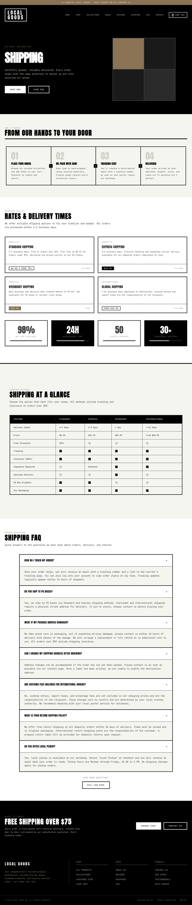 | 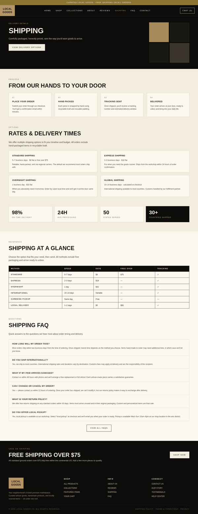 |
| faq |  | 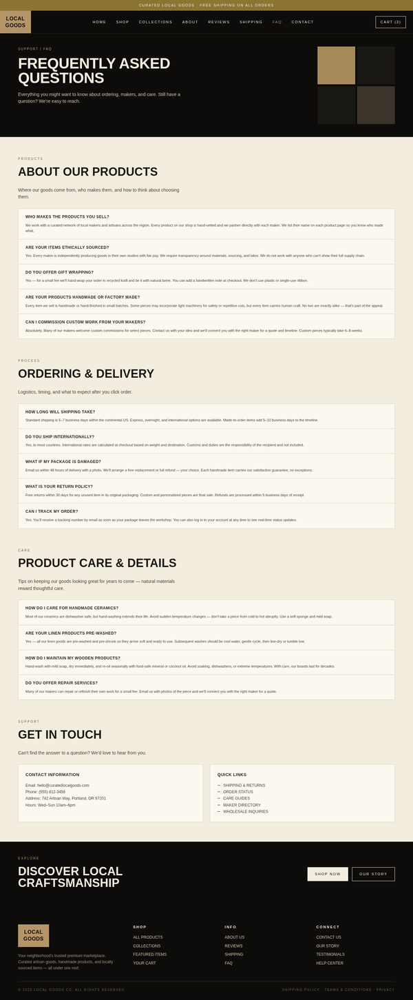 |
| contact | 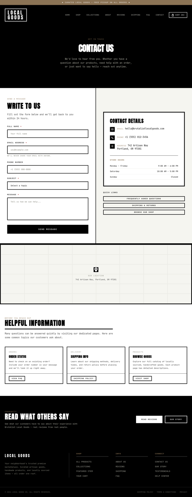 | 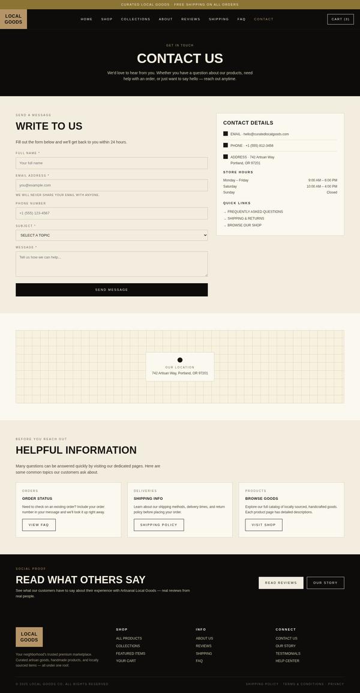 |
