# Model-eval report — 012_restaurant-hospitality_neo-brutalist_low

## 1. Provenance

| field | value |
|---|---|
| Task | 012_restaurant-hospitality_neo-brutalist_low |
| Seed tuple | restaurant-hospitality / neo-brutalist / low / students-and-educators / warm-and-welcoming |
| Archetype / Aesthetic / Complexity | restaurant-hospitality / neo-brutalist / low |
| Model | claude-opus-4-7 |
| Agent | claude-code |
| Executor | modal |
| Trials | 10 |
| Cost | $13.97 |
| Wall-clock | 11.1 min |
| Date | 2026-06-01 |
| Repo commit | fd7c5311b6ae7fbe07c534662a9b313d1a6931f7 |

## 2. Per-trial scores

| trial | reward | structure | color | content | design_judge |
|---|---|---|---|---|---|
| GaSq58z | 0.762 | 0.719 | 0.960 | 0.636 | 0.735 |
| KCpDEkL | 0.779 | 0.718 | 0.950 | 0.737 | 0.710 |
| YfRY3rU | 0.782 | 0.716 | 0.968 | 0.724 | 0.720 |
| ZJAFwSi | 0.782 | 0.731 | 0.969 | 0.714 | 0.715 |
| dqYb4au | 0.777 | 0.704 | 0.960 | 0.727 | 0.715 |
| eKKkQ9u | 0.752 | 0.715 | 0.962 | 0.640 | 0.690 |
| izQKYyG | 0.778 | 0.718 | 0.962 | 0.717 | 0.715 |
| knXCnZZ | 0.774 | 0.721 | 0.959 | 0.706 | 0.710 |
| nJ2oHuK | 0.749 | 0.726 | 0.957 | 0.610 | 0.705 |
| r58s8vF | 0.754 | 0.709 | 0.954 | 0.642 | 0.710 |
| **summary** | med 0.775 · 0.769±0.012 | med 0.718 · 0.718±0.007 | med 0.960 · 0.960±0.005 | med 0.710 · 0.685±0.045 | med 0.712 · 0.713±0.011 |

## 3. Reward + per-term distributions

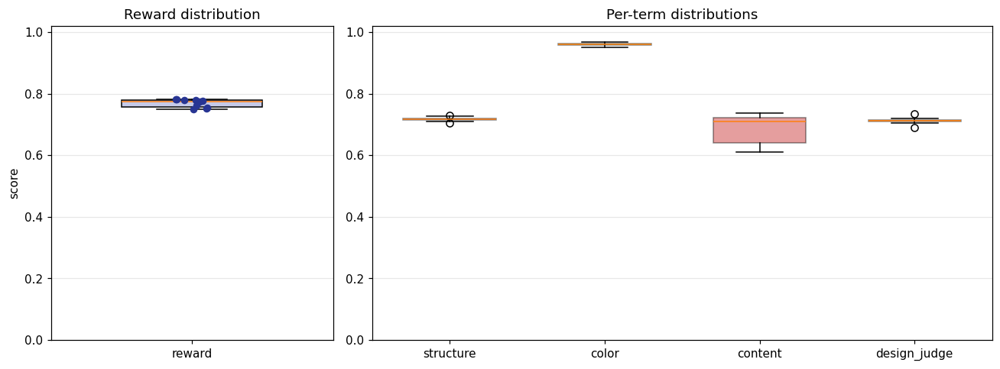

## 4. Per-term means

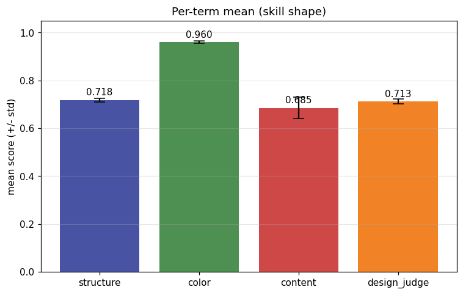

## 5. Per-page × per-term heatmap

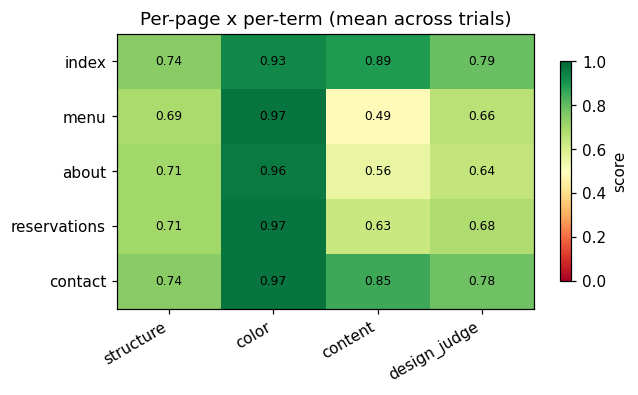

## 6. Worst per metric (reference vs candidate)

**structure** — worst page `menu` (trial `dqYb4au`, score 0.661)

| reference | candidate |
|---|---|
|  | 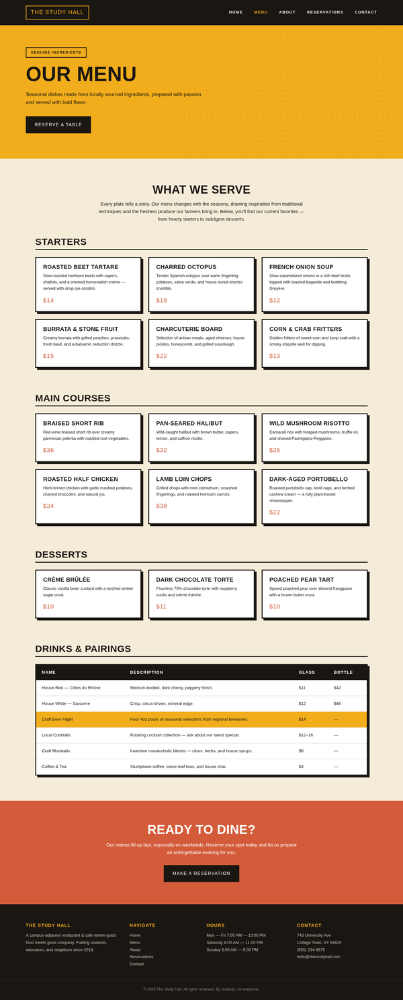 |

**color** — worst page `index` (trial `r58s8vF`, score 0.922)

| reference | candidate |
|---|---|
|  | 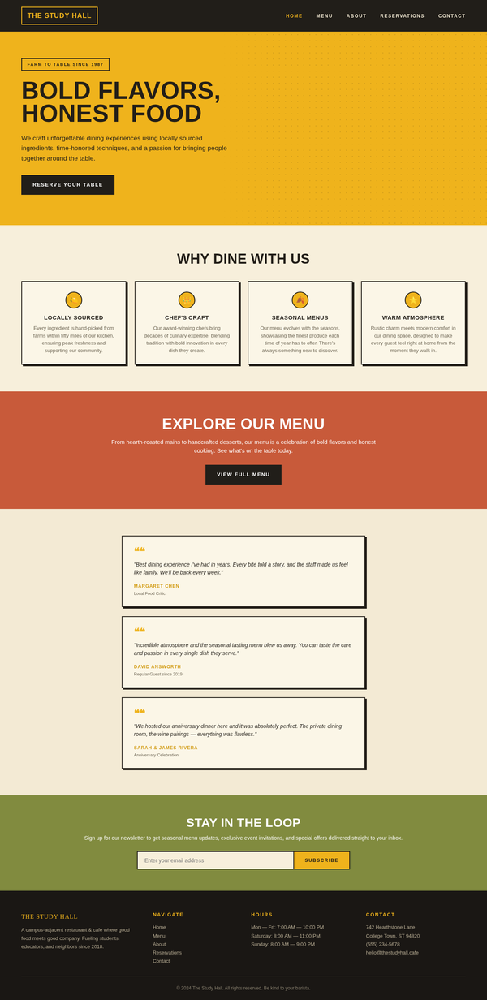 |

**content** — worst page `menu` (trial `eKKkQ9u`, score 0.400)

| reference | candidate |
|---|---|
| 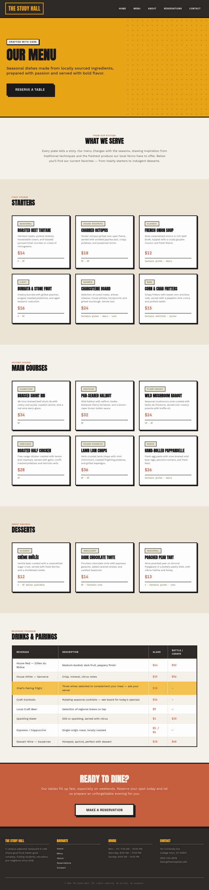 |  |

**design_judge** — worst page `menu` (trial `eKKkQ9u`, score 0.575)

| reference | candidate |
|---|---|
|  | 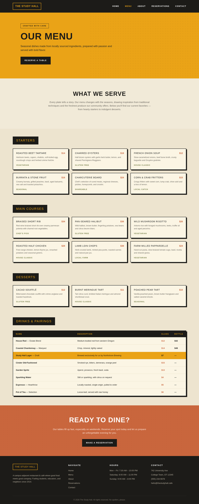 |

## 7. Best-overall attempt vs reference (all pages)

Best-overall trial `ZJAFwSi` (reward 0.782).

| page | reference | candidate |
|---|---|---|
| index | 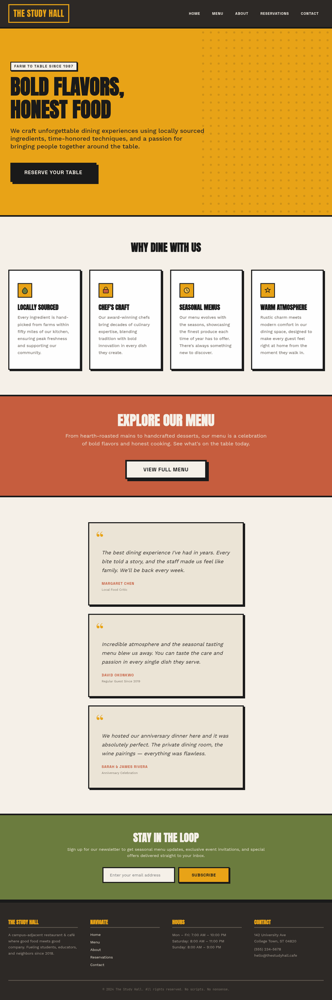 | 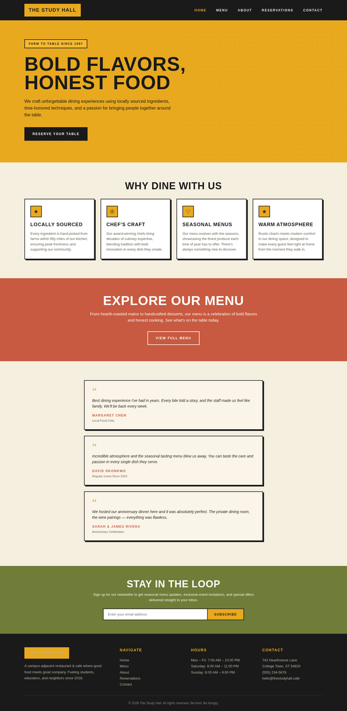 |
| menu |  | 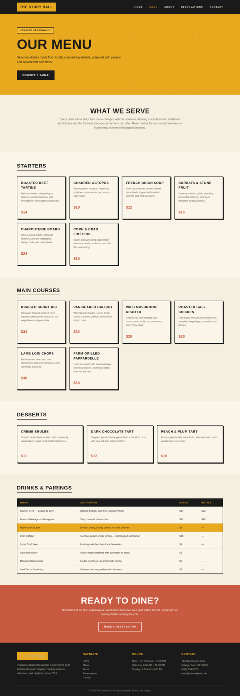 |
| about | 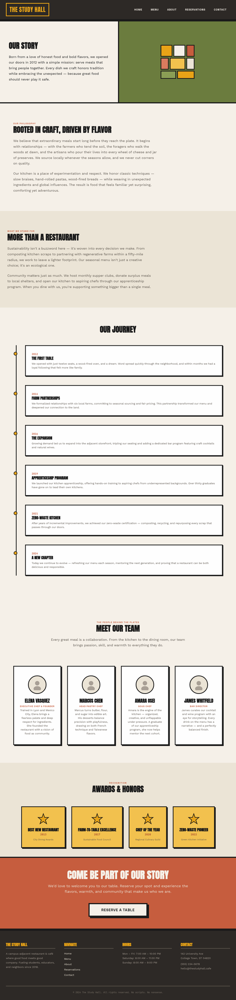 | 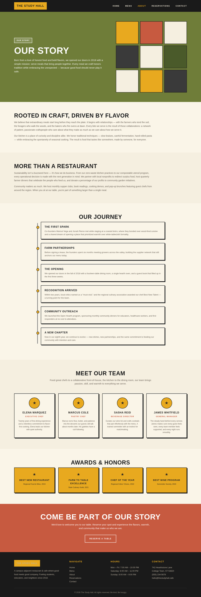 |
| reservations | 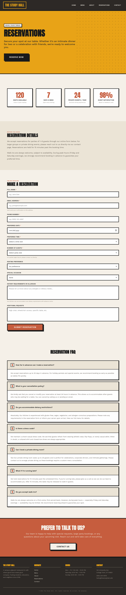 | 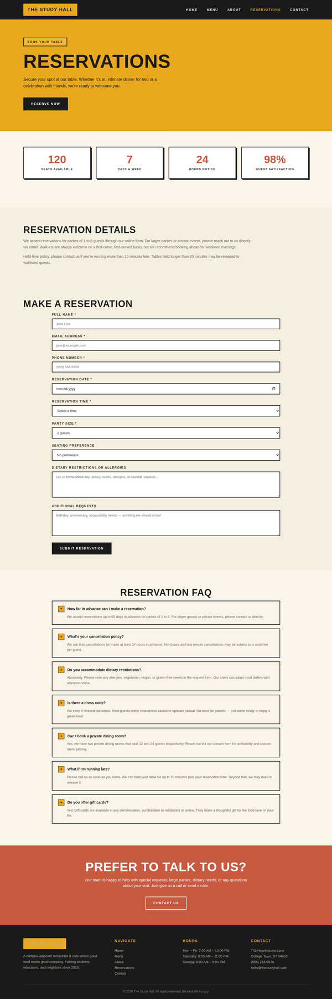 |
| contact | 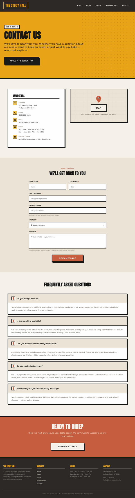 | 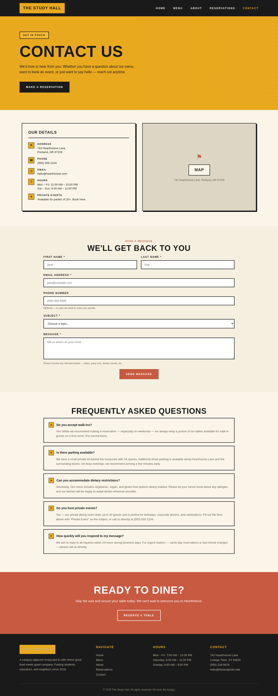 |
