# Model-eval report — 015_personal-resume_dark-techy_low

## 1. Provenance

| field | value |
|---|---|
| Task | 015_personal-resume_dark-techy_low |
| Seed tuple | personal-resume / dark-techy / low / health-and-wellness-seekers / nostalgic-and-charming |
| Archetype / Aesthetic / Complexity | personal-resume / dark-techy / low |
| Model | claude-opus-4-7 |
| Agent | claude-code |
| Executor | modal |
| Trials | 10 |
| Cost | $19.23 |
| Wall-clock | 14.6 min |
| Date | 2026-06-01 |
| Repo commit | fd7c5311b6ae7fbe07c534662a9b313d1a6931f7 |

## 2. Per-trial scores

| trial | reward | structure | color | content | design_judge |
|---|---|---|---|---|---|
| BMyDojV | 0.798 | 0.770 | 0.960 | 0.717 | 0.745 |
| MN6qpvX | 0.801 | 0.768 | 0.969 | 0.720 | 0.745 |
| NNG9xW8 | 0.795 | 0.764 | 0.954 | 0.724 | 0.740 |
| SNZSfqP | 0.800 | 0.757 | 0.957 | 0.712 | 0.775 |
| SXJwTNA | 0.801 | 0.777 | 0.978 | 0.728 | 0.720 |
| TBbDeHA | 0.792 | 0.757 | 0.967 | 0.709 | 0.735 |
| YyCjji9 | 0.794 | 0.761 | 0.956 | 0.714 | 0.745 |
| Zzt8pGh | 0.793 | 0.770 | 0.969 | 0.684 | 0.750 |
| cDJEu6D | 0.797 | 0.780 | 0.957 | 0.693 | 0.760 |
| hudrGud | 0.798 | 0.776 | 0.958 | 0.724 | 0.735 |
| **summary** | med 0.798 · 0.797±0.003 | med 0.769 · 0.768±0.008 | med 0.959 · 0.963±0.007 | med 0.715 · 0.712±0.013 | med 0.745 · 0.745±0.014 |

## 3. Reward + per-term distributions

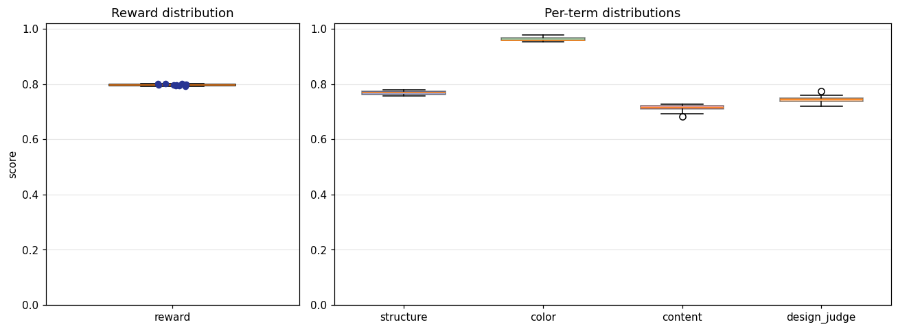

## 4. Per-term means

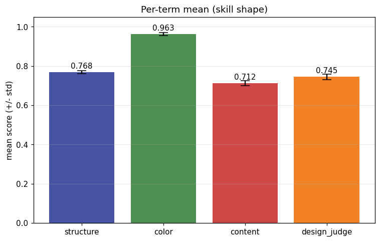

## 5. Per-page × per-term heatmap

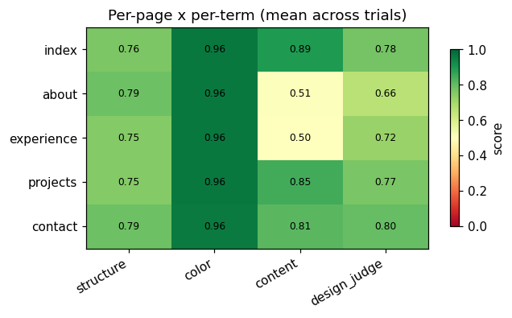

## 6. Worst per metric (reference vs candidate)

**structure** — worst page `projects` (trial `TBbDeHA`, score 0.738)

| reference | candidate |
|---|---|
|  | 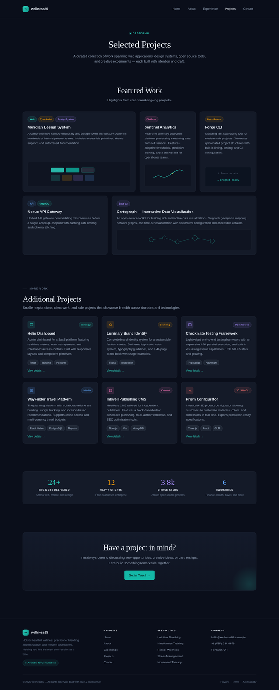 |

**color** — worst page `contact` (trial `NNG9xW8`, score 0.951)

| reference | candidate |
|---|---|
|  | 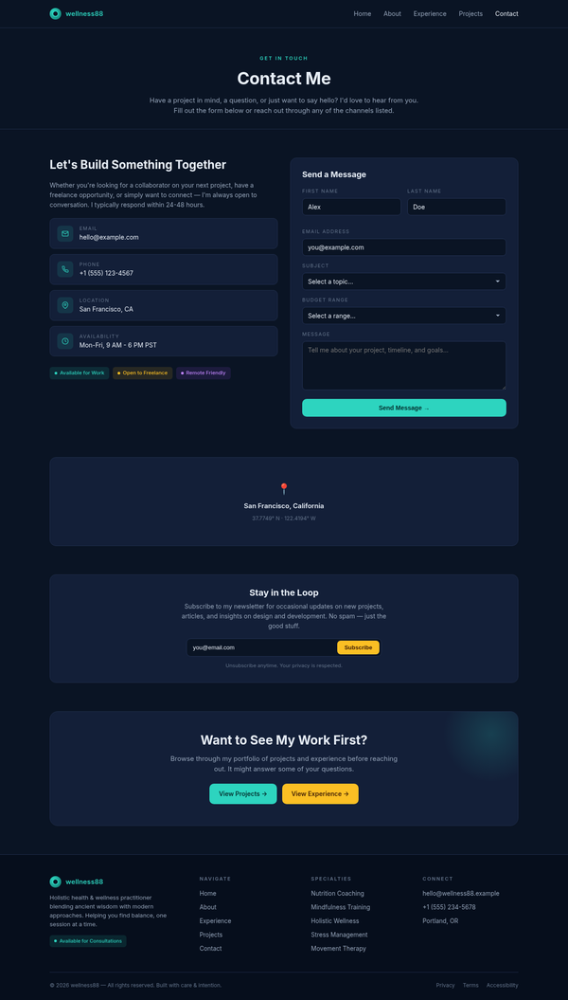 |

**content** — worst page `experience` (trial `Zzt8pGh`, score 0.424)

| reference | candidate |
|---|---|
| 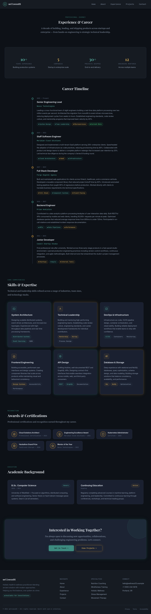 |  |

**design_judge** — worst page `about` (trial `NNG9xW8`, score 0.600)

| reference | candidate |
|---|---|
|  | 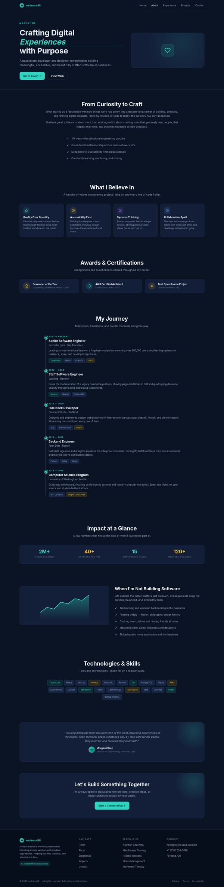 |

## 7. Best-overall attempt vs reference (all pages)

Best-overall trial `SXJwTNA` (reward 0.801).

| page | reference | candidate |
|---|---|---|
| index | 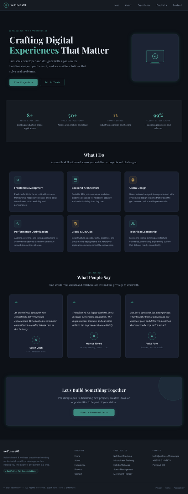 | 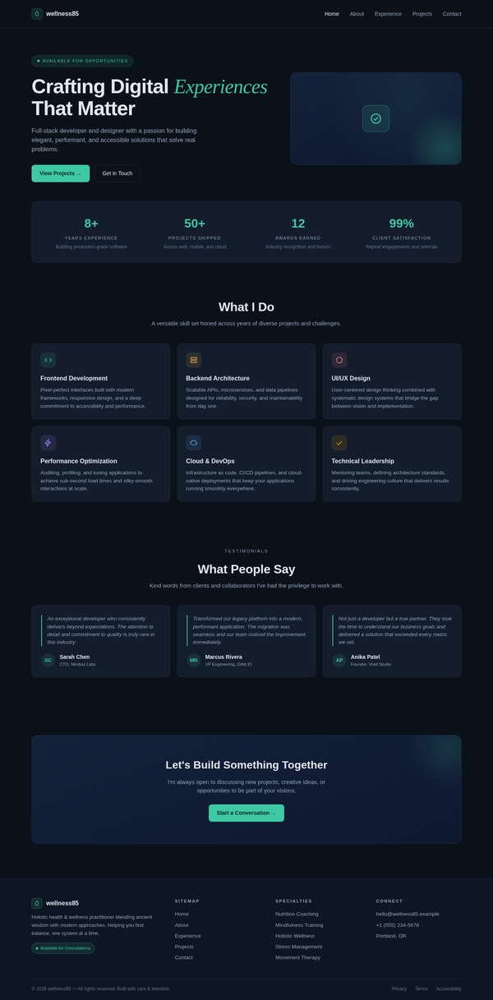 |
| about | 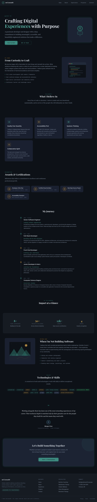 | 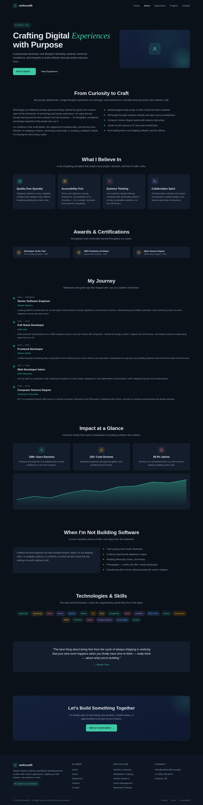 |
| experience |  |  |
| projects | 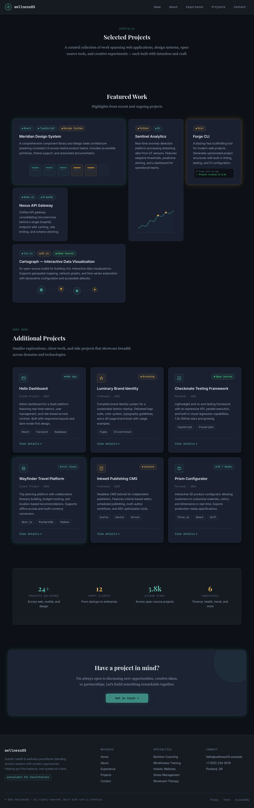 | 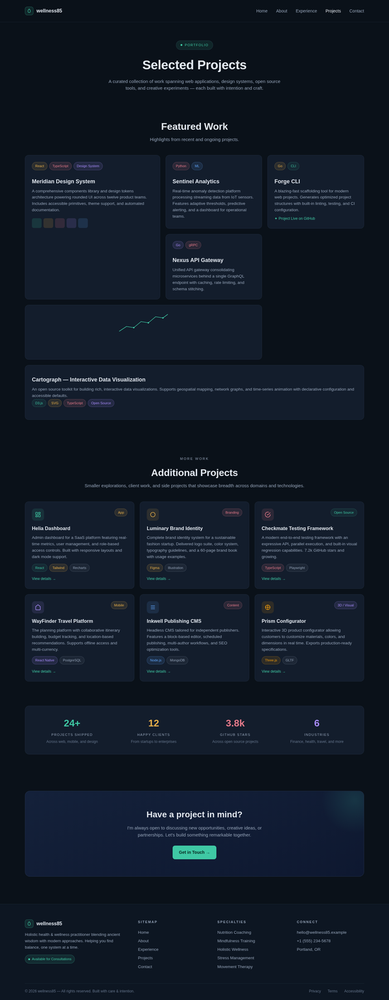 |
| contact | 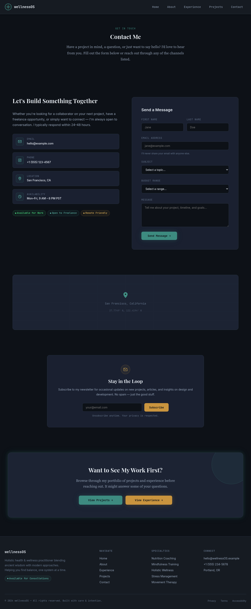 | 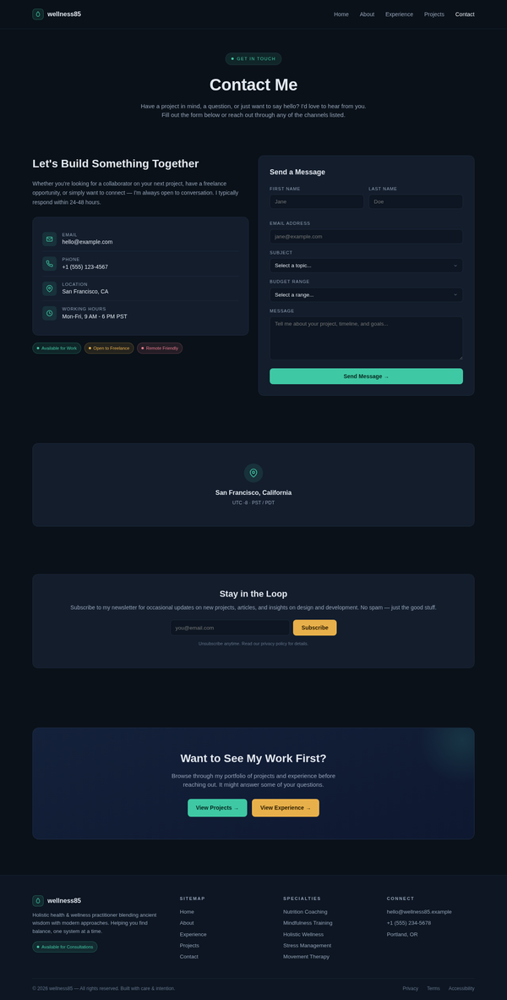 |
