# Model-eval report — 019_saas-landing_playful-rounded_med

## 1. Provenance

| field | value |
|---|---|
| Task | 019_saas-landing_playful-rounded_med |
| Seed tuple | saas-landing / playful-rounded / med / local-community / premium-and-understated |
| Archetype / Aesthetic / Complexity | saas-landing / playful-rounded / med |
| Model | claude-opus-4-7 |
| Agent | claude-code |
| Executor | modal |
| Trials | 10 |
| Cost | $22.33 |
| Wall-clock | 16.1 min |
| Date | 2026-06-01 |
| Repo commit | fd7c5311b6ae7fbe07c534662a9b313d1a6931f7 |

## 2. Per-trial scores

| trial | reward | structure | color | content | design_judge |
|---|---|---|---|---|---|
| 72asDxZ | 0.800 | 0.805 | 0.972 | 0.731 | 0.693 |
| LQH4vp7 | 0.795 | 0.794 | 0.976 | 0.707 | 0.704 |
| MPrwRB5 | 0.798 | 0.798 | 0.976 | 0.720 | 0.696 |
| MdSego7 | 0.765 | 0.776 | 0.970 | 0.644 | 0.671 |
| Q8kF9GB | 0.786 | 0.794 | 0.975 | 0.689 | 0.686 |
| RtQUVPT | 0.786 | 0.781 | 0.972 | 0.677 | 0.714 |
| XHwxNcB | 0.772 | 0.786 | 0.981 | 0.627 | 0.693 |
| eJxPX9H | 0.790 | 0.786 | 0.973 | 0.714 | 0.689 |
| gddxyCa | 0.800 | 0.804 | 0.978 | 0.709 | 0.707 |
| wbmycsL | 0.801 | 0.809 | 0.977 | 0.730 | 0.689 |
| **summary** | med 0.793 · 0.789±0.012 | med 0.794 · 0.793±0.010 | med 0.976 · 0.975±0.003 | med 0.708 · 0.695±0.034 | med 0.693 · 0.694±0.011 |

## 3. Reward + per-term distributions

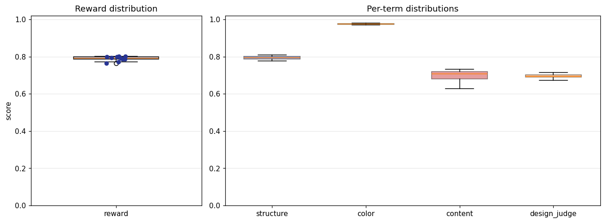

## 4. Per-term means

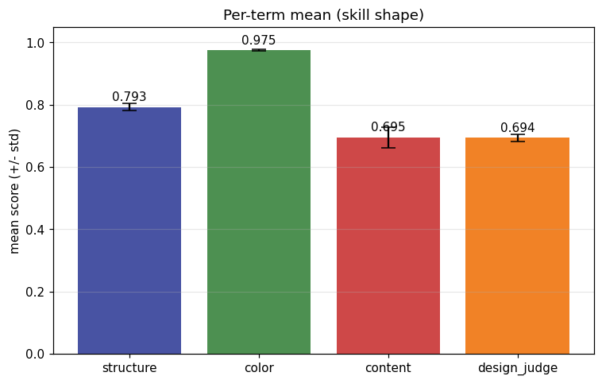

## 5. Per-page × per-term heatmap

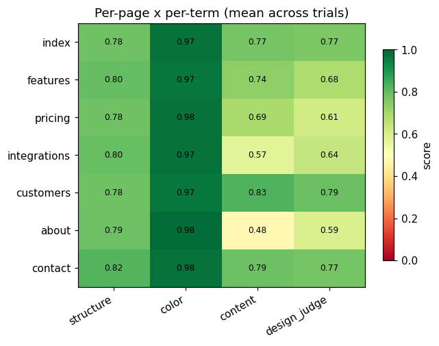

## 6. Worst per metric (reference vs candidate)

**structure** — worst page `customers` (trial `MdSego7`, score 0.749)

| reference | candidate |
|---|---|
| 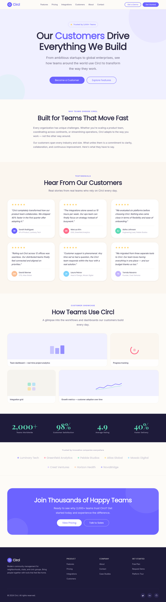 |  |

**color** — worst page `customers` (trial `MdSego7`, score 0.952)

| reference | candidate |
|---|---|
|  | 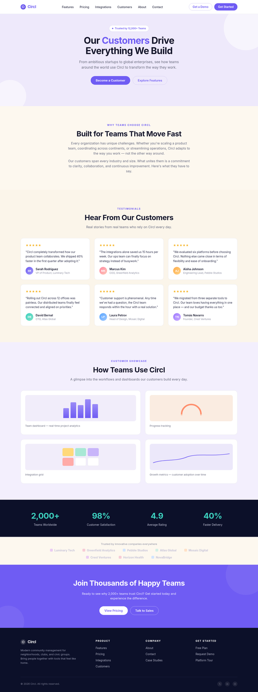 |

**content** — worst page `about` (trial `eJxPX9H`, score 0.422)

| reference | candidate |
|---|---|
| 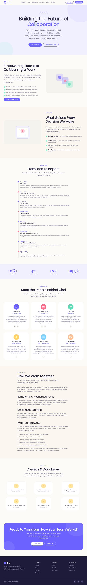 | 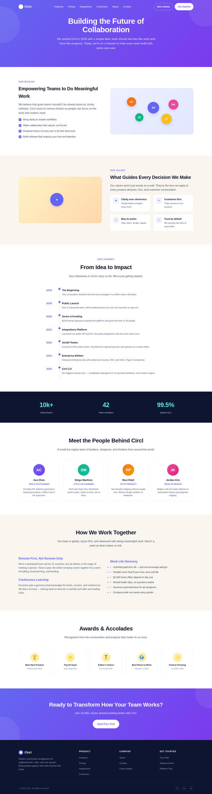 |

**design_judge** — worst page `integrations` (trial `MdSego7`, score 0.550)

| reference | candidate |
|---|---|
|  | 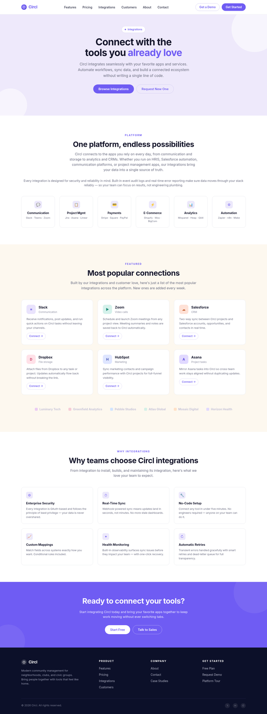 |

## 7. Best-overall attempt vs reference (all pages)

Best-overall trial `wbmycsL` (reward 0.801).

| page | reference | candidate |
|---|---|---|
| index | 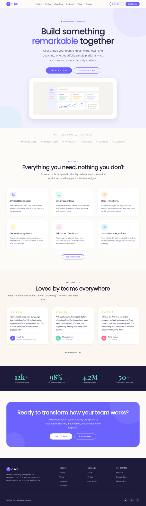 | 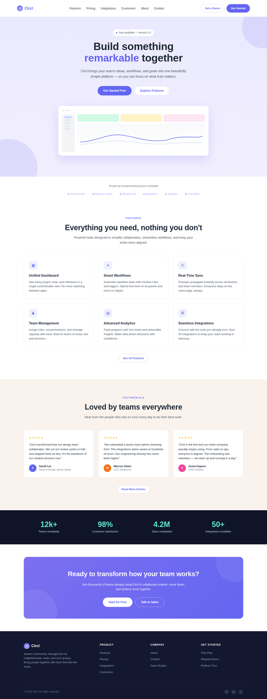 |
| features | 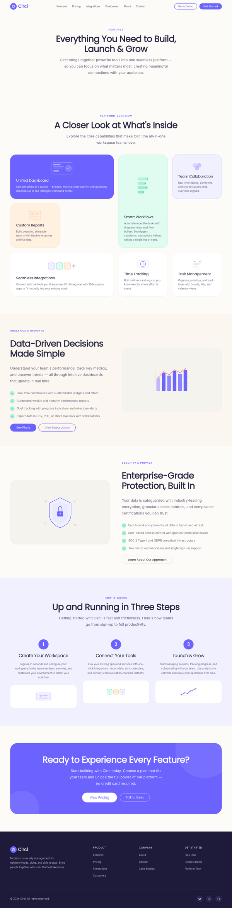 | 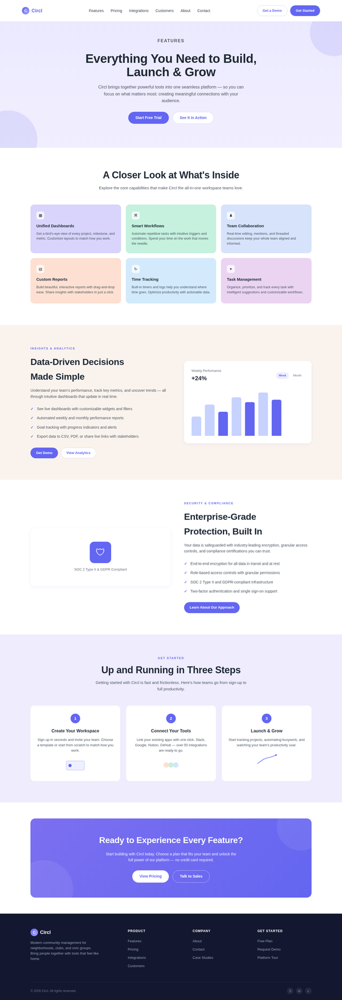 |
| pricing | 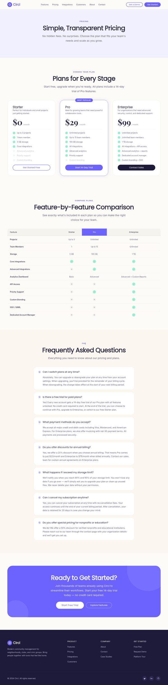 | 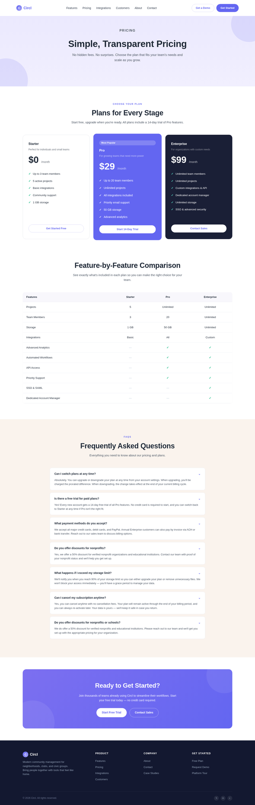 |
| integrations | 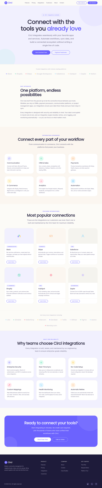 | 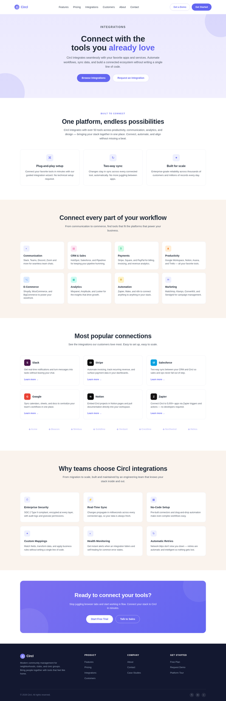 |
| customers |  | 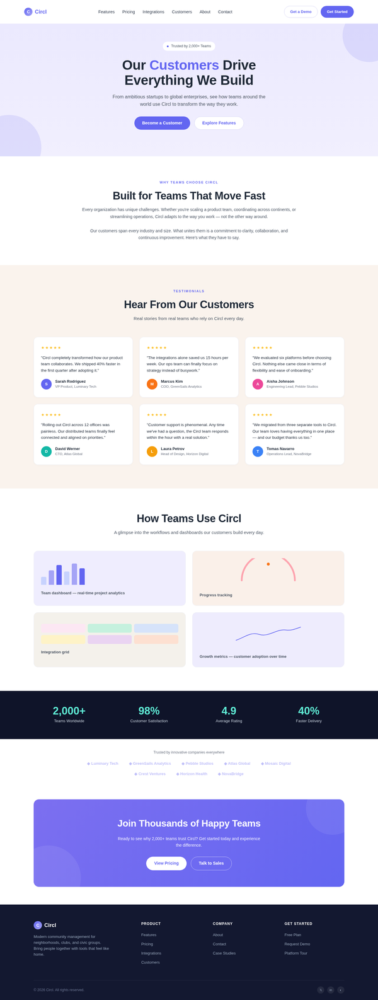 |
| about |  | 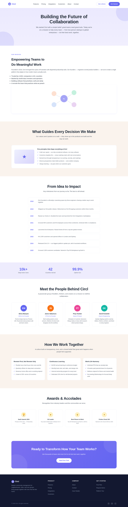 |
| contact | 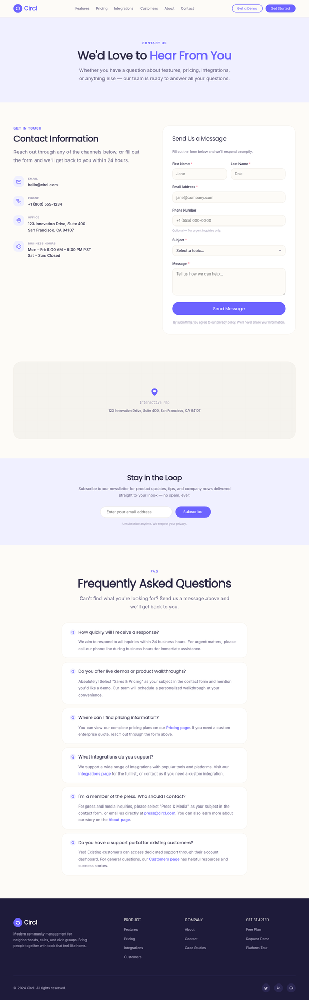 | 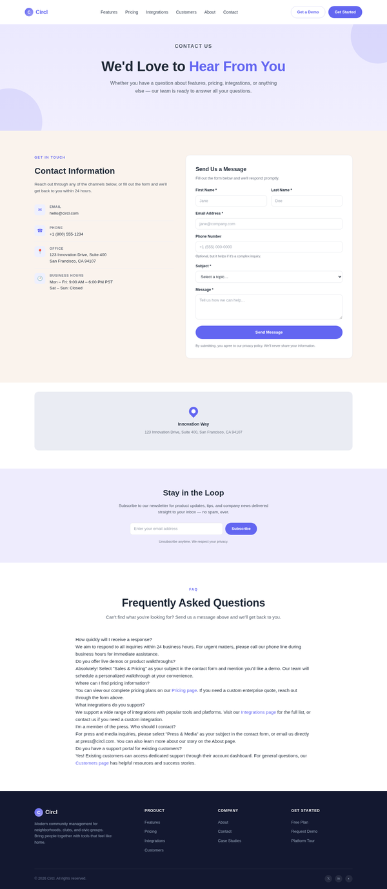 |
