# Model-eval report — 023_nonprofit-civic_glassmorphism_high

## 1. Provenance

| field | value |
|---|---|
| Task | 023_nonprofit-civic_glassmorphism_high |
| Seed tuple | nonprofit-civic / glassmorphism / high / health-and-wellness-seekers / nostalgic-and-charming |
| Archetype / Aesthetic / Complexity | nonprofit-civic / glassmorphism / high |
| Model | claude-opus-4-7 |
| Agent | claude-code |
| Executor | modal |
| Trials | 10 |
| Cost | $32.76 |
| Wall-clock | 21.3 min |
| Date | 2026-06-01 |
| Repo commit | fd7c5311b6ae7fbe07c534662a9b313d1a6931f7 |

## 2. Per-trial scores

| trial | reward | structure | color | content | design_judge |
|---|---|---|---|---|---|
| FtyeZRs | 0.785 | 0.807 | 0.977 | 0.670 | 0.685 |
| JjLBhMf | 0.776 | 0.824 | 0.967 | 0.644 | 0.667 |
| RS8tMwx | 0.776 | 0.810 | 0.964 | 0.663 | 0.667 |
| TA4HQkQ | 0.784 | 0.811 | 0.978 | 0.671 | 0.677 |
| bQQGc2V | 0.776 | 0.816 | 0.979 | 0.638 | 0.672 |
| gtTWf2y | 0.782 | 0.819 | 0.981 | 0.657 | 0.672 |
| nMQ4UGo | 0.782 | 0.817 | 0.974 | 0.656 | 0.680 |
| p9ULnYQ | 0.779 | 0.821 | 0.984 | 0.649 | 0.662 |
| vAaxFXA | 0.777 | 0.814 | 0.979 | 0.636 | 0.677 |
| vBxhtE7 | 0.788 | 0.818 | 0.976 | 0.667 | 0.690 |
| **summary** | med 0.781 · 0.780±0.004 | med 0.816 · 0.816±0.005 | med 0.978 · 0.976±0.006 | med 0.657 · 0.655±0.012 | med 0.675 · 0.675±0.008 |

## 3. Reward + per-term distributions

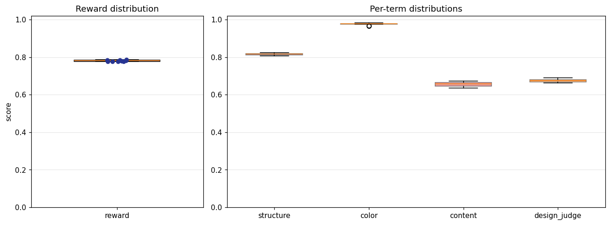

## 4. Per-term means

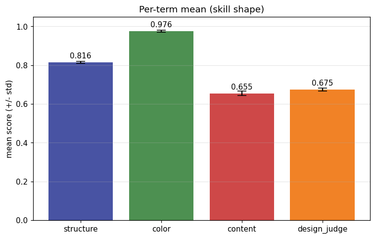

## 5. Per-page × per-term heatmap

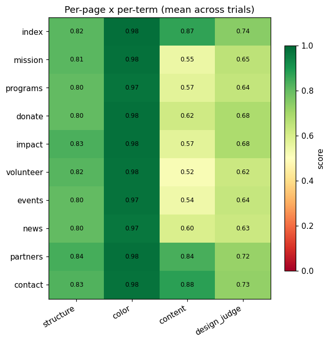

## 6. Worst per metric (reference vs candidate)

**structure** — worst page `programs` (trial `FtyeZRs`, score 0.788)

| reference | candidate |
|---|---|
| 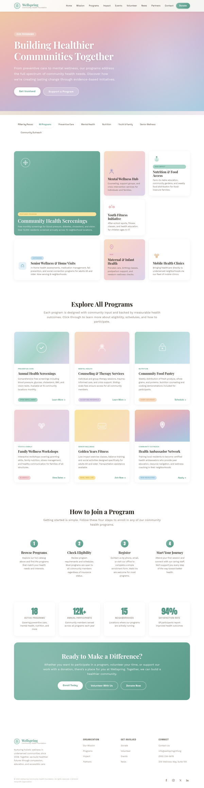 | 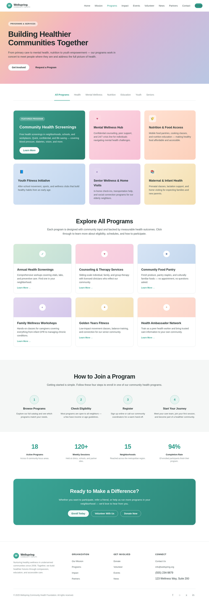 |

**color** — worst page `programs` (trial `RS8tMwx`, score 0.957)

| reference | candidate |
|---|---|
|  | 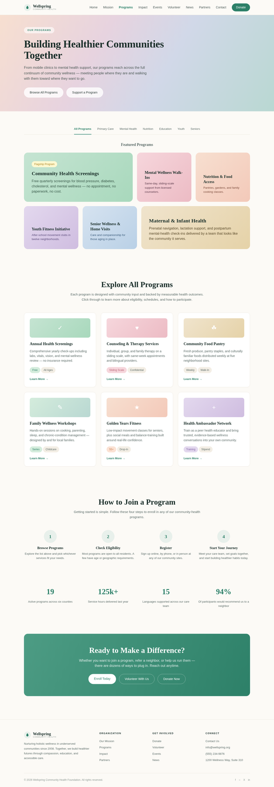 |

**content** — worst page `events` (trial `vAaxFXA`, score 0.451)

| reference | candidate |
|---|---|
| 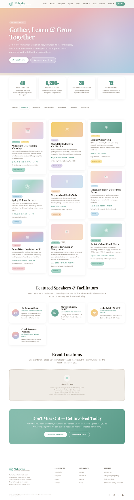 | 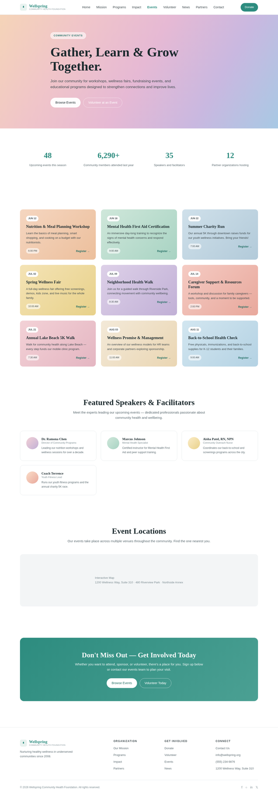 |

**design_judge** — worst page `events` (trial `JjLBhMf`, score 0.575)

| reference | candidate |
|---|---|
|  | 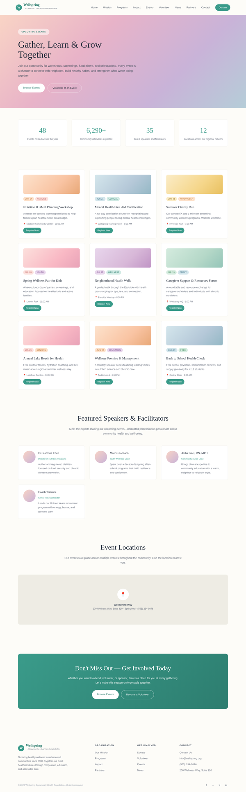 |

## 7. Best-overall attempt vs reference (all pages)

Best-overall trial `vBxhtE7` (reward 0.788).

| page | reference | candidate |
|---|---|---|
| index | 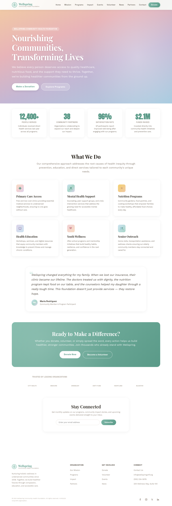 | 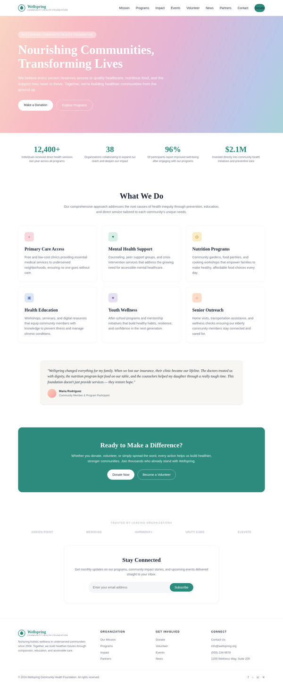 |
| mission | 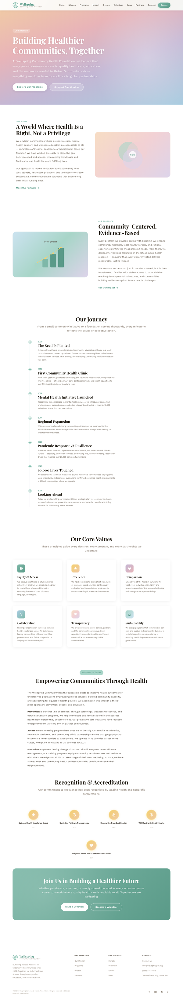 | 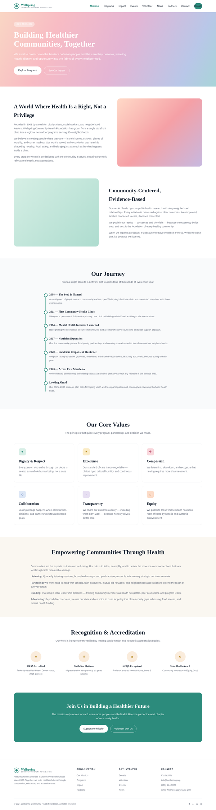 |
| programs |  | 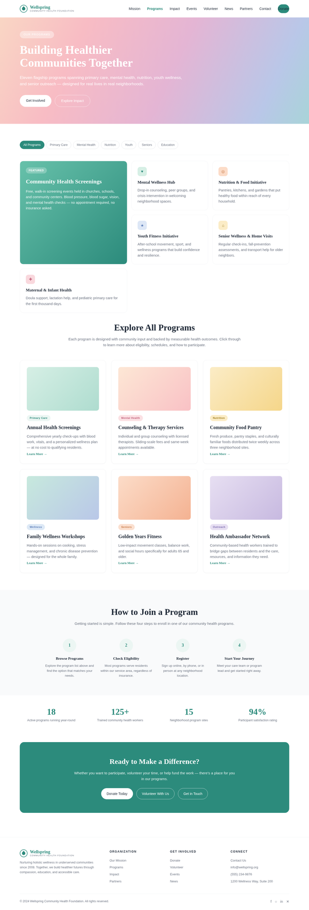 |
| donate | 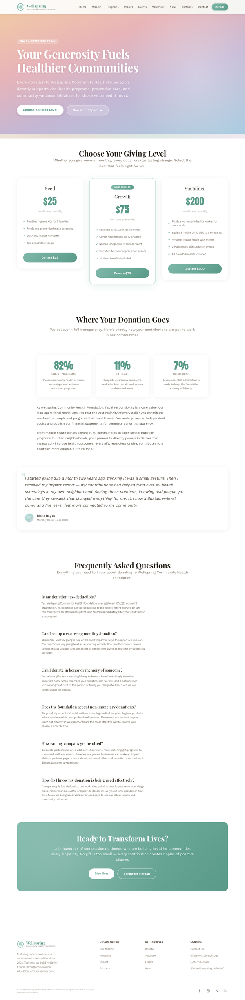 | 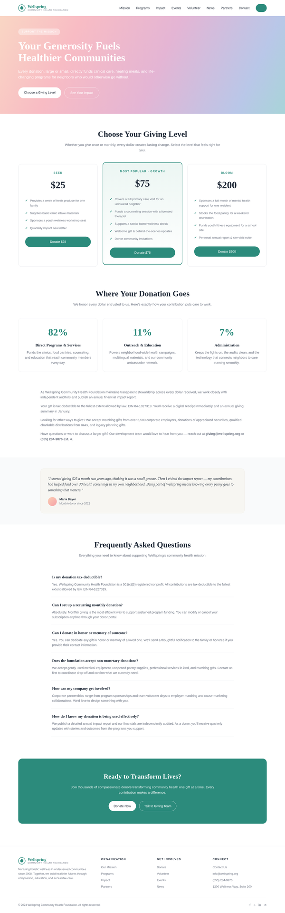 |
| impact | 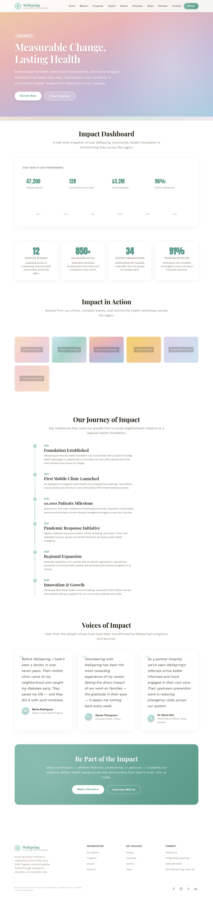 | 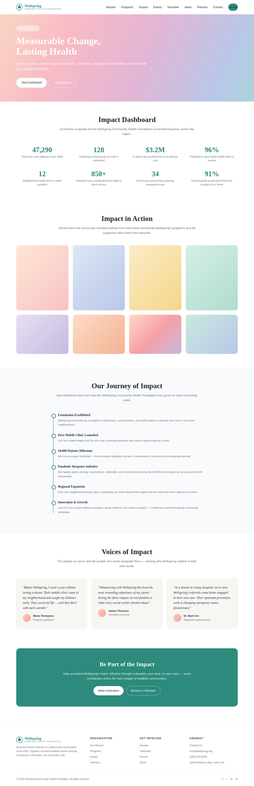 |
| volunteer | 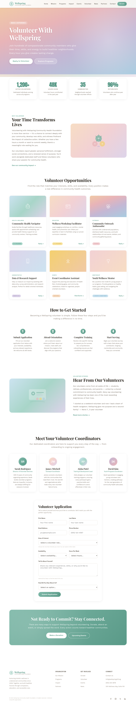 | 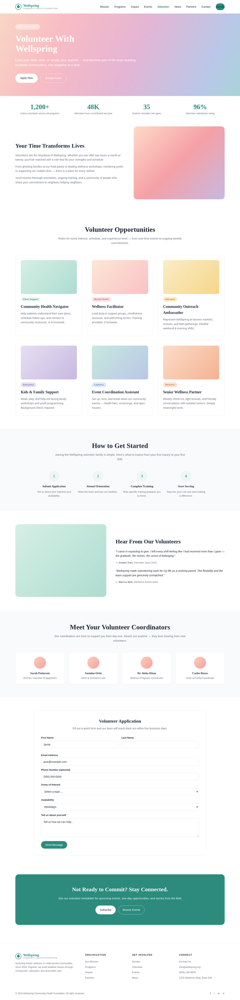 |
| events |  | 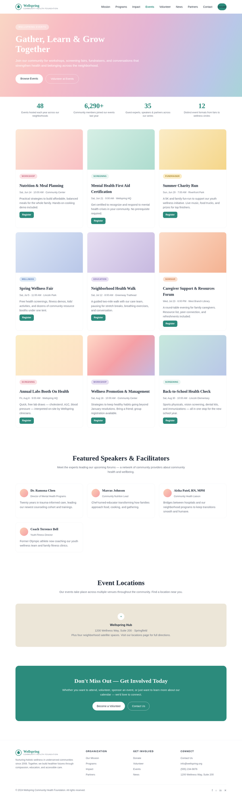 |
| news | 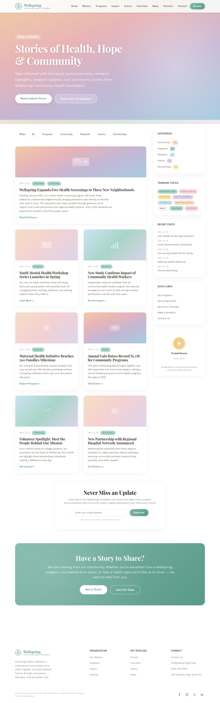 | 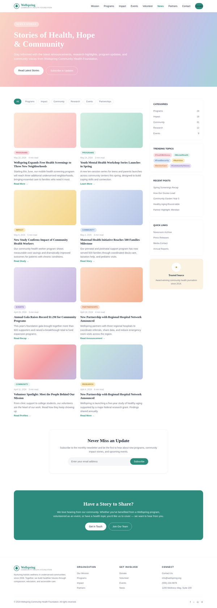 |
| partners | 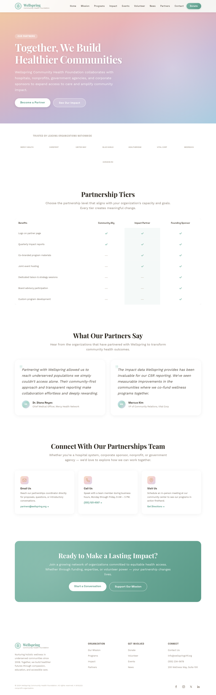 | 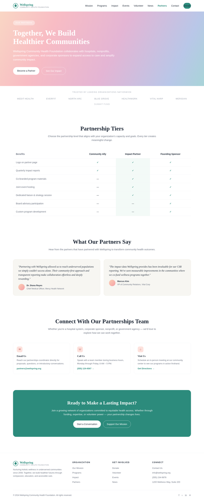 |
| contact | 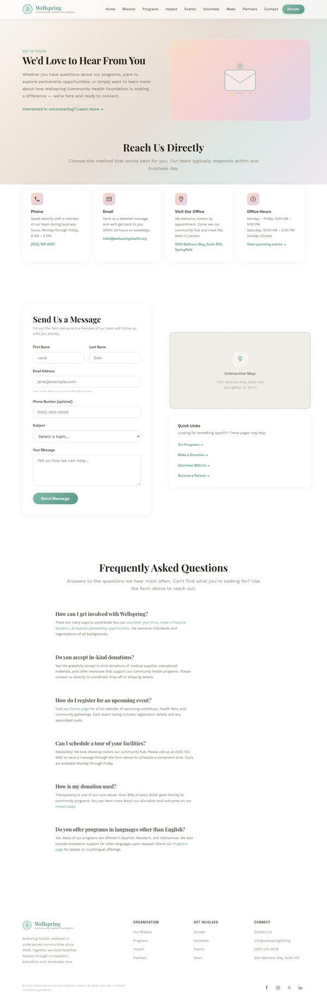 | 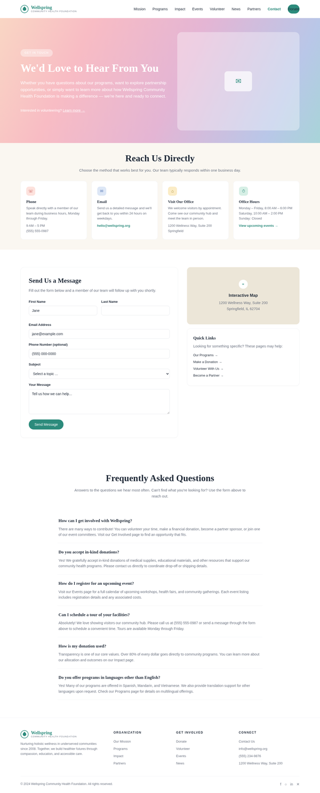 |
