# Model-eval report — opus47-035

## 1. Provenance

| field | value |
|---|---|
| Task | opus47-035 |
| Seed tuple | local-service / dark-techy / high / local-community / premium-and-understated |
| Archetype / Aesthetic / Complexity | local-service / dark-techy / high |
| Model | claude-opus-4-7 |
| Agent | claude-code |
| Executor | modal |
| Trials | 10 |
| Cost | $31.97 |
| Wall-clock | 21.5 min |
| Date | 2026-05-31 |
| Repo commit | fd7c5311b6ae7fbe07c534662a9b313d1a6931f7 |

## 2. Per-trial scores

| trial | reward | structure | color | content | design_judge |
|---|---|---|---|---|---|
| 3M4CAXn | 0.747 | 0.774 | 0.974 | 0.545 | 0.695 |
| BraKtNp | 0.738 | 0.766 | 0.977 | 0.523 | 0.688 |
| KbwY6JH | 0.752 | 0.782 | 0.978 | 0.563 | 0.685 |
| NCSn9vP | 0.743 | 0.724 | 0.982 | 0.555 | 0.713 |
| S2ywVEC | 0.716 | 0.667 | 0.971 | 0.551 | 0.675 |
| WXnEkTs | 0.719 | 0.698 | 0.966 | 0.563 | 0.647 |
| h9QcJ6D | 0.738 | 0.727 | 0.977 | 0.551 | 0.698 |
| isoBE3J | 0.720 | 0.706 | 0.975 | 0.521 | 0.677 |
| sjat758 | 0.746 | 0.763 | 0.991 | 0.529 | 0.703 |
| v8hWxPH | 0.739 | 0.771 | 0.976 | 0.539 | 0.670 |
| **summary** | med 0.739 · 0.736±0.012 | med 0.745 · 0.738±0.037 | med 0.976 · 0.977±0.006 | med 0.548 · 0.544±0.015 | med 0.686 · 0.685±0.018 |

## 3. Reward + per-term distributions

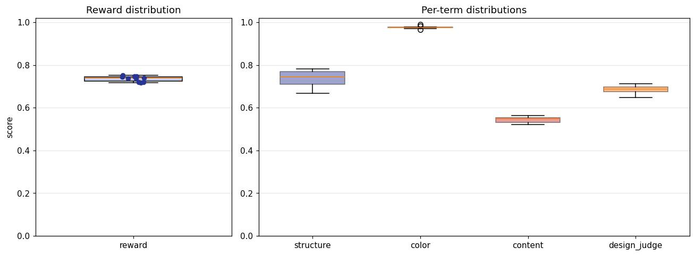

## 4. Per-term means

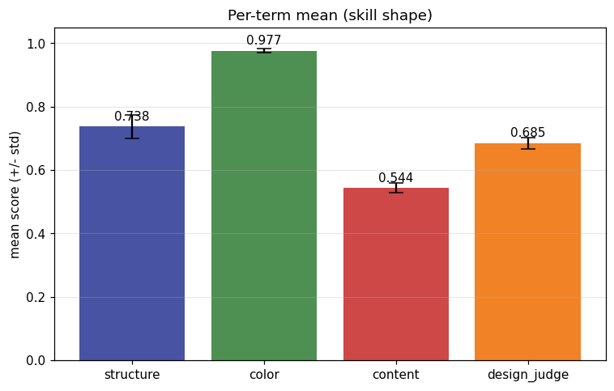

## 5. Per-page × per-term heatmap

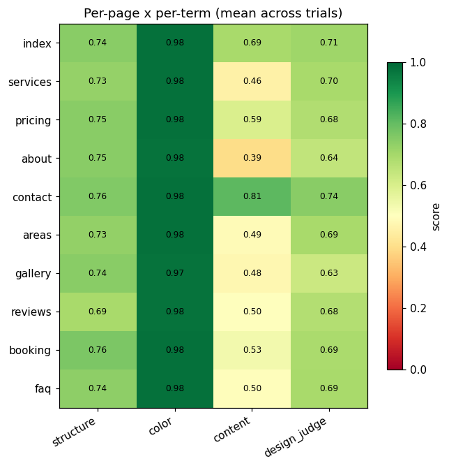

## 6. Worst per metric (reference vs candidate)

**structure** — worst page `reviews` (trial `S2ywVEC`, score 0.623)

| reference | candidate |
|---|---|
| 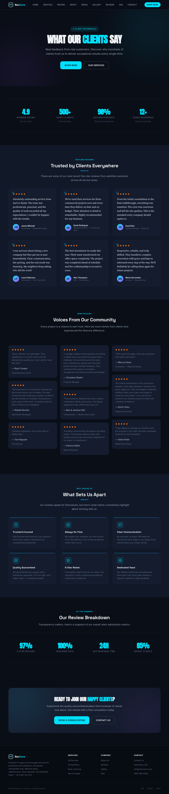 | 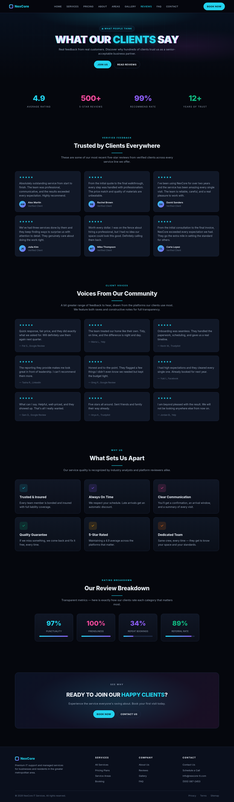 |

**color** — worst page `gallery` (trial `BraKtNp`, score 0.954)

| reference | candidate |
|---|---|
|  | 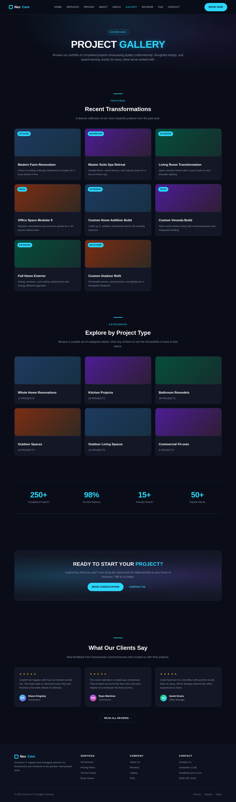 |

**content** — worst page `faq` (trial `BraKtNp`, score 0.326)

| reference | candidate |
|---|---|
| 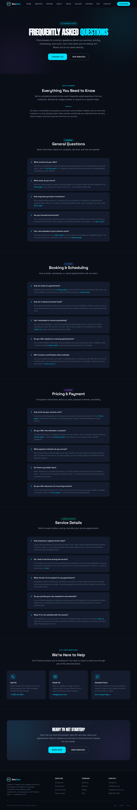 | 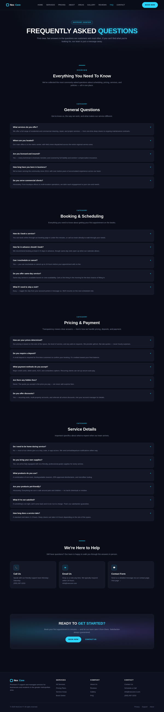 |

**design_judge** — worst page `about` (trial `v8hWxPH`, score 0.550)

| reference | candidate |
|---|---|
|  |  |

## 7. Best-overall attempt vs reference (all pages)

Best-overall trial `KbwY6JH` (reward 0.752).

| page | reference | candidate |
|---|---|---|
| index | 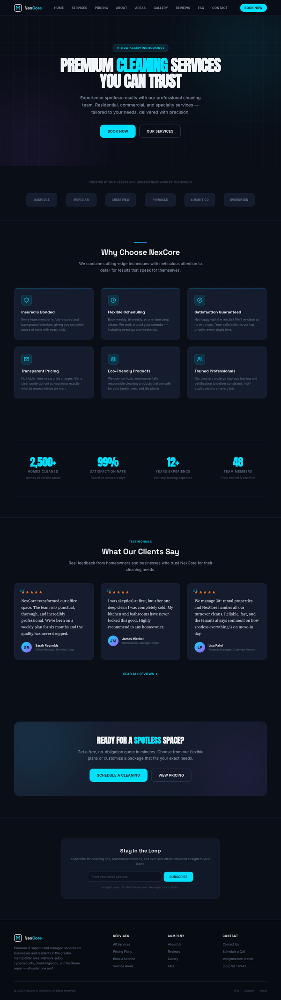 |  |
| services | 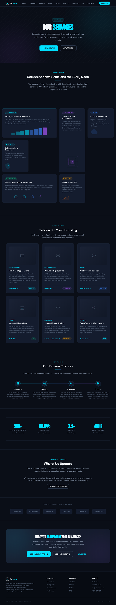 | 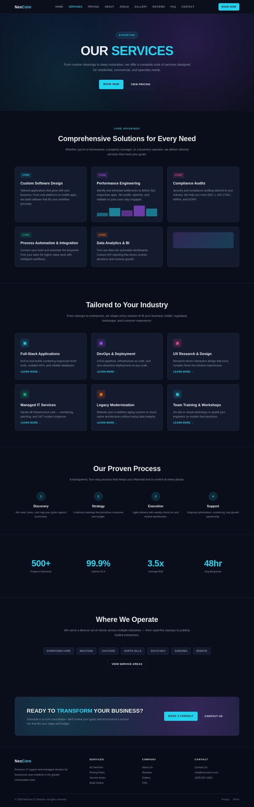 |
| pricing | 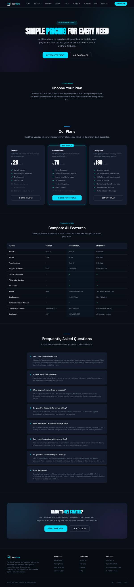 |  |
| about |  |  |
| contact | 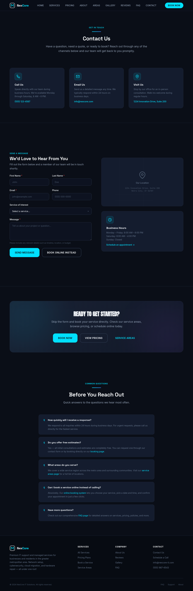 | 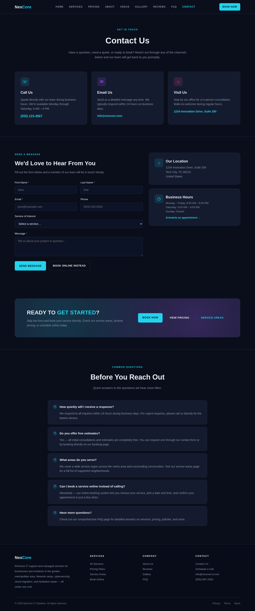 |
| areas | 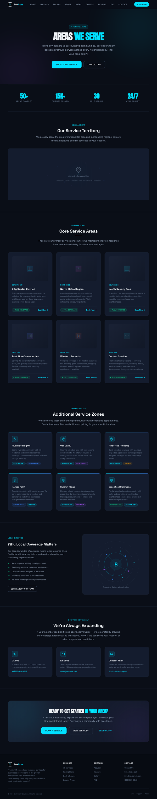 | 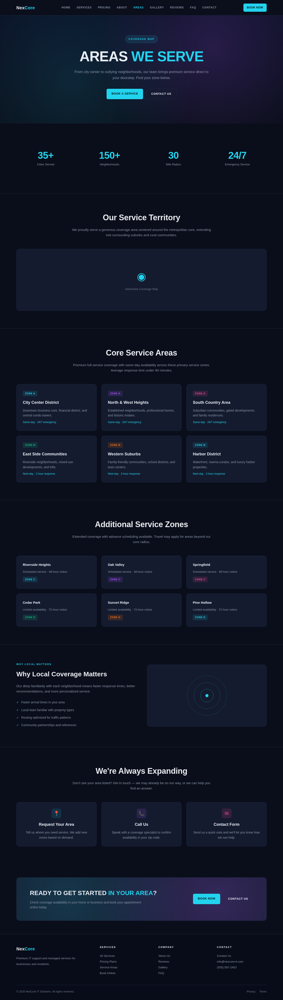 |
| gallery |  |  |
| reviews |  |  |
| booking |  |  |
| faq |  |  |
