# Model-eval report — 036_docs-product_warm-organic_low

## 1. Provenance

| field | value |
|---|---|
| Task | 036_docs-product_warm-organic_low |
| Seed tuple | docs-product / warm-organic / low / students-and-educators / warm-and-welcoming |
| Archetype / Aesthetic / Complexity | docs-product / warm-organic / low |
| Model | claude-opus-4-7 |
| Agent | claude-code |
| Executor | modal |
| Trials | 10 |
| Cost | $18.08 |
| Wall-clock | 69.6 min |
| Date | 2026-06-01 |
| Repo commit | fd7c5311b6ae7fbe07c534662a9b313d1a6931f7 |

## 2. Per-trial scores

| trial | reward | structure | color | content | design_judge |
|---|---|---|---|---|---|
| 3qPLxTL | 0.788 | 0.785 | 0.961 | 0.676 | 0.730 |
| DDgGMbK | 0.783 | 0.768 | 0.957 | 0.660 | 0.745 |
| H4YVNtK | 0.792 | 0.784 | 0.960 | 0.716 | 0.710 |
| bH5Duba | 0.803 | 0.789 | 0.960 | 0.703 | 0.760 |
| cgXF6Jt | 0.791 | 0.789 | 0.968 | 0.660 | 0.745 |
| jTVW9wW | 0.769 | 0.728 | 0.965 | 0.653 | 0.730 |
| nbsmZVn | 0.799 | 0.760 | 0.963 | 0.735 | 0.735 |
| w2bxPDP | 0.775 | 0.725 | 0.968 | 0.661 | 0.745 |
| wBK2sUz | 0.794 | 0.765 | 0.964 | 0.705 | 0.740 |
| yCSMM7E | 0.809 | 0.785 | 0.960 | 0.730 | 0.760 |
| **summary** | med 0.792 · 0.790±0.012 | med 0.776 · 0.768±0.023 | med 0.962 · 0.963±0.004 | med 0.689 · 0.690±0.030 | med 0.742 · 0.740±0.014 |

## 3. Reward + per-term distributions

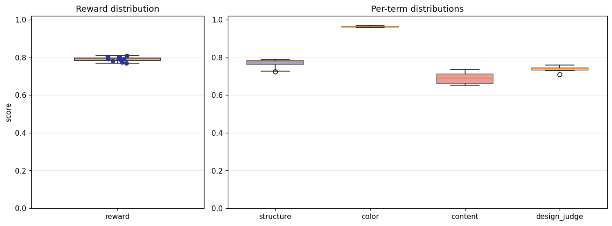

## 4. Per-term means

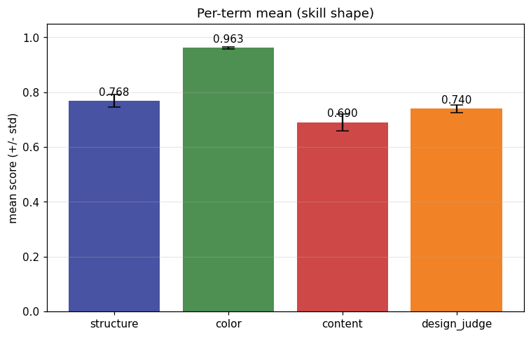

## 5. Per-page × per-term heatmap

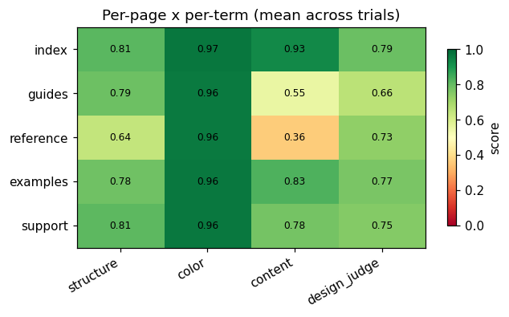

## 6. Worst per metric (reference vs candidate)

**structure** — worst page `reference` (trial `w2bxPDP`, score 0.422)

| reference | candidate |
|---|---|
| 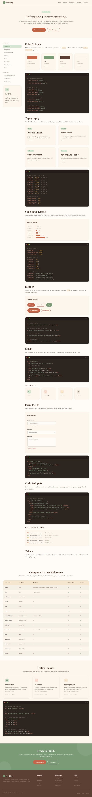 | 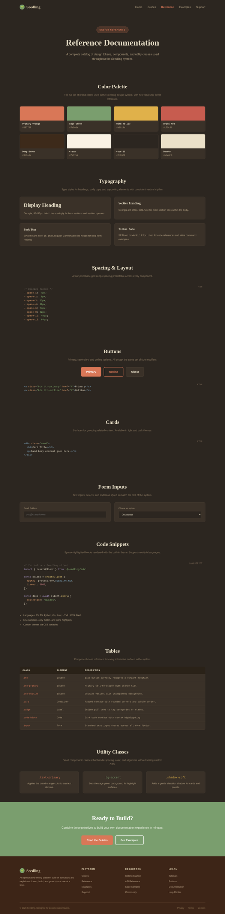 |

**color** — worst page `reference` (trial `H4YVNtK`, score 0.953)

| reference | candidate |
|---|---|
|  | 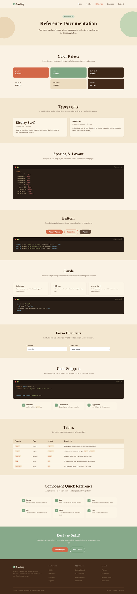 |

**content** — worst page `reference` (trial `jTVW9wW`, score 0.271)

| reference | candidate |
|---|---|
|  | 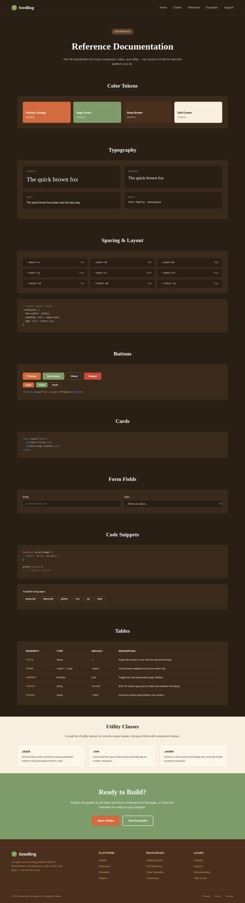 |

**design_judge** — worst page `guides` (trial `H4YVNtK`, score 0.600)

| reference | candidate |
|---|---|
|  |  |

## 7. Best-overall attempt vs reference (all pages)

Best-overall trial `yCSMM7E` (reward 0.809).

| page | reference | candidate |
|---|---|---|
| index | 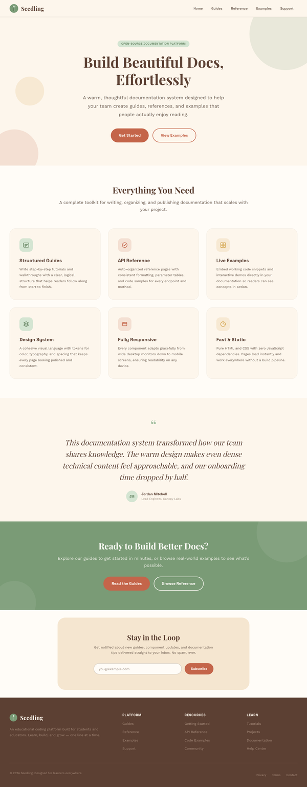 |  |
| guides |  |  |
| reference |  | 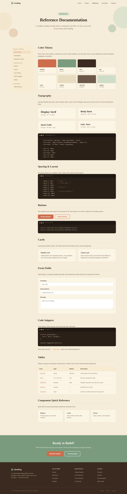 |
| examples | 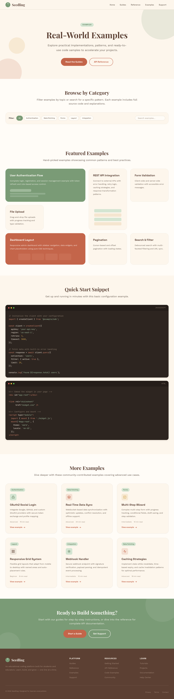 | 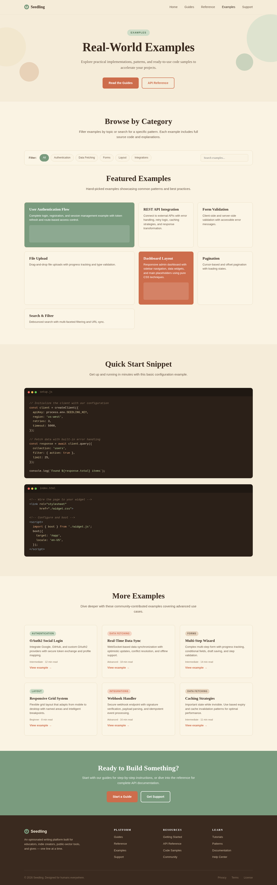 |
| support | 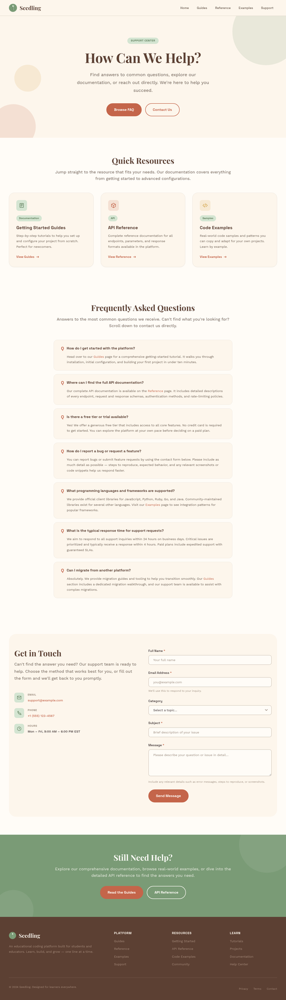 | 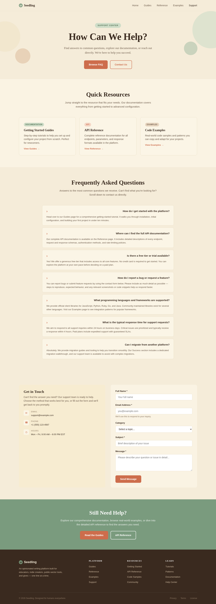 |
