# Model-eval report — 038_agency-portfolio_luxury-serif_high

## 1. Provenance

| field | value |
|---|---|
| Task | 038_agency-portfolio_luxury-serif_high |
| Seed tuple | agency-portfolio / luxury-serif / high / creative-professionals / rebellious-and-edgy |
| Archetype / Aesthetic / Complexity | agency-portfolio / luxury-serif / high |
| Model | claude-opus-4-7 |
| Agent | claude-code |
| Executor | modal |
| Trials | 10 |
| Cost | $32.26 |
| Wall-clock | 20.5 min |
| Date | 2026-06-01 |
| Repo commit | fd7c5311b6ae7fbe07c534662a9b313d1a6931f7 |

## 2. Per-trial scores

| trial | reward | structure | color | content | design_judge |
|---|---|---|---|---|---|
| 2JsBHaS | 0.751 | 0.736 | 0.986 | 0.534 | 0.750 |
| 3wH5V5x | 0.734 | 0.708 | 0.973 | 0.539 | 0.715 |
| 9hYxY8a | 0.747 | 0.720 | 0.985 | 0.559 | 0.722 |
| D3R9oFB | 0.742 | 0.699 | 0.983 | 0.537 | 0.750 |
| HufxrKX | 0.740 | 0.714 | 0.980 | 0.529 | 0.738 |
| KACxe2y | 0.744 | 0.732 | 0.983 | 0.537 | 0.725 |
| NDo6buR | 0.749 | 0.714 | 0.982 | 0.557 | 0.742 |
| QLcPvzE | 0.744 | 0.726 | 0.982 | 0.542 | 0.725 |
| cwRa77U | 0.737 | 0.707 | 0.976 | 0.517 | 0.747 |
| gGvA7Tt | 0.725 | 0.690 | 0.982 | 0.518 | 0.713 |
| **summary** | med 0.743 · 0.741±0.007 | med 0.714 · 0.715±0.014 | med 0.982 · 0.981±0.004 | med 0.537 · 0.537±0.013 | med 0.731 · 0.733±0.014 |

## 3. Reward + per-term distributions

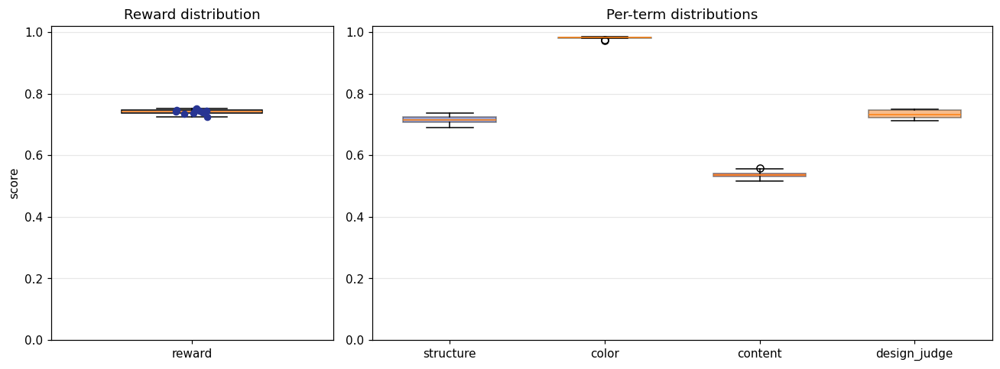

## 4. Per-term means

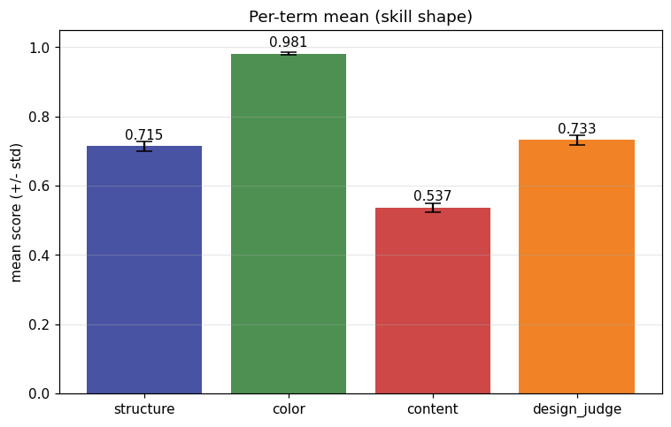

## 5. Per-page × per-term heatmap

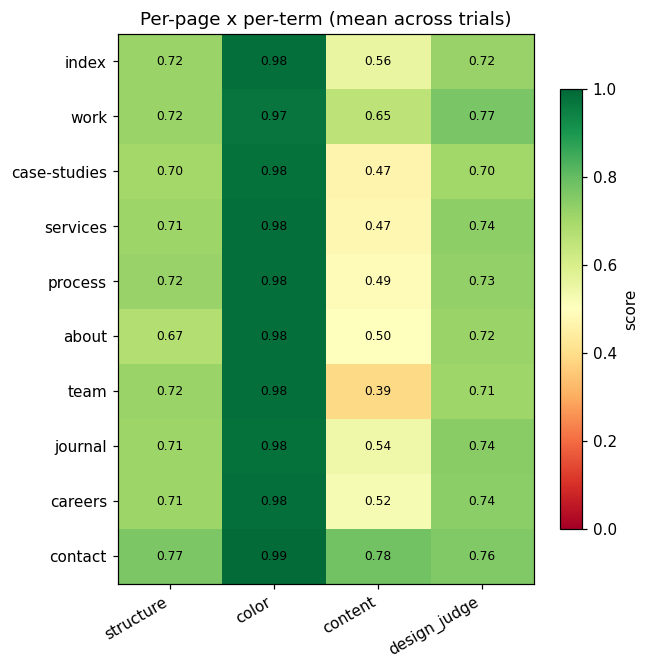

## 6. Worst per metric (reference vs candidate)

**structure** — worst page `work` (trial `gGvA7Tt`, score 0.646)

| reference | candidate |
|---|---|
| 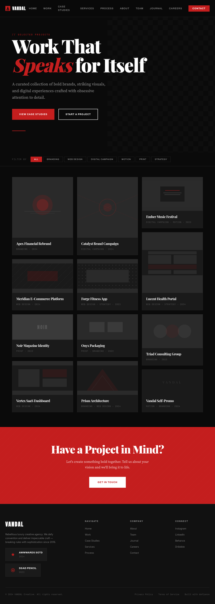 | 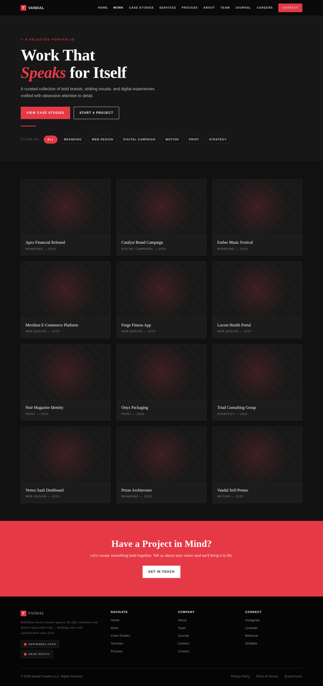 |

**color** — worst page `work` (trial `gGvA7Tt`, score 0.960)

| reference | candidate |
|---|---|
|  |  |

**content** — worst page `team` (trial `HufxrKX`, score 0.333)

| reference | candidate |
|---|---|
| 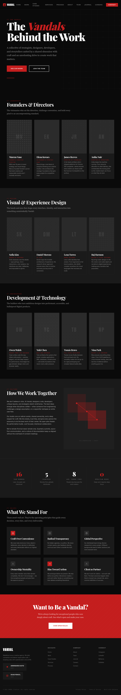 | 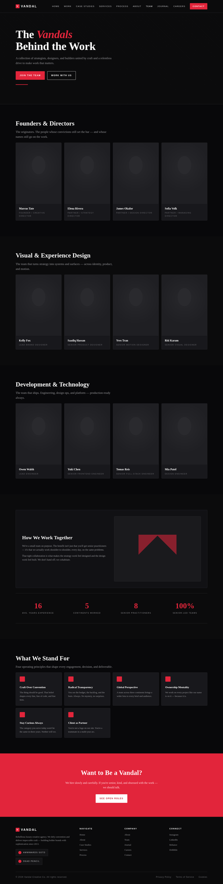 |

**design_judge** — worst page `contact` (trial `QLcPvzE`, score 0.625)

| reference | candidate |
|---|---|
| 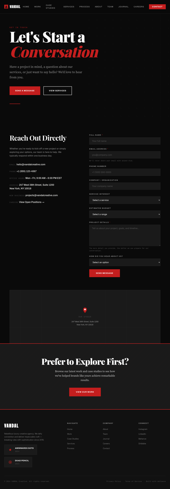 | 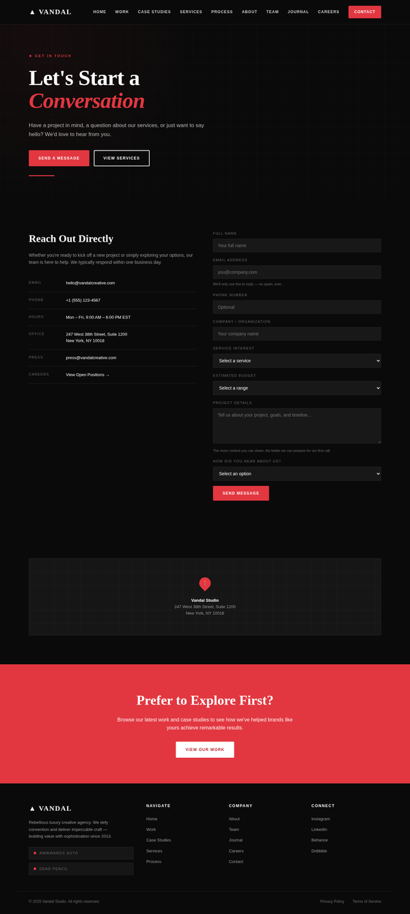 |

## 7. Best-overall attempt vs reference (all pages)

Best-overall trial `2JsBHaS` (reward 0.751).

| page | reference | candidate |
|---|---|---|
| index | 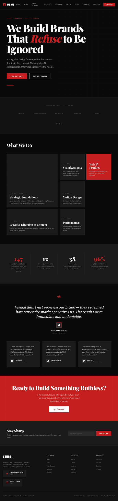 | 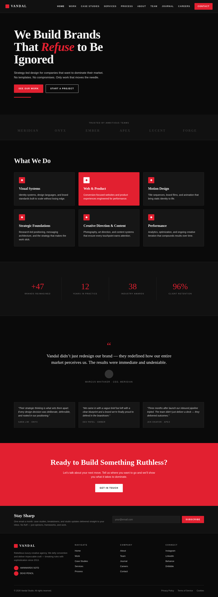 |
| work |  | 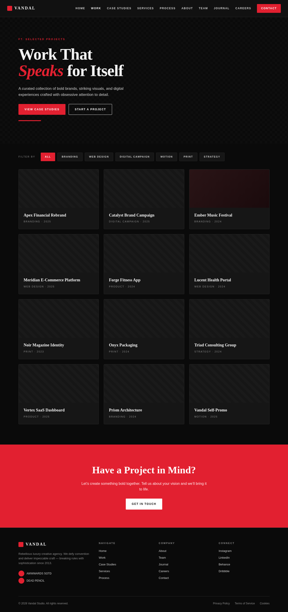 |
| case-studies | 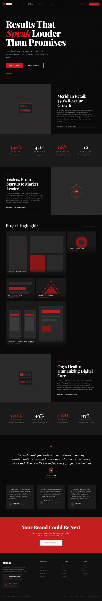 | 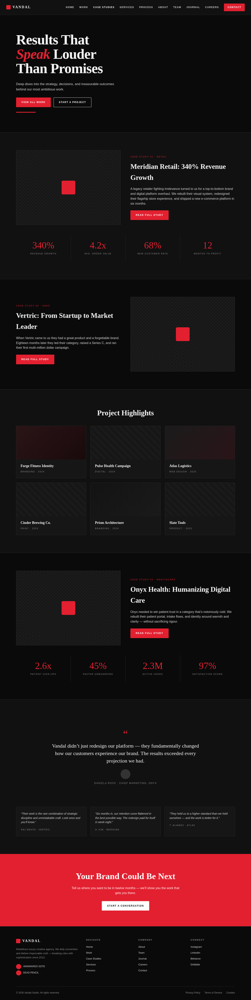 |
| services | 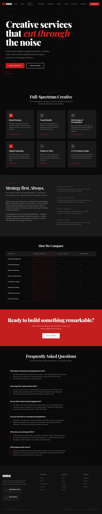 | 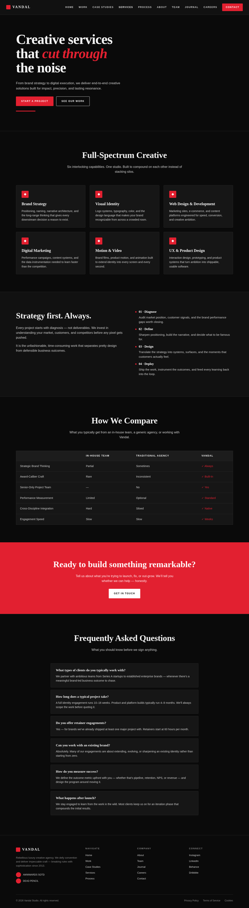 |
| process | 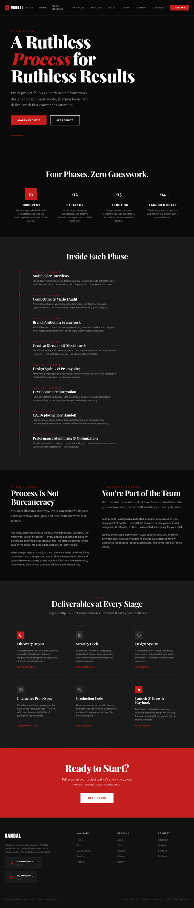 | 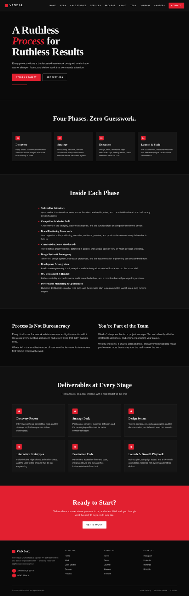 |
| about | 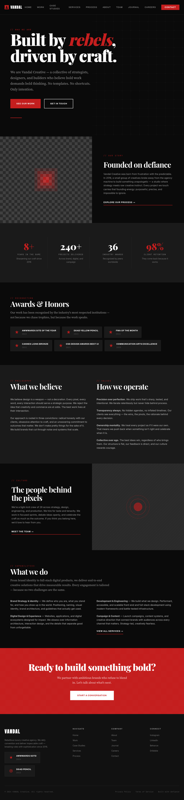 | 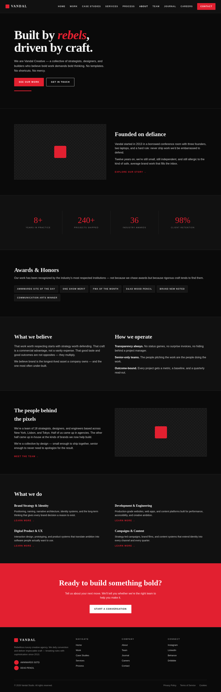 |
| team |  | 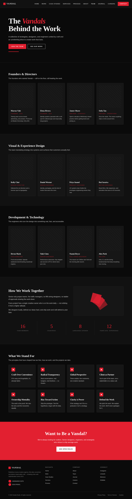 |
| journal | 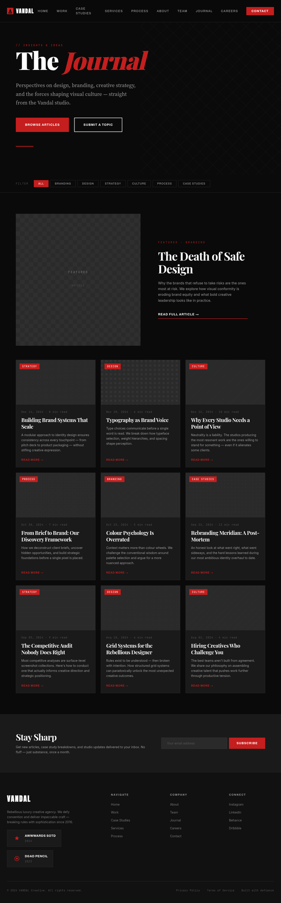 | 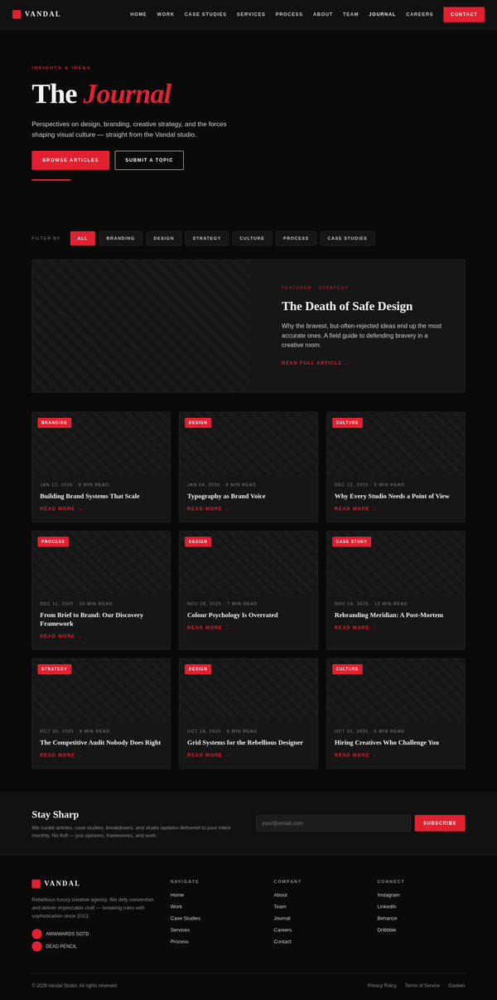 |
| careers | 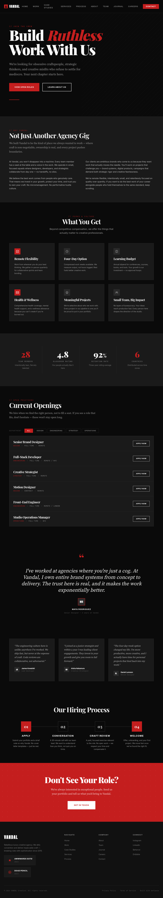 | 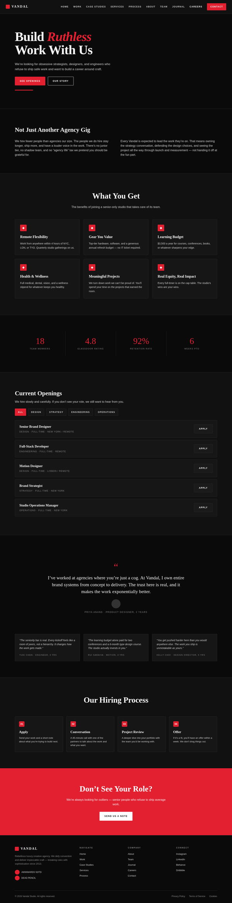 |
| contact |  | 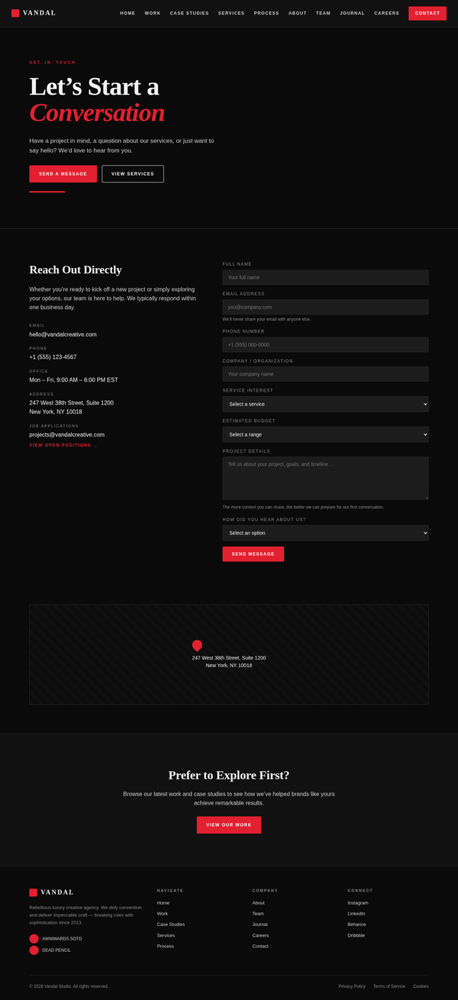 |
